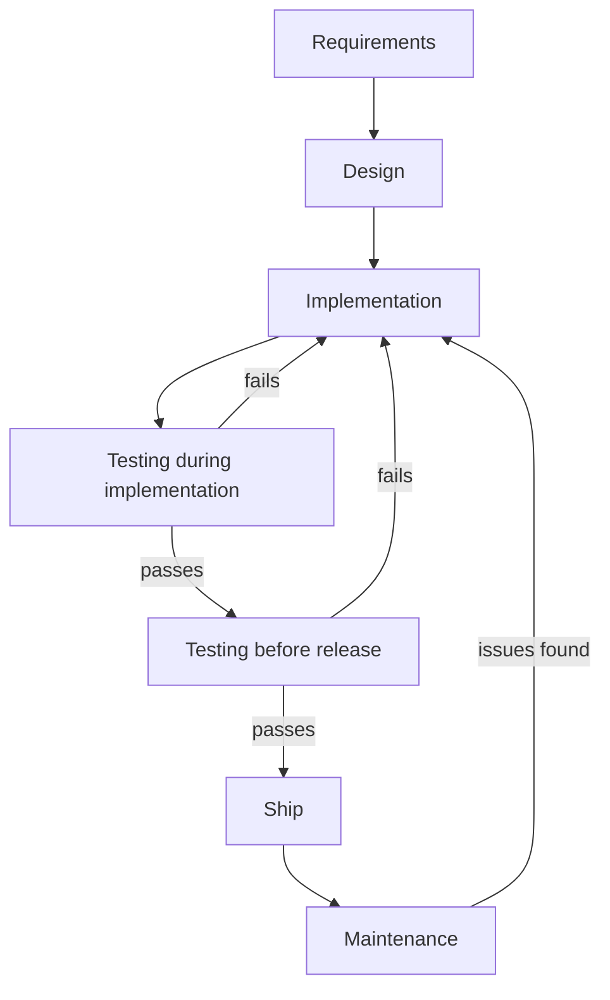
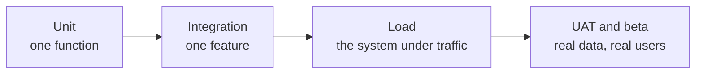

Every folder so far has been about making something work. This one is about knowing that it does — and continuing to know it after the next change, which is a different problem and needs its own machinery.

# Where testing sits

Testing is not a phase that happens after the code is written. It appears twice in the life of a piece of software, and the two appearances have different purposes.

> [!important] **The first loop is continuous.** As each meaningful piece of implementation is finished it is tested, and a failure sends you straight back to the code. This is not a stage — it runs alongside writing the feature.

> [!important] **The second is a gate.** Before release, a more rigorous set of checks runs against the whole thing rather than the piece just written.

Both matter and they catch different things. The first catches a function that does not do what you meant; the second catches a feature that works while breaking something else.

> [!important] The purpose underneath both: **catch issues early, when they are cheap.** A defect found while writing the function costs minutes. The same defect found by a user costs an incident, a rollback, and whatever it did to their data in between.

# The kinds, and who does them

Five worth knowing, and they are not alternatives — a serious system has all of them.

| | Tests | Who writes it |
|---|---|---|
| **Unit** | One small piece of code in isolation | **The developer who wrote the feature** |
| **Integration** | A complete feature, end to end | Developer, and QA for the manual half |
| **Load and stress** | Behaviour under heavy traffic | **The developer** |
| **User acceptance** | The real flow with realistic data | Developers, product, QA together |
| **Alpha and beta** | Real users, a limited subset | Nobody writes it — you release it |

> [!important] They form a progression from **small and fast and frequent** to **large and slow and rare.** A unit test runs in milliseconds and runs thousands of times a day. A beta release runs once per feature and takes weeks.

## The responsibility that surprises people

There is often a separate QA team, and it is easy to assume testing is therefore their job.

> [!warning] **Unit tests are not written by QA.** They are written by whoever wrote the feature, as part of writing the feature. QA does a different kind of testing entirely, and the code you merge is expected to arrive with its tests already passing.

> [!important] Which makes this an engineering skill rather than a specialism you can delegate. **Nobody else is going to write them for you**, and a pull request without them is incomplete work rather than work awaiting someone else's step.

# What the rest of this folder does

Unit tests come first and get the most attention, because they are the ones you write daily and because their central idea — isolating the thing under test from everything it depends on — is the one that has to be understood before any of the tooling makes sense.
