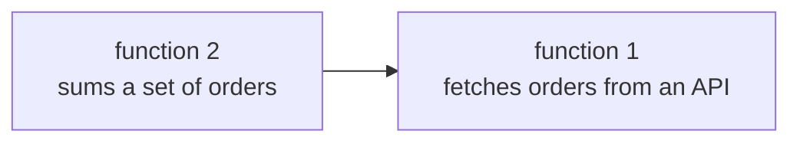
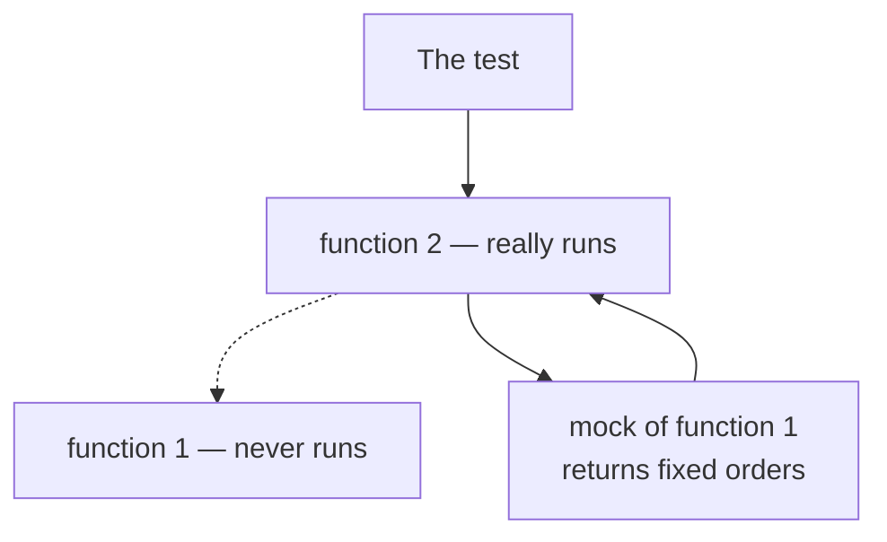
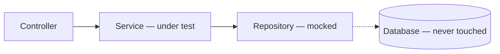

Unit tests are the ones written daily, and their central idea is not the assertion at the end — it is what has to be removed before the assertion means anything.

# What a unit is

> [!important] A **unit test** tests a very small piece of code — usually a single function, sometimes a short flow across two or three. Each test is itself a function containing the logic that does the checking.

> [!important] **The focus is deliberately narrow.** One test asks one question. Not does the feature work, but does this specific piece behave correctly given this specific input.

# The problem that shapes everything

Take two functions:



You want to test that **orders are summed correctly.** That is function 2's job. But function 2 calls function 1 to get the orders, so running the test runs the API call.

> [!warning] **Now the test can fail for reasons that have nothing to do with what it tests.** The network is down. The API is slow. The remote data changed. Your summing logic is perfect and the test is red.

> [!important] Worse than a wrong answer, this is an **unreliable** one. A test that sometimes passes and sometimes fails, for reasons outside the code, is called **flaky** — and a flaky test is worse than no test, because people learn to ignore it and then ignore it on the day it is right.

## The isolation rule

> [!important] **A unit test is run in isolation from its dependencies.** Whatever the code under test depends on is replaced, so the only thing that can make the test fail is the logic being tested.

Function 1 is tested separately, by its own test. This test assumes it works.

# Mocking

> [!important] **A mock is a stand-in for a dependency, with a response you fix in advance.** When the code under test calls function 1, it reaches the mock instead, which returns your hardcoded orders and nothing else happens.



> [!important] Note carefully what is and is not mocked. **The thing under test really runs** — that is the point. **Its dependencies do not.** Mocking the function you are testing would test nothing at all.

Every language has libraries for this and the mechanics differ. **The concept does not** — it is the same idea in Java, Python, JavaScript and Ruby.

# Arrange, act, assert

Every unit test has the same three parts, in the same order.

| | |
|---|---|
| **Arrange** | Set up what the test needs — create mocks, build input data, construct the object |
| **Act** | Call the thing under test, for real |
| **Assert** | Check the result is what you expected; if not, the test fails |

```java
1  @Test
2  void sumsOrderTotalsCorrectly() {
3      // arrange
4      when(orderClient.fetchOrders()).thenReturn(List.of(order(100), order(250)));
5
6      // act
7      BigDecimal total = orderService.totalOfAllOrders();
8
9      // assert
10     assertEquals(new BigDecimal("350"), total);
11 }
```

> [!info] **Unverified** — illustrative of the shape rather than run against the project. The specific syntax depends on the library; the three parts do not.

> [!important] The order is not a style preference. **Arrange establishes the conditions under which the answer is predictable; act produces the answer; assert compares it to what those conditions imply.** A test missing the arrange step is testing whatever state happened to be lying around.

# The shape this takes in a Spring application

The layering makes the dependency obvious.



> [!important] **Testing a service method means mocking the repository.** The service holds the logic worth testing; the repository makes a database call, and that call is what would make the test slow and flaky.

> [!warning] Without the mock, **every unit test needs a running database with the right data in it.** That is a shared, mutable, network-dependent thing sitting under a test suite that is supposed to be fast and deterministic — which is how a suite becomes something people stop running.

A concrete example: a system that saves a tweet and extracts its hashtags. To test hashtag extraction, mock both saves and assert only on the extracted hashtags. **The database work is assumed to work; the parsing is what is under test.**

> [!info] The mock is also how you test failure paths. Making the repository return nothing, or throw, is trivial with a mock and awkward with a real database — so the unlikely branches get tested too.

# When you write them

> [!important] **The developer writing the feature writes its unit tests**, and running the whole suite before merging is part of merging. New code arrives with new tests; existing tests must still pass.

That is the property the whole apparatus exists for. **Any change that breaks a previously working behaviour turns something red before it reaches anyone** — which is only true if the tests are fast enough to run constantly, which is only true if they are isolated.
