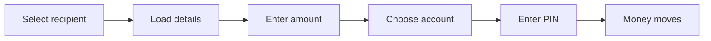
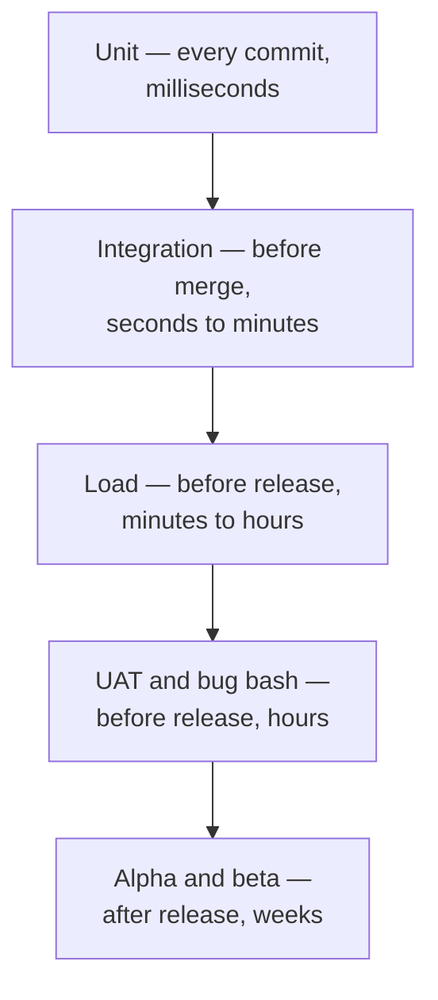

A unit test proves one function behaves. It cannot prove the feature works, because the whole point of isolating dependencies is that the connections between pieces were never exercised. Everything in this note tests what unit tests deliberately excluded.

# Integration tests

> [!important] An **integration test** runs a complete feature end to end, with its parts really talking to each other. Nothing is mocked — that is the difference.

A payment flow is the clearest example. Select a recipient, load their details, enter an amount, choose an account, enter a PIN, send.

Each of those steps has its own unit test. **The integration test is that the sequence works** — and that the interesting failures are handled: an invalid recipient, insufficient funds, a wrong PIN.

> [!important] This is exactly what unit tests cannot catch. **Two functions can each be correct and still not fit together** — one returns what the other does not expect, and both test suites are green.

## Automated and manual

| | Automated | Manual |
|---|---|---|
| What it is | A script running the flow | A person performing it |
| Written by | **Developers** — QA generally do not write code | **Developers and QA**, mostly QA |
| When | Continuously, before each release | Before each release |

> [!info] On a large product the manual pass is a real operation. A payment app may have a couple of hundred major flows; they are divided among a QA team and walked through by hand on a real device with the release build installed — add a recipient, enter an amount, pay, confirm — for every release.

> [!info] There are tools for automating browser and device flows, and QA teams use them. **They are usually not a developer's responsibility**, and it is entirely normal to build a career writing unit and integration tests without ever touching one.

---
# Load and stress tests

> [!important] **Load and stress tests answer whether the system survives traffic**, rather than whether it is correct. Correctness is assumed; capacity is the question.

Written by developers, because the answer usually requires changing code.

> [!important] The value is in **finding the bottleneck and the single point of failure** — under heavy traffic, which component gives way first? That is not deducible from a diagram, and it is rarely the component people expect.

The method is to simulate more traffic than you expect. A coding platform expecting 100,000 concurrent submissions during a contest tests at 200,000 — and if it cannot cope, the useful output is **which part failed and where the error rate climbed**, not the pass or fail.

> [!info] Tools vary by ecosystem — Postman for smaller runs, and dedicated frameworks such as Locust for Python, k6, or Bombardier. Which one is usually decided by the company rather than by you.

# User acceptance testing

> [!important] **UAT runs the real flow with data as close to real as possible**, before release. Not a mocked order — an actual test transaction moving through the actual system.

A reporting feature for sellers is the example: place genuine test orders through a near-real seller and a near-real buyer, then check the report the feature generates against what those orders should produce.

> [!info] It is a collective activity — developers, product managers, and often QA. Product is there because UAT is the last point at which someone asks whether this is what we meant, as opposed to whether it works.

# Alpha and beta

Everything above happens before release. These are release, to a restricted audience.

| | Released to |
|---|---|
| **Alpha** | **People inside the company**, who opt in |
| **Beta** | **A subset of real users** — signed up, selected, or paying |

> [!important] The purpose is **early feedback from people who did not build it.** Every prior stage is run by people who know how the feature is supposed to work, and that knowledge makes them unable to see what is confusing.

> [!warning] **A purely backend change often cannot have an alpha or beta.** If no user action triggers your code path, there is nothing for a tester to do differently. This applies whenever the feature is not reachable from an interface.

---
# Bug bash

> [!important] A **bug bash** is a scheduled session where the whole team spends an hour deliberately doing unreasonable things to the product.

Start a transaction and kill the app mid-flow. Enter nonsense. Press buttons in an order no user would.

> [!important] Its value is that **every other form of testing follows an expected path**, including the ones designed to test failure — you can only test the failures you thought of. A bug bash exists to find the ones nobody thought of, by removing the assumption that the user is behaving sensibly.

# How they fit together

> [!important] Cost and frequency move in opposite directions. **Anything catchable by a unit test should be caught by one**, because that is where catching it is nearly free. The stages above exist for the things unit tests structurally cannot see — and each one is expensive enough that using it to find something a cheaper stage would have caught is waste.
