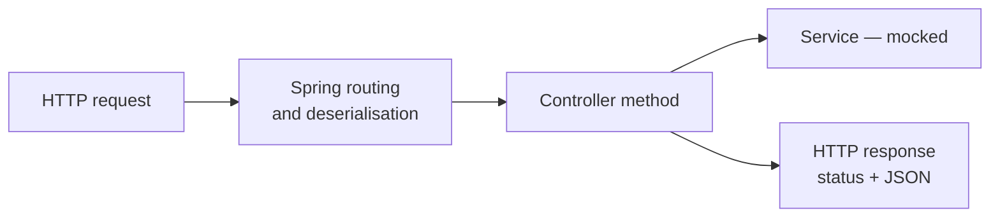

A service test constructs an object and calls a method. A controller cannot be tested that way, because nobody calls a controller method — they send an HTTP request, and the framework decides which method that becomes.

# What a controller test has to simulate



> [!important] **The parts worth testing are the parts Spring does**, not the method body. Does this URL reach this method, is the request body deserialised correctly, is the status code right, does the JSON come out in the expected shape. Calling the method directly skips all of it.

So the test needs something that speaks HTTP without a real server.

> [!important] **`MockMvc` simulates HTTP requests against your controllers.** Full routing, deserialisation, the handler, exception advice and serialisation — with no socket, no port, and no network.

# The setup

```java
1  // src/test/java/com/example/FakeCommerce/controllers/CategoryControllerTest.java
2  @WebMvcTest(CategoryController.class)
3  public class CategoryControllerTest {
4
5      @Autowired
6      private MockMvc mockMvc;
7
8      @MockitoBean
9      private CategoryService categoryService;
10 }
```

> [!important] **`@WebMvcTest(CategoryController.class)` loads the web slice for one controller.** Routing, JSON conversion, validation and exception handlers — and no services, no repositories, no database.

Naming the controller matters: without it Spring loads every controller in the application, and each one's dependencies then need mocking.

## `@MockitoBean`, not `@Mock`

This is the distinction that catches people, and it follows directly from the previous note.

| | `@Mock` | `@MockitoBean` |
|---|---|---|
| From | Mockito | **Spring** |
| Knows Spring exists | **No** | Yes |
| What it does | Creates a mock object | **Creates a mock and puts it in the application context** |

> [!important] A service test used `@Mock` because there was no Spring context — `@InjectMocks` passed the mock straight to a constructor. **Here there is a context**, because `MockMvc` needs Spring's routing to work at all. The controller is built by the container, so the mock has to be a bean the container can find.

> [!warning] `@Mock` in a `@WebMvcTest` compiles and fails at runtime: the mock exists as a field, the context knows nothing about it, and Spring reports no qualifying bean of type `CategoryService`.

> [!info] `@MockitoBean` replaces `@MockBean`, which is deprecated. Older material shows the old name.

# The test

```java
1  @Test
2  void createCategory_returns201() throws Exception {
3      // arrange
4      Category testCategory = Category.builder().name("Test Category").build();
5      testCategory.setId(1L);
6      when(categoryService.createCategory(any())).thenReturn(testCategory);
7
8      // act and assert
9      mockMvc.perform(MockMvcRequestBuilders.post("/api/v1/categories")
10             .contentType(MediaType.APPLICATION_JSON)
11             .content("{\"name\": \"Test Category\"}"))
12         .andExpect(MockMvcResultMatchers.status().isCreated())
13         .andExpect(MockMvcResultMatchers.jsonPath("$.data.name").value("Test Category"));
14 }
```

**Lines 4 to 6 arrange** — the object the mocked service will return.

**Lines 9 to 11 act** — a POST with a JSON body, exactly as a client would send it. The body is a raw string, so it exercises real deserialisation rather than handing the controller a ready-made object.

**Lines 12 and 13 assert.**

> [!important] **Act and assert merge here**, because `perform` returns a chainable result and the expectations attach to it. The third step has not disappeared — it is `.andExpect(...)`.

## Asserting on the response, not a return value

```java
  .andExpect(status().isCreated())
  .andExpect(jsonPath("$.data.name").value("Test Category"))
```

> [!important] **`status()` checks the HTTP status code.** `isCreated()` is 201 — the thing a client actually sees, and something no service test can verify because a service does not know about status codes.

> [!important] **`jsonPath` reaches into the serialised response body.** `$.data.name` navigates the JSON that came out of the response, which means it verifies the response envelope too: the `data` wrapper is asserted as a fact about the shape a client receives.

> [!info] `throws Exception` on line 2 is required — `perform` declares it. Every `MockMvc` test carries it.

# Prove it can fail

Change the controller from `HttpStatus.CREATED` to `HttpStatus.OK` and rerun.

```text
  Status expected:<201> but was:<200>
```

> [!important] Ten seconds, and it proves the assertion is connected to the code. Restore it and the test passes. **This is the same discipline as the service test**, and it matters more here, because a `MockMvc` chain has more places for a mistake to hide silently.

# The cost

> [!warning] **Controller tests are noticeably slower**, because Spring has to build a context — even a sliced one. A service test runs in milliseconds; a `@WebMvcTest` takes seconds on the first one in a class.

Which shapes what belongs where:

> [!important] **Put logic in the service and test it there.** A controller should map a request to a call and a result to a response, so its tests stay few and shallow — the status code, the response shape, and the paths where the request itself is wrong. Business rules tested through `MockMvc` cost seconds each for something a service test settles in milliseconds.
