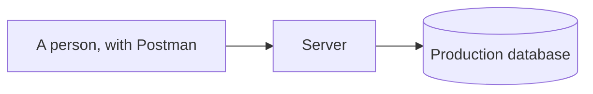
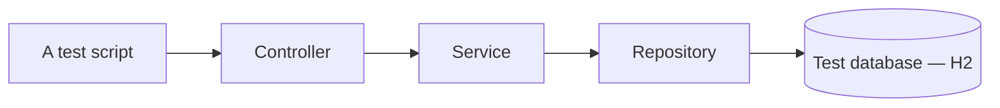
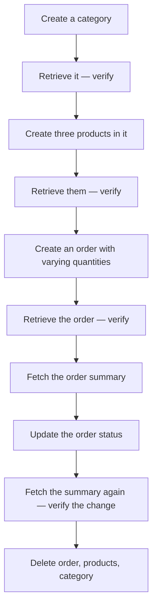

Every test so far has been a unit test with something mocked out — the repository, the service, the database. The point of each was that only one thing was real. An integration test inverts that: nothing is mocked, and what is being checked is whether the pieces fit.

# What is being replaced

Without automation, testing a full flow means a person doing it.



The automated version changes two things and nothing else:



> [!important] **The person becomes a script, and the real database becomes the test database.** Every layer in between runs for real. That is the entire idea, and everything below is mechanics.

> [!info] The script can be in any language — Python, JavaScript, Ruby — since it only makes HTTP calls. Writing it in Java keeps it in one ecosystem and one build, which is usually reason enough.

# `MockMvc` again, used differently

The controller test already had something that makes HTTP calls in Java.

> [!important] **The same `MockMvc`, with one change: the service is not mocked.** The controller calls the real service, which calls the real repository, which reaches H2. `MockMvc` is the entry point rather than the whole scope.

# The annotations

```java
1  @SpringBootTest(
2      webEnvironment = SpringBootTest.WebEnvironment.MOCK,
3      properties = { "spring.autoconfigure.exclude=..." }
4  )
5  @AutoConfigureMockMvc
6  public class EcomFlowIntegrationTest {
```

> [!important] **`@SpringBootTest` loads the entire application context** — every controller, service, repository and configuration. Not a slice. That is required, because the flow passes through all of them.

> [!important] **`webEnvironment = MOCK` means no real HTTP server.** The servlet environment is simulated, so nothing binds to port 8080 and the test cannot collide with a running application.

> [!warning] **`@AutoConfigureMockMvc` is easy to forget.** `@WebMvcTest` configures `MockMvc` for you; `@SpringBootTest` does not, because it has no idea you intend to make web calls. Without this line the `MockMvc` injection fails.

# What is still mocked, and why

Not everything can run for real.

```java
1  @MockitoBean
2  private ProductRedisCache productRedisCache;
3
4  @BeforeEach
5  void setUp() {
6      when(productRedisCache.getSummary(anyLong())).thenReturn(Optional.empty());
7  }
```

> [!important] **There is no test Redis, so the cache is mocked to always miss.** `Optional.empty()` is a cache miss, which sends every read down the path that queries the database — the path the test exists to exercise.

That is a deliberate choice with a clear justification:

> [!important] **Mocking the cache tests the slower, more interesting path every time.** A real cache would make the second request skip the database, so the test would exercise less on each run and depend on ordering. **Forcing a miss makes it deterministic.**

> [!info] The alternative is a test Redis instance, the same way H2 is a test database. Reasonable, and more setup — an embedded Redis or a container, plus flushing between runs.

## The exclusion list, and a bug in it

Alongside the mock, the source excludes Redis auto-configuration:

```java
1  properties = {
2      "spring.autoconfigure.exclude=" +
3          "org.springframeframework.boot.data.redis.autoconfigure.DataRedisAutoConfiguration," +
4          "org.springframework.boot.autoconfigure.data.redis.DataRedisReactiveAutoConfiguration," +
5          "org.springframework.boot.autoconfigure.data.redis.DataRedisRepositoriesAutoConfiguration"
6  }
```

> [!warning] **None of those three names is correct**, so nothing is excluded. Line 3 reads `springframeframework` — a typo. Lines 4 and 5 use the Spring Boot 3 package layout, `boot.autoconfigure.data.redis`, which does not exist in Boot 4.

Reading the class names straight out of `spring-boot-data-redis-4.0.2.jar`:

```text
  org/springframework/boot/data/redis/autoconfigure/DataRedisAutoConfiguration.class
  org/springframework/boot/data/redis/autoconfigure/DataRedisReactiveAutoConfiguration.class
  org/springframework/boot/data/redis/autoconfigure/DataRedisRepositoriesAutoConfiguration.class
```

So the working form is:

```java
1  "spring.autoconfigure.exclude=" +
2      "org.springframework.boot.data.redis.autoconfigure.DataRedisAutoConfiguration," +
3      "org.springframework.boot.data.redis.autoconfigure.DataRedisReactiveAutoConfiguration," +
4      "org.springframework.boot.data.redis.autoconfigure.DataRedisRepositoriesAutoConfiguration"
```

> [!warning] **The test passes either way**, which is why the bug survives. `@MockitoBean` replaces the cache regardless, and the Lettuce client connects lazily — so nothing ever reaches Redis and no connection is attempted. **A name that matches no class on the classpath is skipped rather than reported.**

> [!important] Which is the fourth instance of one shape in these notes, after the annotation that generated no index, `spring.redis.host`, and the text index that was never used. **Configuration that names something wrongly fails silently far more often than it fails loudly** — and the only way to know a setting works is to observe it doing something.

# The flow

One test, one journey, in order:



> [!important] **Each step's output feeds the next.** The category id is read out of the creation response and used to create products; the product ids are used to build the order. That chaining is what makes it an integration test — a broken link anywhere fails the whole thing, which is exactly the failure unit tests structurally cannot see.

```java
1  private Long extractId(MvcResult result) throws Exception {
2      String json = result.getResponse().getContentAsString();
3      return ((Number) JsonPath.read(json, "$.data.id")).longValue();
4  }
```

> [!info] A small helper pulling the id out of each response. Its existence is a sign the test is doing the right thing — **reading what the API returned rather than assuming what the database assigned.**

> [!important] Ending with the deletions is deliberate. It **tests the delete endpoints** and leaves the database as it was found, so the test does not depend on running first or alone.

> [!info] **`MockMvc` is not the only way to drive this.** It calls into the application without going over the network, which keeps the test fast and in-process. The alternative is to start the application for real and hit it with an HTTP client — Spring's own `WebClient`, a library like Retrofit, or a script in another language entirely. **The choice of client changes nothing about the logic**: exercise the flow end to end, point it at a test database rather than a real one, and clean up whatever you created. What an external client buys you is that the network and the serialisation are real too; what it costs is a running application and a slower test.

# Where each kind of test loads

The whole progression, in one place:

| | Loads | Real | Mocked |
|---|---|---|---|
| **`@ExtendWith(MockitoExtension)`** | **Nothing** | The service | Repository |
| **`@DataJpaTest`** | JPA slice | Repository, H2 | — |
| **`@WebMvcTest`** | Web slice | Controller, routing, JSON | Service |
| **`@SpringBootTest`** | **Everything** | **All layers, H2** | Only what cannot run |

> [!important] Reading down that table is reading the cost. **The first runs in milliseconds and the last takes seconds**, and the reason is exactly how much of Spring has to be built before anything is checked.

> [!important] Which is why the shape from `03-Beyond-Unit-Tests` holds: **many unit tests, few integration tests.** An integration test is worth having for each important journey and is the wrong tool for a branch, because it costs seconds to check something a unit test settles in a millisecond — and when it fails, it tells you the flow is broken without telling you where.
