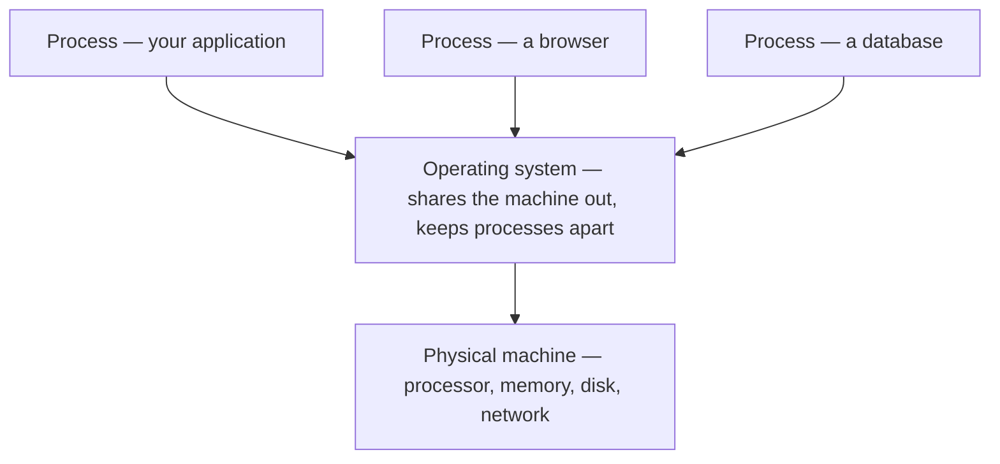
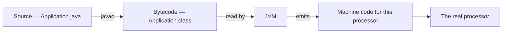
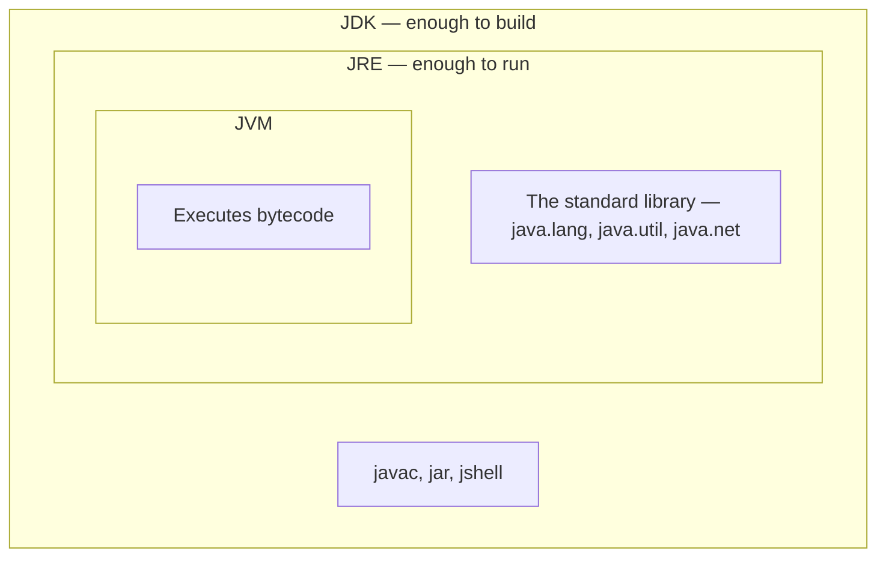
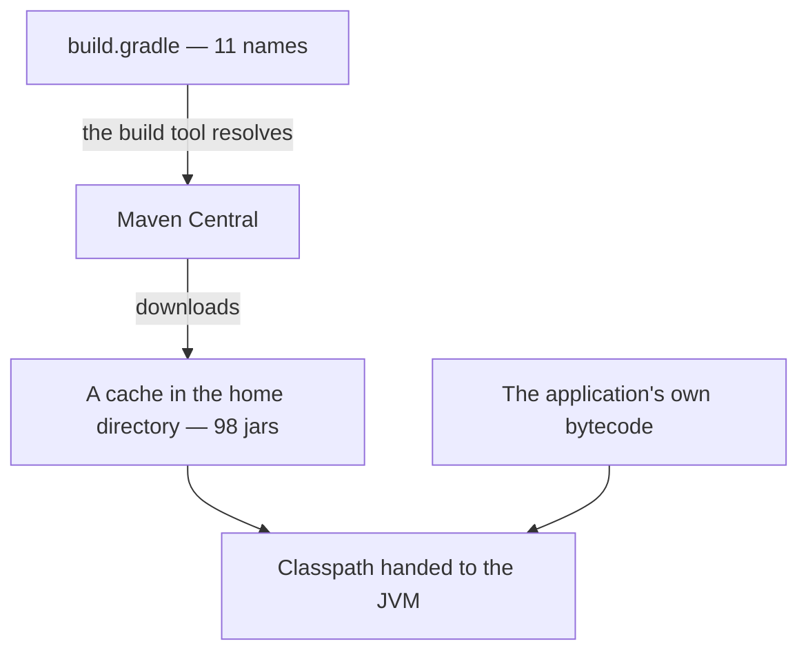
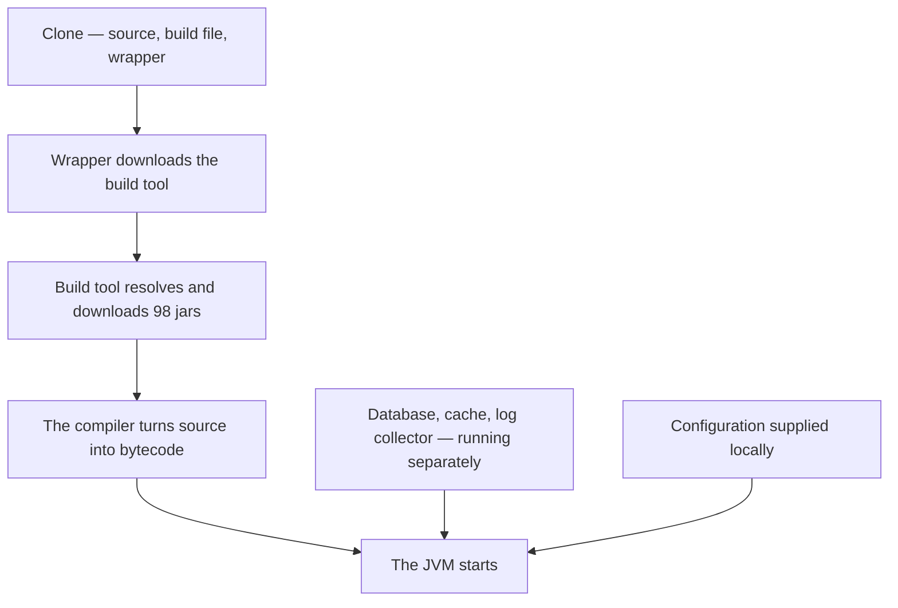
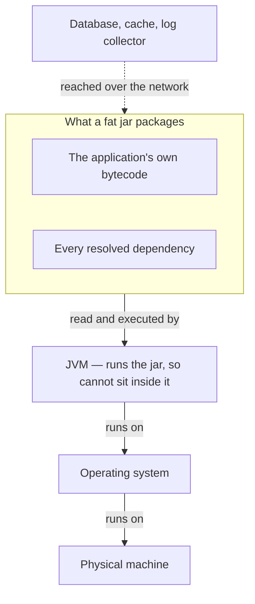
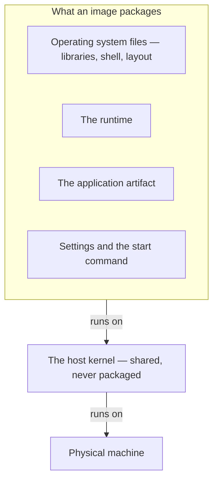
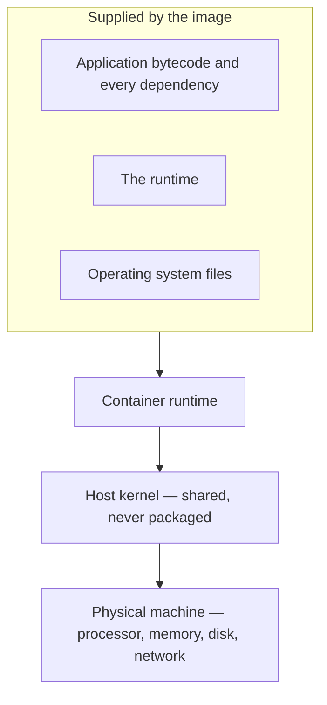
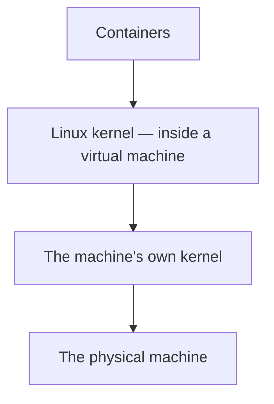

**Code that has been written and compiled still does nothing.** Something has to pick it up and run it, and a considerable amount of machinery has to already be present on a machine before that can happen. Knowing exactly which parts have to be there, and which ones travel with the application, is the whole of what follows.

# A file on disk is not a program

A built application sitting in a folder is a file. It occupies storage and does nothing else — no memory, no processor time, no existence beyond the bytes on the disk. Copying it, renaming it or staring at it changes none of that.

For it to do anything at all, something has to load those bytes into memory and arrange for the processor to begin executing them. That something is the **operating system**.

# What the operating system hands a running program

The moment a program starts, the operating system gives it five things it did not have as a file:

| What it gets | What that means |
|---|---|
| Memory of its own | A region of RAM that no other program can read or write |
| Processor time | The operating system decides who runs when, switching between programs many times a second |
| A way to reach files | A program never touches the disk itself — it asks, and the operating system checks whether it is allowed |
| A way to reach the network | The same arrangement, through the same gatekeeper |
| An identity | A process identifier, so the operating system can track it, measure it and stop it |

A program that has been given all of this is called a **process**. That is the only form in which code exists while it is running. Not a file — a process.

# The machine underneath

The operating system is not conjuring any of that. Underneath it is the physical machine: a processor that executes instructions, memory that holds what is being worked on, a disk that keeps what must survive a restart, and a network interface that moves bytes in and out.

The operating system's job is to share those four finite things among every process running at once, and to keep each one from reaching into another's memory.



**An operating system is never part of an application, and it is never optional.** Every program ever written assumes one is already there doing all of the above on its behalf, which is why the question of what has to be installed on a machine before an application can run always starts here rather than with the application.

# Bytecode is not machine code

A processor only understands machine code written for its own architecture. The chip in an Apple laptop is ARM; the chip in most rented servers is x86. Their instruction sets are different and mutually unintelligible.

Java's compiler does not produce either of them. Compiling `Application.java` with `javac` produces `Application.class`, and what is inside it is **bytecode** — an instruction set for a machine that does not physically exist. No processor anywhere can execute a `.class` file directly.

Something therefore has to sit in the middle and translate as the program runs. That something is the **JVM**, the Java Virtual Machine: virtual because it behaves like a processor that understands bytecode, while being software rather than silicon.



The translation step is where portability comes from. **One `.class` file runs on an ARM laptop, an x86 Linux server and a Windows desktop with no recompiling**, because each of those machines has a JVM built for its own processor, and each turns the same bytecode into its own machine code. Write once and run anywhere means anywhere a JVM has already been installed — which is also why the JVM download page asks which operating system and which processor, while the application being run does not care.

# The process is the JVM, not the application

The JVM is an ordinary program, so everything above applies to it: the operating system loads it, gives it memory, gives it processor time, gives it a process identifier.

That has a consequence worth stating on its own. **When a Java application runs, the process the operating system starts is the JVM.** The application is data — bytecode that the JVM reads and executes. A process listing shows a process called `java`, never one named after the application's own file. It is also why memory limits are set with a flag on the launcher rather than in application code: the thing being configured is the process, and the process is the JVM.

# JDK, JRE and JVM

These are three nested boxes rather than three separate downloads.



Installing a JDK installs the JVM, because the JVM is inside it. `javac` is the compiler and exists only in the JDK; `java` is the launcher that starts a JVM and exists in the JRE. **Running somebody's built application needs the inner box. Compiling their source needs the outer one.**

# The code an application does not contain

The bytecode a team writes itself is usually a small fraction of what runs. A modest Spring Boot service compiles down to under a hundred kilobytes of its own classes, while the libraries it leans on run to tens of megabytes.

Those libraries are bytecode too — written by other people, compiled by other people, packaged into jars of their own, in exactly the format the application's own classes use. The JVM draws no distinction between them.

What it does do is look for a class the moment that class is first mentioned. The list of places it searches is the **classpath**. If the jar holding that class is not reachable, the program dies with a `NoClassDefFoundError` at that exact moment — not at startup, which is what makes a missing dependency such an unpleasant way to discover a mistake. **Every jar has to be physically present on the machine before the code that needs it runs.**

# A list is not the thing it lists

A build file does not contain those jars. It contains their names.

```groovy
1  // build.gradle
2  dependencies {
3      implementation 'org.springframework.boot:spring-boot-starter-data-jpa'
4      implementation 'org.springframework.boot:spring-boot-starter-webmvc'
5      implementation 'io.github.cdimascio:dotenv-java:3.0.0'
6      implementation 'redis.clients:jedis'
7      runtimeOnly 'com.mysql:mysql-connector-j'
8  }
```

Group, artifact, and sometimes a version. No code. Delete every downloaded jar from the machine and this file is unchanged, because it never held them.

Building is what turns the list into files. The build tool reads it, downloads each named artifact from a public repository such as Maven Central, stores them in a cache in the home directory, and hands the JVM a classpath pointing at what it fetched. Only then does anything run.

The list also expands on the way. **Eleven declared dependencies routinely become ninety-eight downloaded jars**, because each dependency carries its own list of what it needs, and those have lists of their own. The build tool walks the whole tree. One starter for database access alone pulls in the object-relational mapper, the transaction manager, the connection pool and their dependencies in turn.



**A build file is a shopping list, the jars are the groceries, and the build tool is the shopper.** Python's `requirements.txt` is the same idea with different names — a list of packages and versions, with `pip` as the shopper and PyPI as the shop. Neither file contains a single line of the code it names.

# What a repository actually carries

Handing the work to a second machine has two shapes, and the first one is to share the repository.

Version control does not carry everything in the project directory. Build output, the dependency cache and any file holding secrets are excluded on purpose, which leaves a much thinner set than the folder suggests.

| Carried | What it is |
|---|---|
| The source tree | Text. Nothing compiled. |
| The build file | The shopping list, and nothing it names |
| The wrapper script | A few kilobytes that know which build tool version to fetch |
| Configuration templates | Compose files, logging configuration, and similar |

The third row repeats the lesson one level higher. **Not even the build tool is in the repository** — the wrapper is a script beside a tiny jar whose only job is to download the build tool named in a properties file. The list-not-the-thing arrangement applies to the tooling as much as to the dependencies.

So a machine starting from a fresh clone has to supply four things itself:

- **A JDK**, not merely a JRE, because there is source here and it has to be compiled.
- **Network access, twice.** The wrapper fetches the build tool, then the build tool fetches every dependency in the resolved tree.
- **Any service the application connects to** — a database, a cache, a log collector — running and reachable, since none of them are in the repository.
- **Its own configuration**, because the file holding it was excluded from version control precisely so that it would not travel.



This is why the first build on a new machine takes minutes and every later one takes seconds: the first run fills the cache, and the rest read it.

**Cloning a repository hands over the recipe and the shopping list, not the meal.** Every step the original machine went through happens again on the new one, over its network, with its compiler, at whatever moment it happens to run — and each of those is a way for the result to differ or to fail.

# Shipping the result instead of the recipe

The second shape is to hand over what the build produced rather than what produced it.

A Spring Boot build emits two files. One holds only the application's own classes and is a few dozen kilobytes. The other — the **fat jar** — holds those classes plus every resolved dependency, and runs to tens of megabytes. The second is the one that gets deployed.

Everything the list-and-shopper arrangement was doing disappears from the receiving machine. There is no build tool to fetch, no tree to resolve, no download, no compiler, and no source. One command starts it:

```bash
  java -jar application.jar
```

| | From the repository | From the fat jar |
|---|---|---|
| Java needed | JDK, because it compiles | JRE, because it only runs |
| Build tool | downloaded on first use | not needed |
| Dependencies | resolved and downloaded per machine | already inside the file |
| Compilation | on the receiving machine | already done, once |
| Network to become runnable | **required** | **not required** |
| Database, cache, log collector | required | required |
| Configuration | required | required |

That the file runs at all deserves an explanation, because a standard launcher cannot read a jar nested inside another jar. The manifest is what arranges it:

```text
# META-INF/MANIFEST.MF
Main-Class: org.springframework.boot.loader.launch.JarLauncher
Start-Class: com.example.Application
```

`Main-Class` is what the launcher actually starts, and it is not the application. It is a small loader packed into the jar, which reads the nested dependency jars, assembles a classpath from them in memory, and only then hands control to `Start-Class`. A fat jar is an ordinary jar wrapped around a loader that knows how to unpack it from the inside.

**The fat jar moves dependency resolution from run time to build time.** It happens once, on one machine, and the outcome is frozen into a file. Every machine afterwards receives the result rather than repeating the process — which removes the network, the build tool and the compiler from the list of things that have to work on the day of deployment.

# What an artifact cannot carry

The fat jar froze every dependency into itself, and then stopped. Its manifest still names a Java version it does not contain — a requirement written down rather than satisfied, which is the shopping-list pattern surviving all the way into the finished artifact.

Two things prevent it going further.

**Format.** A jar holds bytecode, and bytecode is identical on every platform. A JVM is not bytecode; it is a native binary compiled for one processor and one operating system. There is no single JVM to enclose — there is a macOS one on ARM, a Linux one on x86, a Windows one. Enclosing any of them would end the portability that bytecode existed to provide.

**Circularity.** The jar is opened by the JVM. Something has to be running already in order to read the file at all, so a JVM stored inside it could never be reached.

Together those give the rule that governs the whole stack:

> A program can package what it **depends on**. It can never package what it **runs on**.

Dependencies are called by the application. The JVM calls the application. Packaging upward is possible and packaging downward is not, and the same holds at every level below: the JVM cannot contain the operating system it runs on, and the operating system cannot contain the machine.



So a receiving machine still has to supply five things:

| Still required | Why the artifact cannot hold it |
|---|---|
| A JVM of the right version | A native binary, and the thing that opens the jar |
| An operating system with the right system libraries | The JVM runs on it |
| Every service the application connects to | Separate programs, separate processes |
| Configuration and secrets | Deliberately kept out of the artifact |
| The start command and its flags | Lives outside the file, on the command line |

> [!info] **Bundling a runtime is possible, and it costs the portability.** Tools exist that produce an application packaged together with a trimmed-down JVM. They work, and they confirm the rule rather than breaking it: the output is built for one platform, so what has been gained in self-containment is paid for in portability, one target at a time.

# Packaging the layer below

The rule says a program cannot package what it runs on. The way out is not to break the rule but to move up a level: build a package that contains the runtime, so that opening the package produces the runtime, and the runtime then opens the artifact. Nothing was missing except the layer underneath, and now the package supplies it.

That package is an **image**.

| What an image holds | Examples |
|---|---|
| Operating system files | The libraries, shell, package manager and directory layout a program expects to find at `/usr`, `/lib`, `/etc` |
| The runtime | The `java` binary and the standard library beside it |
| The application artifact | The fat jar |
| Settings | Environment variables, the working directory |
| The start command | The exact command line to run |

**An image does not contain an operating system.** It contains the operating system's **files** — the userland — and not the kernel. The kernel belongs to the machine the image runs on, and is shared by everything running there.

So the rule holds after all. An image packages everything up to the kernel and never the kernel itself, because the kernel is precisely what it runs on. **An image is the largest package the rule permits.**



Two consequences follow from the missing kernel. An image costs hundreds of megabytes rather than the gigabytes a full guest operating system costs — a minimal userland such as Alpine Linux is about 5 MB, and the runtime is usually the bulk of what remains. And starting one takes milliseconds rather than minutes, because there is no operating system to boot when there is no kernel inside to boot.

# The recipe that builds it

An image is produced by a file of instructions, standing in the same relation to it as a build file does to the jars it names: a list of steps, not the thing the steps produce.

```dockerfile
1  # Dockerfile
2  FROM eclipse-temurin:21-jre
3  COPY build/libs/application.jar /app.jar
4  ENTRYPOINT ["java", "-jar", "/app.jar"]
```

Line 2 does the heavy lifting. **`FROM` means begin from an image somebody else has already built** — here, one that already holds a Linux userland with a Java 21 runtime installed in it. Nothing is being assembled from parts; a finished image is being taken as the starting point and one file added to it. Line 3 adds that file. Line 4 supplies the start command, which was the last of the things the artifact itself had no way to carry.

Of everything a receiving machine previously had to provide, only two remain outside the image: the services the application connects to, and the secrets it is configured with.

# One service per package

An application and the database it talks to could be installed into the same image. The reason nobody does is what happens when a second copy is wanted.

Running the application five times would produce five databases, each with its own separate data, and none of them holding the truth. Somebody who registers against the third copy does not exist as far as the other four are concerned. The application is stateless and wants many copies; the database is stateful and wants exactly one. **They scale in opposite directions, so they cannot share a package.**

| | Application | Database |
|---|---|---|
| Copies wanted | Five, ten, forty | One |
| Changes | Several times a day | Rarely, and carefully |
| Restarted casually | Yes | No |
| Data that must survive a restart | None | All of it |

There is a mechanical reason underneath the practical one. **A container's life is tied to a single process** — it begins when that process begins and ends the moment it exits, which is what declaring a start command means. Two programs in one container require a supervisor to keep both alive, and the runtime then loses any view of whether either is healthy, because the process it is watching is the supervisor rather than the work.

So each service is built into an image of its own, run as a container of its own, and reaches the others over a network. A logging pipeline of three cooperating services is three images, three containers and one network between them, with each finding the others by name.

# The container is the image running

An image is read-only and never changes. Starting one produces a **container**: the same files, plus a thin writable layer belonging to that container alone, plus a running process.

That is why five copies of an application are five containers from one image rather than five images. Each has its own processes and its own scratch space, and all of them read the same unchanged files underneath.

# The whole stack



Every layer in that diagram was arrived at by asking what the layer above could not carry. The application could not carry its dependencies, so a build tool fetched them and a fat jar froze them. The jar could not carry the runtime that reads it, so an image enclosed both. The image cannot carry the kernel it runs on, so the kernel stays shared — and that limit is exactly what makes an image megabytes rather than gigabytes.

One consequence is easy to miss on a development machine. The files an image carries are Linux files and they need a Linux kernel. On a machine whose own kernel is not Linux, the container runtime quietly starts a lightweight Linux virtual machine and runs every container inside it.



Virtual machines were not replaced by containers. On any host that is not already Linux, there is one underneath every container being run — which is the subject [[02-Virtual-Machines]] takes up.
