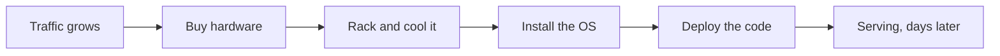
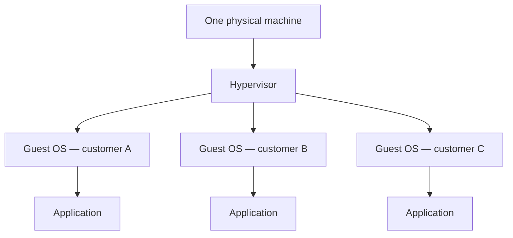
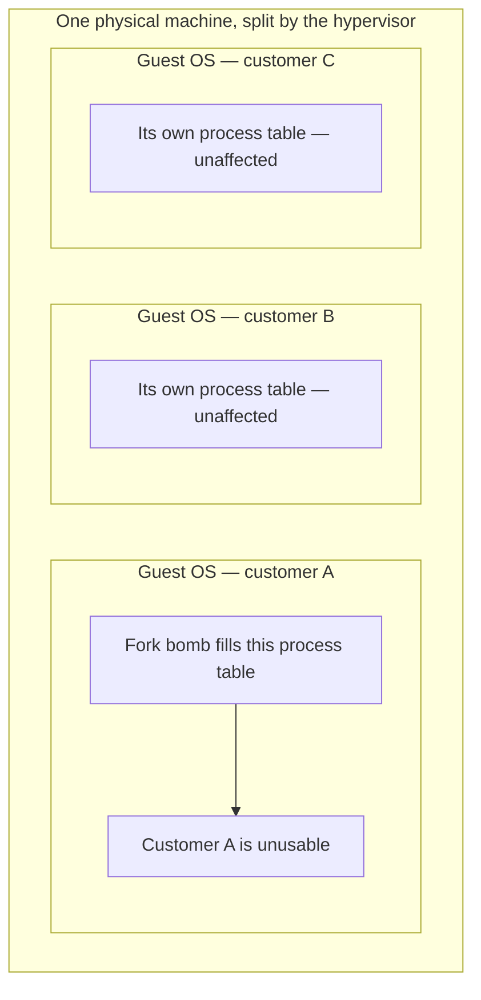

**Every stack ends at a physical machine, and that machine belongs to somebody.** Who owns it, and how it gets divided among the people paying to use it, is a different question from what has to be installed on it — and the answers arrived in sequence, each one forced by a failure of the one before.

# Owning the machine

In the early days, **deploying a server meant preparing a physical machine and running the process on it.** A university department hosting its own website did it exactly this way — a dedicated box in a room, not a rented one.

This works until the traffic grows. Suppose the application serves a thousand users a minute and then has to serve fifty thousand requests a second. Scaling means buying another physical machine, racking it, installing the operating system, loading the code and booting the server. That takes days, not seconds. And every machine that exists has to be maintained — cooled, patched, repaired — which takes people.

# Renting the machine instead

Public cloud platforms — AWS, Azure, Google Cloud Platform, DigitalOcean — solved the ownership half of the problem. They operate data centres full of powerful machines, and they rent them out.

The gain is that nobody using them has to know how to cool a room or wire a rack. Log into an account, do some configuration, and a server is running. The **maintenance cost moves to the provider**.

But the machines are still real and still finite. A provider cannot hand one entire computer to each customer, because there are more customers than computers. One physical machine has to be divided among several of them.

# Dividing a machine with virtual machines

A virtual machine is a whole operating system running inside another one. On a Windows desktop, software like VMware can boot Linux inside the running Windows — not alongside it as a dual boot, but inside it, with several Linux instances at once if you want them.

That is the division the cloud uses. **One physical machine hosts several virtual machines, each rented to a different customer.**

# How far a failure reaches

The split a hypervisor makes is a real one. Every guest gets its own operating system, its own memory allocation and its own share of the processor, and the boundary is enforced from below by the hardware. **A program that crashes, or that exhausts everything within its reach, takes down its own guest and nothing else.**

That is worth stating precisely, because the two failures people worry about on shared hardware sit on opposite sides of the line.

**A crashing program stays inside itself.** Every process is given its own region of memory and scheduled independently, as [[01-What-Runs-Your-Code]] sets out, so a Java application that recurses too deep and dies with a `StackOverflowError` takes down its own process and nothing else — Spotify crashing on a laptop leaves Chrome running in the window beside it, and on a server holding a payment service and a profile service, the payment service dying leaves the profile service still answering requests. None of that needs virtualisation; it is what an operating system does.

**Exhausting the operating system is a different size of problem.** A few resources belong to no single process: the table of running processes, the pool of process identifiers, the scheduler's run queue. There is exactly one of each per operating system, shared by everything running on it. **A fork bomb is a program whose only behaviour is to copy itself, endlessly** — it never crashes, it simply fills that table until nothing else can start. **Every program under that operating system stops, not just the offender.**

Put a fork bomb inside a virtual machine, though, and the operating system it fills is the **guest** operating system — its own. The guest next door has a different process table, a different memory allocation and a different share of the processor, all handed out and policed by the hypervisor. The physical machine keeps running, and the customer next door stays up.

# What still crosses between tenants

Isolation of that strength is not the same as no interaction at all, but far less crosses than the reputation suggests. It is worth being exact about which parts of a machine are genuinely divided between tenants and which are not.

| What one tenant does | Reaches the neighbours | What they see |
|---|---|---|
| A program crashes | No | Nothing |
| Fills its own process table, exhausts its own memory | No | Nothing |
| Saturates the storage and network bandwidth it was allocated | No | Nothing |
| Evicts shared cache lines, competes for the memory channels | Yes | Small, variable extra latency |
| Exploits a defect in the hypervisor | Yes | A breach |

**Processor time, memory, storage and network are partitioned.** On current cloud hardware the hypervisor pins physical cores to an instance for its lifetime, and those cores run no other customer's work; memory pages are never shared between instances. The virtualisation of storage and networking has been moved off the main processor onto dedicated cards beside it, storage is network-attached with throughput provisioned per volume rather than drawn from a shared local disk, and network bandwidth is allocated per instance size. A neighbour cannot spend an allocation that was never pooled with yours in the first place.

**What is left over is the cache and the memory channels.** Cores on one socket physically share the last-level cache and the paths out to memory, and no software partition separates them. A neighbour working through a large data set evicts your cache lines and competes for the same memory bandwidth, so your code runs a little slower. That is the whole of the noisy neighbour effect on modern hardware: small, variable, and impossible to aim, because nobody chooses which host they land on and therefore nobody chooses whose cache they disturb. Processor designers are spending transistors on it rather than solving it in software — Graviton5 raised its shared last-level cache from 36 MB to 192 MB, and Ampere pairs each core with 2 MB of its own second-level cache, both to absorb exactly this.

**Where sharing is deliberate, it is sold as such.** Burstable instance families give you a baseline fraction of a core plus a balance of credits to exceed it, and once the credits are spent you are throttled back to the baseline. That is the contract you bought, not a neighbour taking something from you, and it is the case people most often meet and mistake for one.

**Overselling exists, but not everywhere.** A provider can sell more memory or more processor than a machine physically holds, betting that tenants will not all claim their allocation at once, and when that bet fails everything on the box suffers together. The major providers do not do this on fixed-performance instance types, where cores and memory are pinned. Budget hosting is where it is common, and it is most of why the noisy neighbour reputation outlived the problem.

**Escaping the hypervisor is real and rare.** VENOM, catalogued as CVE-2015-3456, was a buffer overflow in the emulated floppy-disk controller shipped by several virtualisation platforms, and code inside a guest could use it to reach the host underneath. That is the leak worth worrying about: two customers with no relationship to one another, separated by one layer, and a defect in that layer. It is a bug in the hypervisor, not the ordinary behaviour of one.

# What the isolation costs

The limit of virtual machines is not the strength of the boundary. It is the weight of it.

Each tenant carries a complete operating system — its own kernel, its own boot sequence, its own updates to install, gigabytes of disk, and memory reserved before a single line of application code runs. Starting one takes minutes.

That is affordable when a machine is rented for months. It stops being affordable the moment the unit of work gets small. A team that wants forty copies of one application on a single box cannot pay for forty operating systems to hold them, and a service that wants to run one stranger's submission for two hundred milliseconds and then throw the whole environment away cannot spend minutes booting the environment first. In both cases the isolation was never the problem. The overhead wrapped around it is.
