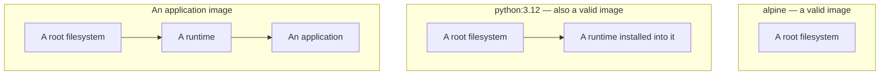
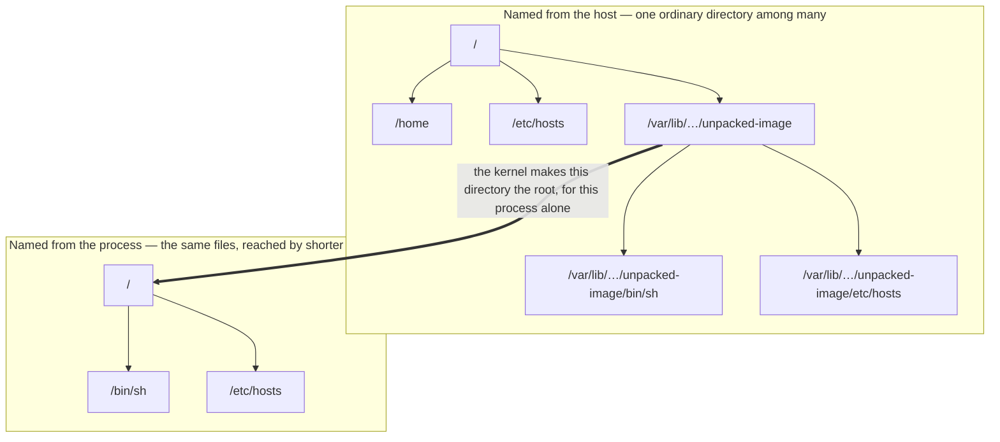
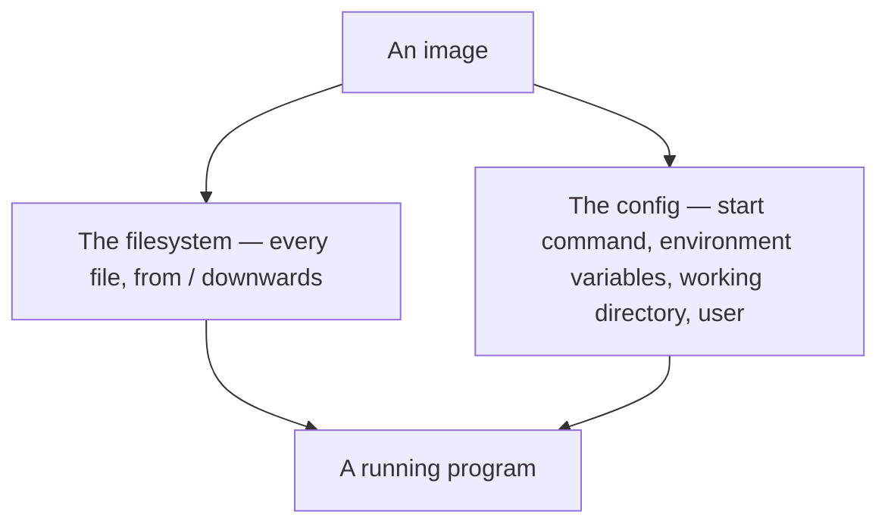

**The word image suggests a picture, or a plan for building something. It is neither.** What it actually names is far more literal, and getting that straight decides what every command later in this folder does.

# A filesystem, not a package

An **image** is a **complete root filesystem** — the whole contents of a **machine's disk**, from `/` downwards.

```text
/
├── bin/     the shell and the basic commands
├── etc/     configuration, the list of users, host names
├── lib/     the system libraries every program links against
├── tmp/     scratch space
├── usr/     installed programs and the files belonging to them
└── var/     logs and anything else that changes as the machine runs
```

A working machine, in other words, **minus the hardware** and **minus the kernel**. The kernel is left out because it is the thing an image runs on rather than anything an image could carry — [[05-Kernel]] takes up what follows from that.

The application is not what the image is made of. It is the last thing placed inside it, along with the **runtime that executes it** and a note of **which command to start.**

That note is the second part of an image, and it is far smaller than the first: beside the filesystem sits a short **config** recording how something should be started in the tree. Almost all of an image's weight is the tree, which is why the tree is the definition — but the config is what makes the tree runnable, and it gets its own section further down.

> An image **with no application** in it at all is still a perfectly good image. `alpine` is one, and it contains no program of yours whatsoever — just a functioning Linux **userland** with nothing running. 
> A jar containing no application would be pointless, because **a jar exists to hold an application.** An image exists to be a **filesystem**, and an application is **optional furniture** inside it.



The filesystem is the constant across all three. Everything above it is optional, and an image that stops at the first box is not a deficient image — it is the base that the other two were built on top of.

# The image becomes the process's root

A running machine has one filesystem with one root, shared by everything on it. When any two programs ask for `/etc/hosts`, the kernel begins at the same `/` and walks down to the same file.

What is easy to miss is that **`/` is not a fixed place. It is a starting point, and the kernel decides, separately for each process, where that starting point is.**

Before it reaches a machine an image is not a live filesystem at all. It is an archive of one, together with the config document, sitting in a registry. Pulling it downloads that archive, and unpacking it lays the files out on the host's disk — where at first they are an ordinary directory like any other:

```text
/
├── home/…
├── etc/hosts                    ← the host machine's version
└── var/lib/…/unpacked-image/    ← an ordinary directory, so far
    ├── bin/sh
    ├── etc/hosts                ← the image's version
    └── usr/bin/
```

> Starting a **program from an image** means **launching a process** and telling the kernel one extra thing: **for this process, `/` means that directory.**

From that point on the process asks for `/etc/hosts`, the kernel walks down from the **new starting point**, and hands back the image's copy. The process's entire view of the machine becomes:

```text
/
├── bin/sh
├── etc/hosts        ← the image's version
└── usr/bin/
```

No `home/`. No host `/etc/hosts`. And more than that — **it cannot even ask for them.** There is no path it can write that reaches above its own root, because `/..` resolves to `/` again. The rest of the machine is not hidden from the process; it is unnameable.

So the process is not pretending to be on a machine of its own. As far as every question it is capable of asking goes, it is on one, and that machine's entire disk is the image.



The two panels are not two filesystems. They are one set of files with two sets of names, and the swap is what decides which names a process gets to use. Note what has no counterpart on the right: `/home` and the host's own `/etc/hosts` are still sitting on the disk, and there is no longer any way to write down where they are.

# What is actually in one

An image is a filesystem, and beside it a short config record. **The start command is not a file in the tree** — it is metadata attached to the image rather than something living at a path, and so is every other field beside it.

The whole config is this short:

| Field | What it decides |
|---|---|
| Start command | What runs when a program is started from this image |
| Environment variables | Values that will already exist in that program's environment |
| Working directory | The directory it starts in |
| User | Which account it runs as |
| Exposed ports | A record of which ports the program listens on, kept as documentation |

**Every one of these is a default.** Each was fixed when the image was built, and each can be replaced at the moment the image is used — which is why the same image can be run with a command other than the one recorded inside it. The filesystem is what an image is; the config is a note attached to it saying how to start something in there.



**A language image is that idea at its simplest.** `python:3.12` is a Debian userland with Python already installed into it, and a config saying the default command is `python3`.

```text
the filesystem
/
├── usr/local/bin/python     already installed, not fetched at start
├── usr/lib/                 the system libraries Python links against
└── bin/, etc/, tmp/, var/   the rest of an ordinary Debian filesystem

the config, which is not a path in that tree
default command:    python3
working directory:  /
```

Nothing is installed when a program is started from it. Python is in the tree because somebody put it there when the image was made.

**An application image is the same shape with more in it:** the userland, a runtime installed into it, the application's own artifact, and a config naming the start command.

```text
the filesystem
/
├── opt/java/…/bin/java      the runtime
├── app.jar                  the application and every dependency it bundles
└── bin/, etc/, lib/, usr/   the userland underneath both

the config, which is not a path in that tree
default command:    java -jar /app.jar
working directory:  /
environment:        SPRING_PROFILES_ACTIVE=prod
user:               app
```

That covers everything a machine previously had to supply. The operating system's files come from the tree, the runtime comes from the tree, the application comes from the tree, and the command comes from the config. The only thing left outside is the kernel, for the reason given above.

# Result, not recipe

An image's filesystem is read-only, and none of it is a description of how to assemble anything. **The assembly already happened**, on some other machine, at some earlier time.

That is where the confusion starts, because an image is named like a plan and behaves like a product. Nothing inside one is fetched, resolved or installed at the moment it is used — the files are simply there. Starting a program from an image is not a small build. It is opening something already built, which is why it takes milliseconds rather than minutes.

Three things sit in a line, and only the first of them is instructions:

| Thing        | What it is                              | When the work happens         |
| ------------ | --------------------------------------- | ----------------------------- |
| `Dockerfile` | The steps for assembling an environment | Once, when the image is built |
| Image        | The environment those steps produced    | Already done                  |
| Container    | That environment, running               | Nothing left to do            |

> [!info] **The size is the price of the certainty.** A set of build instructions is a few lines of text; the image they produce runs to hundreds of megabytes. Shipping the result rather than the instructions means shipping everything the instructions would have produced — which is precisely what removes the chance of them producing something different next time.


