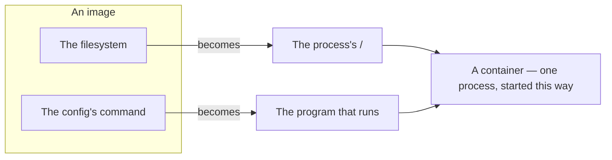
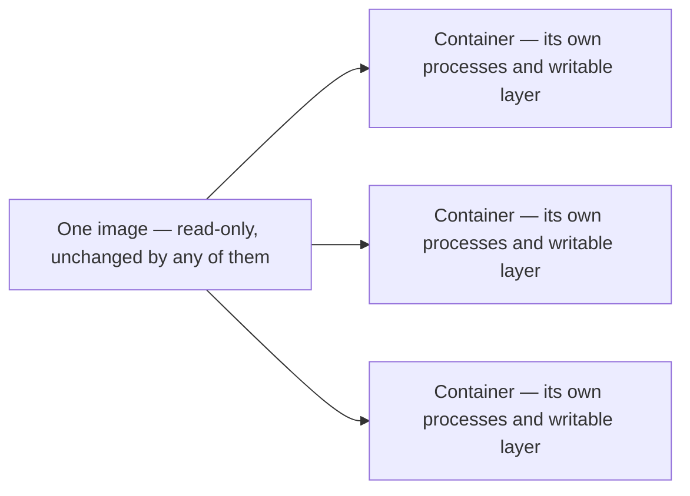
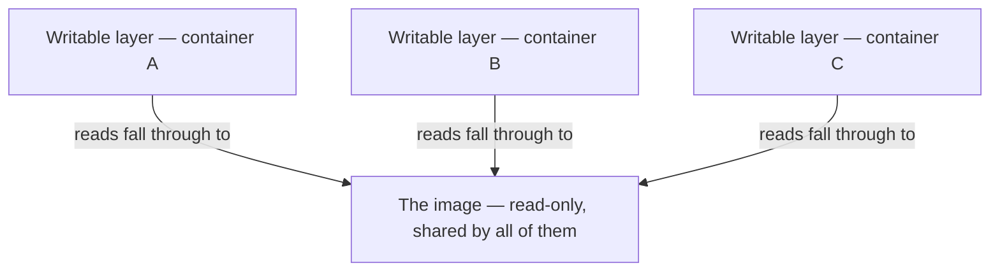
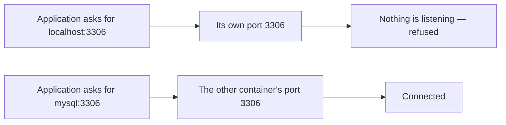
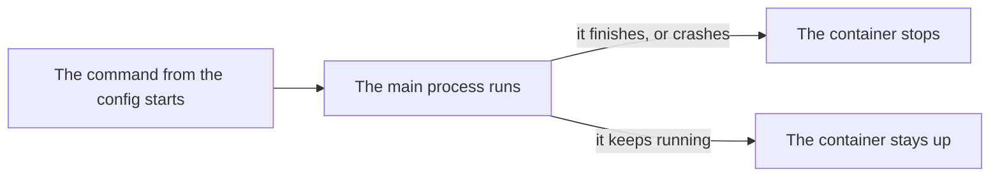
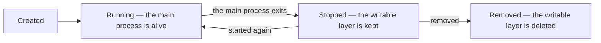

**An image is a filesystem and a config. A container is what happens when one of them is run.**

# Running an image

An image is a filesystem and a config naming a command. **Running it means the kernel starts one process, hands it that filesystem as its `/`, and runs that command.** Nothing more elaborate than that happens.

| From the image | Becomes |
|---|---|
| The filesystem | The process's `/` |
| The config's command | The program that process actually runs |



**The word container invites a wrong picture** — a box that gets created, boots up, and then has programs placed into it, like a small machine to start and log into.

There is no box. **The container is the process.** The kernel does not build a container and then run something inside it; it starts a program and at the moment of starting, says which **root** it will see, which **network** it will use and which **limits** apply to it. Container is the name for a process started with those things replaced, not a place the process lives in.

That is why there is nothing to boot and nothing to wait for. Starting a container takes milliseconds because starting a process takes milliseconds, and the filesystem it will see was already sitting on the disk before it began.

# One image, many containers

A **container** is a running instance of the environment an image holds, and the image is untouched by it — anything the container writes goes to a thin layer of its own.

In programming terms the **image is the class** and the **container is the object**. One class produces as many objects as you ask for, each with its own state, all from the same definition. One image produces as many containers as you ask for, each with its own processes and its own writable layer, all from the same files.



# Where the changes go

An image is read-only, and it is also the whole of a container's filesystem. Both are true, and programs inside a container still write files freely.

What makes that work is that a container does not only get the image. It gets **a thin, empty, writable layer stacked on top of it**, belonging to that container alone. Every lookup then runs top-down.

| The program does | What happens |
|---|---|
| Reads a file | The writable layer is checked first, and if the file is not there the image underneath is read |
| Creates a file | It is written into the writable layer, and the image never sees it |
| Changes a file that came from the image | The file is copied up into the writable layer first, and the copy is what changes |
| Deletes a file that came from the image | A marker is written in the writable layer recording it as gone, while the original stays in the image, masked |



The deletion case is the design in miniature: **an image is never modified, only shadowed.** Nothing a container does can reach back into the files it started from.

Three consequences follow, and all three come up constantly.

> [!important] **Many containers cost almost no extra disk.** 
> Five containers from one image share a single read-only copy of every file in it. What is duplicated five times is the **thin writable layer**, holding only what that particular container has changed. Running five copies of a 400 MB image does not consume 2 GB.

>[!important] **Removing a container removes everything it wrote.** 
>The writable layer goes with it and the image is left exactly as it was. A database run in a plain container therefore loses its data the moment the container is removed — which is this mechanism working correctly rather than failing, and is why **anything that has to outlive a container needs somewhere else to live.**

> [!important] **The first write to a large file is slow.** 
> Copying up means the entire file is duplicated into the writable layer before the change is applied, so altering one byte of a two-gigabyte file copies two gigabytes first.

---
# localhost means the container

The image gave the process its own filesystem. **The same arrangement gives it its own network**, and **its own view of what else is running** — so what a container really gets is **replaced surroundings**, of which the files are only the most visible part.

The network is the one that causes trouble, and it causes it early. Put an application in one container and its database in another, then configure the application the way you would on a laptop:

```text
jdbc:mysql://localhost:3306/lab
```

It fails, with the connection refused. Not a firewall, not a password, not a missing driver.

**`localhost` means this machine, wherever I happen to be** — and inside a container, this machine is the container. The application looked for a database inside its own container, found nothing listening on port 3306, and gave up. The database was never there to find.

| Where `localhost` is said | What it means |
|---|---|
| On the machine | The machine |
| Inside the application's container | That container |
| Inside the database's container | That container |

**The same fact is why port clashes stop happening.** Three containers can all listen on port 3000 at once without competing, because each has a port 3000 of its own — the way three houses can each have a number 12 on their own street.

What works instead is the other container's **name**:

```text
jdbc:mysql://mysql:3306/lab
```



That only works when the two containers have been put on the **same network**, which does not happen by default and is a separate problem with a separate answer — [[12-Container-Networking]] takes it up.

One smaller consequence of the same thing: a container sees only the processes started inside it. Listing what is running inside one shows almost nothing, which is disconcerting the first time and is the point rather than a fault.

# How long it lives

**When the container's main process exits, the container stops.** Nothing else is holding it open, because there is nothing else that it is.



That accounts for the first surprise everybody meets. An image whose command is a shell, started with nothing attached to type into it, ends instantly — the shell reads end of input, exits, and the container goes with it. An image whose command is a web server stays up, because a web server does not exit. Neither image is better made than the other: one has a command that finishes and one has a command that does not. **A container that will not stay running is usually working correctly.**

**The container's exit code is the process's exit code, unchanged.** So an application container that dies two seconds after starting is not a problem with containers at all — it is the application failing at startup, and the exit code and the log output are the ones that application would have produced anywhere else. A great deal of what looks like a container problem is an ordinary application problem wearing a costume.

Only the main process counts. If it starts something in the background and then returns, the container stops anyway and everything inside it is torn down along with it. Nothing survives the process that defined it.

**And this is the mechanical reason for one program per container**, rather than a matter of taste. A container's life is tied to exactly one process, so putting two programs inside means that the moment the watched one exits the other is killed mid-work, whatever it happened to be doing. There is no arrangement in which both are equals.

# Stopped is not removed

The difference between the two is where the writable layer goes.

| State | The process | What it wrote |
|---|---|---|
| Running | Alive | In its writable layer |
| **Stopped** | Gone | **Still there** |
| Removed | Gone | Gone |



**Stopping only kills the process.** The writable layer stays on disk untouched, so a stopped container is still a real object, and starting it again finds everything it had written exactly where it was left. A database container built from an image holding five rows, given three more while it ran, then stopped and started again, is looking at eight.

**Removing is what deletes the writable layer.** That is the moment those three rows cease to exist. The image was never touched by any of it, so a fresh container from that same image starts at five — not at eight, and not at whatever the previous container happened to leave behind.

The trap sits in between. Stopped containers are invisible in ordinary use: they do nothing, nothing shows them, and they accumulate quietly until somebody tidies up. **Tidying up is removal**, which is precisely the operation that deletes everything every one of those containers ever wrote. The routine housekeeping action and the destructive action are the same action.

**So data that matters does not live in a container.** That is not advice — the writable layer is bound to the container's lifetime by design, and nothing changes that. Anything which has to survive is stored outside the container entirely, and the container is given a window onto it, which is what [[11-Bind-Mounts-And-Volumes]] is for and why database images ship with an empty data directory rather than a full one.

**A container is disposable, and it is meant to be.** One process, a layer that dies with it, and no state carried forward are all built on the assumption that it will be thrown away and another started. Anything inside one that would be painful to lose is a sign it is in the wrong place.
