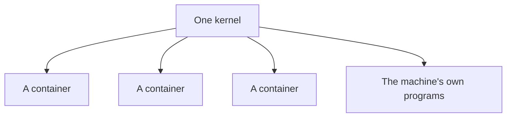

A container gets its **own filesystem**, its **own network** and its **own view of what is running**. What it **never gets is a kernel**.

# One kernel, shared

Every container on a machine, and the machine itself, run on the same kernel. There is not a second one anywhere, and there is no way to ask for one.



**A crash is contained.** A process inside a container that dies takes nothing else with it, and the containers beside it carry on without noticing. That is ordinary operating system behaviour rather than anything containers added — separate processes have always been separated that way.

**Consumption is not contained.** Memory, processor time and the slots for new processes all come from one pool belonging to the machine. A container's view of them is its own; its claim on them is not. **A container that takes all the memory has taken it from everything else on that machine, and no amount of separate views changes that.**

Which gives the sentence worth carrying away from this note:

> A container is a **fault boundary**, not a **security boundary**.

It stops accidents from spreading. It does not stop deliberate attacks, because an attack on the kernel is an attack on the one thing everything shares — and code that gets through it is loose on the machine and in every container beside it. **Running code you do not trust needs something stronger than a container.** That is a real category of problem with real answers, and none of them is a plain container.

# Limits are off unless you ask for them

**A container is given no ceiling by default.** It may take every byte of memory the machine has and every cycle of its processor, and nothing intervenes until the machine is in trouble.

What happens then is worth knowing, because it is not what people expect. The kernel does not kill the container that caused the problem. It runs an **out-of-memory killer** that picks a victim by its own reckoning, and that victim is frequently something else — a database, another service, whatever happened to look expensive at the moment the decision was made.

Setting a ceiling makes the failure land where it belongs:

```text
--memory   the most memory this container may use
--cpus     the share of processor time it may take
```

With a memory ceiling in place, a container that grows past it is killed on its own, and everything else on the machine is untouched. A container killed this way exits with **137**, which is worth recognising on sight: it means the process was killed outright rather than exiting, and running out of memory is much the commonest reason.

A ceiling is what makes a container a fault boundary at all. Without one it separates a program's view of the machine and does nothing whatever about its claim on the machine — so **the container was never the containment; the ceiling is.**

# A limit the process does not know about

Setting a ceiling on the container is half of the job. The program inside has to be told about it too, or it will work from a number that is no longer true.

The JVM is the clearest case, because it decides its maximum heap size at startup by looking at how much memory it thinks it has. **Before Java 10 it looked at the machine.** Given a 32 GB host and a 512 MB container, it would size a heap for 32 GB, allocate confidently past the ceiling, and be killed — with an exit code of 137 and nothing in the application logs to explain it, since from the application's point of view nothing went wrong.

Java 10 fixed the reading: **a modern JVM finds the container's limit and works from that instead.** But it does not use all of it, and this is the part that surprises people:

| Setting | Default | What it means |
|---|---|---|
| `MaxRAMPercentage` | **25** | The heap may grow to a quarter of the memory the JVM believes it has |

So a 512 MB container gives a heap ceiling of about 128 MB, whatever the application actually needs. The remaining three quarters are not wasted — thread stacks, metaspace, the garbage collector's own structures and native buffers all live outside the heap and all have to fit — but a quarter is a conservative starting point rather than a correct one, and raising it is a normal thing to do:

```text
-XX:MaxRAMPercentage=75
```

The processor ceiling has the same shape. A JVM sizes its garbage collection threads and its default thread pools from the number of processors it believes it has, so tightening a container's processor share quietly changes how much parallelism the application has available.

**The rule holds beyond the JVM.** A limit set on a container is enforced by the kernel whether or not the program inside knows about it. Any runtime that sizes something from available memory or available processors — a connection pool, a worker count, a cache — is guessing unless it has been told the real number.
