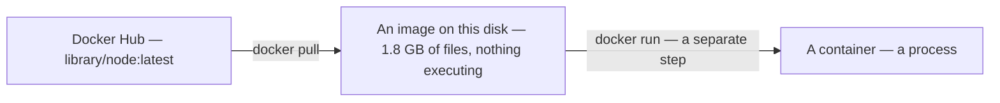
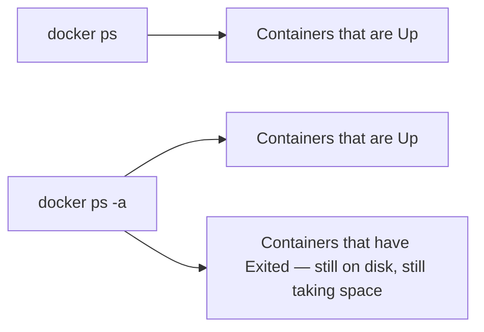
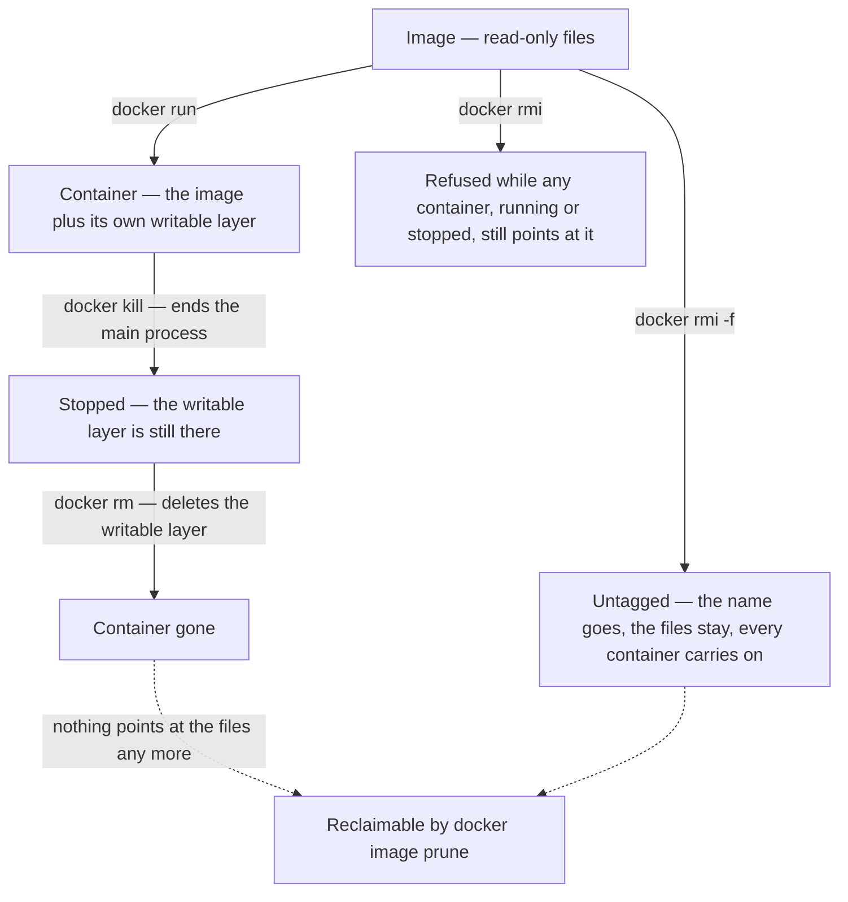
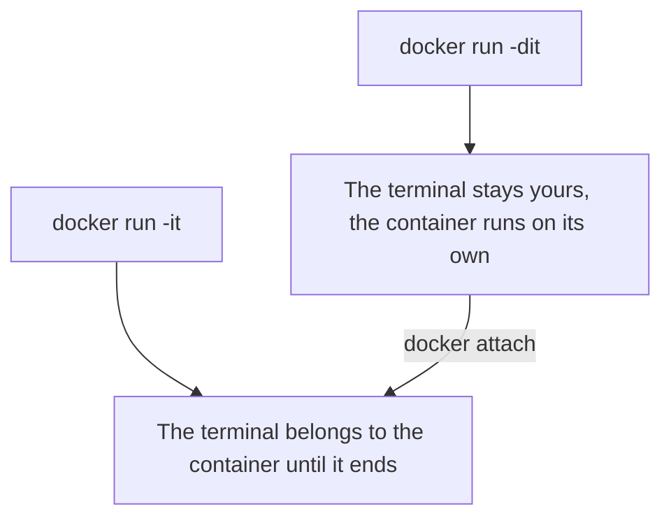
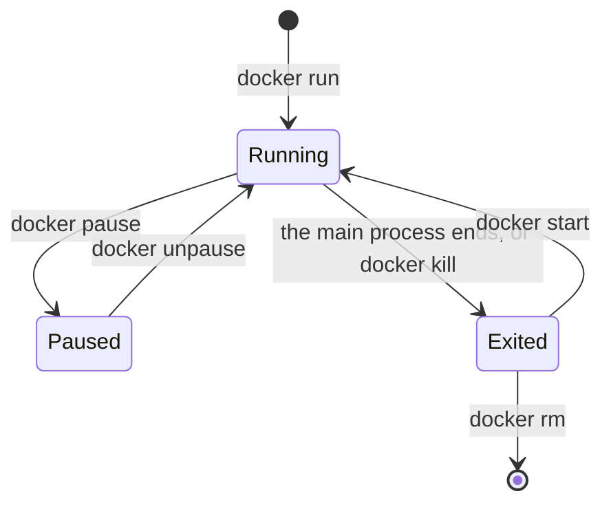
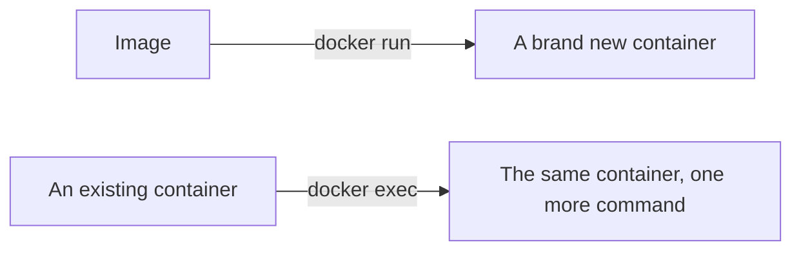
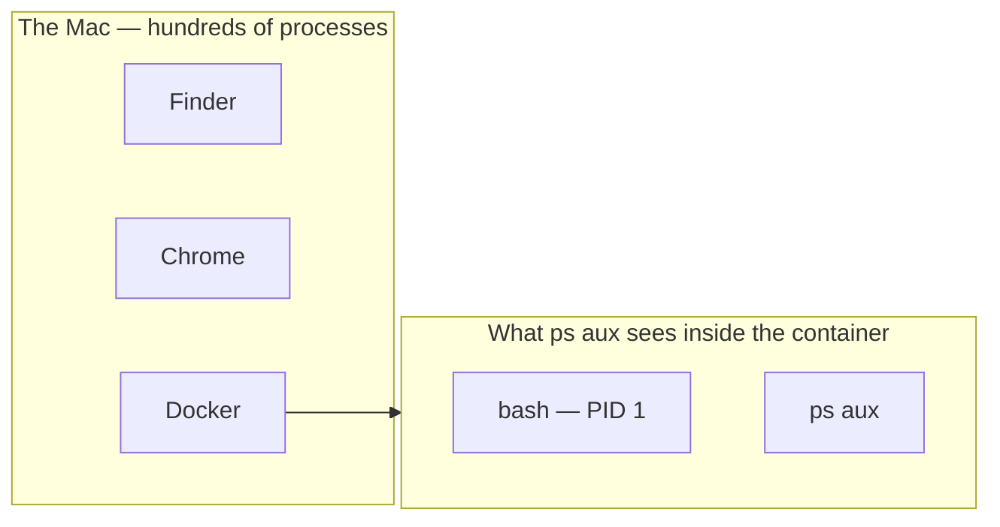
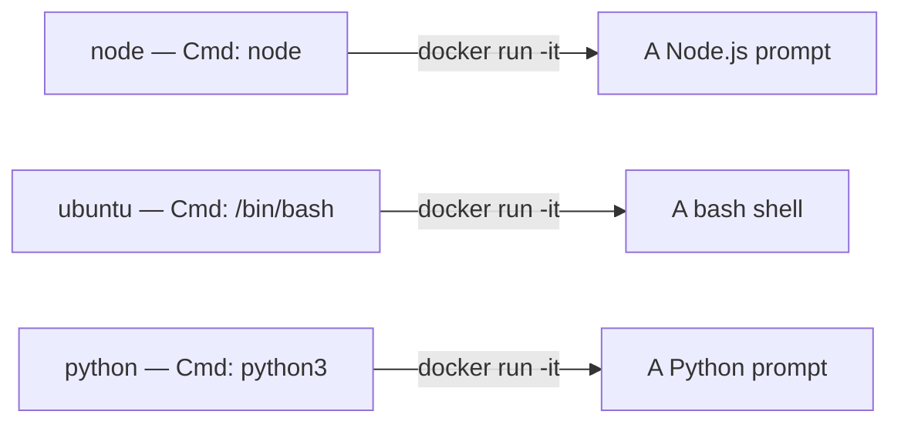
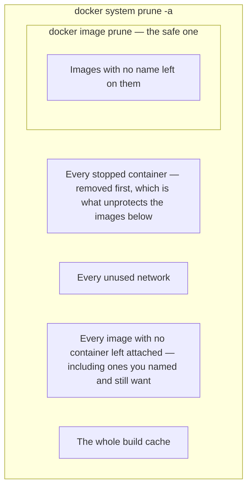

**With an image identified on Docker Hub, the next step is getting it onto the machine and turning it into something running.** That is a small set of commands, and the distinctions between them matter more than the flags do.

# Downloading an image

```bash
  docker pull node
```

```text
Using default tag: latest
latest: Pulling from library/node
Digest: sha256:f5d1cc40abc10c2843339a2134d07817cf33c405cb16bfd052b0ed790254c3a3
Status: Image is up to date for node:latest
docker.io/library/node:latest
```

**`pull` downloads an image and stops there.** Nothing runs and no container is created — the filesystem described in [[03-Images]] is fetched and unpacked onto the disk, and that is the whole of it.



One line in that output is worth reading rather than scrolling past. `Using default tag: latest` means no tag was given, so `latest` was assumed.

`pull` is safe to repeat. The first pull of an image prints a line per layer as it arrives and ends with `Status: Downloaded newer image for node:latest`; every pull after that reports `Image is up to date` instead, and downloads again only if the published image has changed.

> [!warning] **Images take real disk space.** `node:latest` is 1.8 GB unpacked. They accumulate quietly and are easy to forget about, so clearing them out periodically is part of using Docker rather than an optional tidy-up.

--- 
# Starting a container

```bash
  docker run -it --rm node
```

```text
Welcome to Node.js v26.8.1.
Type ".help" for more information.
> console.log("hello")
hello
undefined
>
```

**`docker run` takes an image, creates a container from it, and starts whatever that image says to start.** The Node.js image says to start `node`, so a Node.js prompt is what appears.

In that session, `hello` is what `console.log` printed and `undefined` on the line after is the value `console.log` returned, which the prompt echoes for every expression it evaluates.

> [!info]- **What a prompt is**
> A prompt is the small piece of text a program prints to say it has stopped and is waiting for you to type. The `>` above is Node.js's. Your shell has one, and so does the MySQL client with its `mysql>`.
>
> It is a signal rather than a component. The program has nothing left to do until it is given a line, so it prints its marker and waits. A program with no prompt is not necessarily broken — it simply never needed to wait for you.

Two flags are doing the work:

| Flag   | What it does                                                                 |
| ------ | ---------------------------------------------------------------------------- |
| `-it`  | Gives you an interactive terminal, so you can type into the container        |
| `--rm` | Deletes the container when it exits                                          |

**Some programs expect you to type at them — the Node.js prompt, a database shell, `bash`. Start one without `-it` and it stops as soon as it starts.** `docker run node` prints nothing and hands your shell straight back: Node.js started, found nothing connected that you could type into, and finished right there. [[04-Containers]] then takes the container down with the process. It is the first thing to check whenever a container refuses to stay up.

--- 

# Seeing what is running

```bash
  docker ps
```

```http
CONTAINER ID   IMAGE     COMMAND   CREATED   STATUS    PORTS     NAMES
```

On a machine with nothing running, that is all there is: column headings and no rows. Run it from a second terminal while two `docker run -it` sessions are open in others, and it has something to show.

Those seven default columns are wider than most terminals, so every row wraps and the table stops being a table. `--format` picks the columns instead:

```bash
  docker ps --format "table {{.ID}}\t{{.Image}}\t{{.Status}}\t{{.Names}}"
```

```text
CONTAINER ID   IMAGE     STATUS              NAMES
5f79d4fc73fe   node      Up About a minute   boring_lamport
f687b11dee73   node      Up About a minute   custom-node
```

**`table` asks for a header row, each `{{…}}` names a field, and `\t` puts a tab between them.** The listings below use those four columns for width; the other three are still in the real output.

Two rows, two containers, both from the same `node` image and each an independent object — which is [[04-Containers]] on one image producing as many containers as you ask for. The containers left behind by every exit without `--rm` are still missing here, and need the other form:



```bash
  docker ps -a
```

```
CONTAINER ID   IMAGE     STATUS                      NAMES

5f79d4fc73fe   node      Up About a minute           boring_lamport
f687b11dee73   node      Up About a minute           custom-node
89f4b63398b3   node      Exited (0) 14 minutes ago   pedantic_mclean
0dc35d9a2350   node      Exited (0) 14 minutes ago   beautiful_greider
```

Four rows where `docker ps` showed two. The same two running containers are at the top, and underneath them are the two from the earlier runs that exited seconds after starting — finished, but still on disk, still named, still occupying space.

| Column         | What it holds                                                                                                                                                       |
| -------------- | ------------------------------------------------------------------------------------------------------------------------------------------------------------------- |
| `CONTAINER ID` | The first 12 characters of the container's full id, which is enough to name it in any other command                                                                 |
| `IMAGE`        | The image it was created from                                                                                                                                       |
| `COMMAND`      | The command it was started with, truncated.                                                                                                                         |
| `CREATED`      | When the container was **made**, which is not when it stopped                                                                                                       |
| `STATUS`       | `Up …` while running, `Exited (n) …` after. The number in brackets is the exit code of the main process, and **`0` means it finished normally** rather than crashed |
| `PORTS`        | Empty until something is **published**, which is [[09-Ports]]                                                                                           |
| `NAMES`        | An adjective and a scientist, invented by Docker unless you supply your own                                                                                         |

> [!important] **`--rm` is what prevents that accumulation.** Exiting a container ends its process, and ending the process is not removal — the container is still there, writable layer and all, holding whatever disk it was holding a second earlier. Ten runs without `--rm` leave ten of them behind, and this listing is where they become visible.

--- 
# Stopping and removing

```bash
  docker kill custom-node
  docker rm custom-node
  docker rmi ubuntu
  docker rmi -f ubuntu
```

**`kill` stops a running container** by killing its main process. **`rm` removes a stopped one**, which is the moment its writable layer is deleted. **`rmi` removes an image** rather than a container — a different kind of object entirely, which is why it is a different command.


`rmi` is the one that argues:

```text
Error response from daemon: conflict: unable to delete ubuntu:latest (must be forced) - container ed6dabac781d is using its referenced image 2260313b31c8
```

**An image cannot be deleted while any container still refers to it, including a stopped one.** That is the layering from [[04-Containers]] enforcing itself: a container's writable layer is stacked on top of the image's files and holds only the differences, so removing the image underneath would leave a set of changes with nothing to be changes to.

**`-f` does not force the deletion through. It forces the name off.** The output says so in one word:

```text
Untagged: ubuntu:latest
```

The containers are untouched — a running one keeps running, a stopped one still starts again — and the image's files are still on disk, because those containers are stacked on them. What changes is that the files no longer have a name. `docker ps -a` stops showing `ubuntu` in its IMAGE column and shows the raw id `2260313b31c8` instead, `docker images` no longer lists the image at all, and `docker images -a` shows it as `<untagged>`, still 179 MB. New containers can still be started from that id; `docker run ubuntu` cannot, because the name now resolves to nothing and Docker would go back to Docker Hub for it.

The files are only genuinely gone once the last container referring to them is removed. At that point nothing names them and nothing uses them, which is the definition of a dangling image and exactly what `docker image prune` sweeps up.




---

# Running in the background

Every container so far has taken over the terminal it was started from. That window belongs to the container until it ends, so you cannot type anything else into it and need a second window to run any other command. To start a container and keep using the terminal you started it from:

```bash
  docker run -dit --name custom-node node
```

```text
f687b11dee732bc9166c3d508dc7591d9cf3b34f99b59f4b82e1837a2433be6c
```

**`-d`, or `--detach`, starts the container in the background** and prints its full id — the same id `docker ps` shows the first twelve characters of. That is the only thing printed, because whatever the container writes no longer arrives in this terminal.

**`--name` replaces Docker's invented name with one of your own**, which is what makes a container easy to refer to afterwards. `docker kill custom-node` is a command you can type from memory; `docker kill f687b11dee73` is one you have to look up first.



```bash
  docker ps
```

```text
CONTAINER ID   IMAGE     STATUS              NAMES
5f79d4fc73fe   node      Up About a minute   boring_lamport
f687b11dee73   node      Up About a minute   custom-node
```

`Up` rather than `Exited` this time. `-it` kept a terminal connected, so Node.js is sitting there waiting for something to be typed instead of finishing the moment it started.

```bash
  docker attach custom-node
```

**`attach` hands the terminal back to a container running in the background.** It is the reverse of `-d`, and it does not start anything new: what appears is the same process that has been running all along.

> [!warning] **Exiting an attached session stops the container.** You are attached to the main process, so leaving it ends that process, and the container's lifetime is that process's lifetime. To look inside a container and leave it running afterwards, use `exec` rather than `attach`.

> [!info]- **Attaching from a second terminal, and what Ctrl+C does**
> Attaching from a second terminal does not open a second session either. Start `docker run -it --rm node` in one window and `docker attach` to it from another, and the two windows are **wired to the same single process**: whatever is typed in one appears in both.
>
> Ctrl+C in either of them is passed straight through to that process, and what happens next is the program's decision rather than Docker's. Node.js catches the interrupt and declines to die:
>
> ```text
> (To exit, press Ctrl+C again or Ctrl+D or type .exit)
> ```
>
> Press it again and Node.js does exit. The main process is gone, so the container is gone, and because it was started with `--rm` it is deleted rather than left behind — `docker ps -a` lists nothing. The first window, which did none of this, is dropped back to its own shell at the same moment.
>
> **A Spring Boot application would not survive the first one.** It treats an interrupt as a request to shut down, runs its shutdown hooks and exits normally, so a single Ctrl+C through an attached session stops that container. `bash` and the Node.js prompt are the exceptions, not the rule.
>
> That is the practical case for `exec` over `attach`. `docker exec -it custom-node bash` starts a separate process of your own, and Ctrl+C in it interrupts only that shell — the container's main process never sees the signal and keeps running.

---

# Pausing instead of stopping

```bash
  docker pause custom-node
  docker unpause custom-node
```

```text
CONTAINER ID   IMAGE     STATUS                       NAMES
5f79d4fc73fe   node      Up About a minute            boring_lamport
f687b11dee73   node      Up About a minute (Paused)   custom-node
```



**Pausing freezes the container's processes where they stand.** The status reads `Up … (Paused)` rather than `Exited`, and the distinction is exact: the processes still exist and still hold their memory, they are simply **never scheduled to run**. Unpausing puts them back to `Up` and they carry on from the instruction they were on. **Stopping, by contrast, ends the process** — there is nothing left to resume, only a container to start again from the beginning.

---
# run and exec are not the same

This is the distinction worth being careful about.



**`docker run` takes an image and creates a new container from it.** Every invocation produces another container — which is exactly how two accumulated above from two commands.

**`docker exec` takes a container that already exists and runs an extra command inside it.** It creates nothing.

That is why the two commands name different things — `run` is followed by an image, `exec` by a container:

```bash
  docker exec custom-node ls /
```

```text
bin
boot
dev
etc
home
lib
media
mnt
opt
proc
root
run
sbin
srv
sys
tmp
usr
var
```

A whole Linux filesystem, which is what an image is. `-it` works here for the same reason it works on `run`, and is how you get a shell rather than a single command:

```bash
  docker exec -it custom-node bash
```

---
# Looking around inside

Because a container runs on an operating system, that operating system can be explored. Doing so means starting something other than the program the image starts by default, and the command has room for exactly that:

```text
docker run  [flags]  <image>  [what to run instead]
```

**Everything after the image name is optional, and whatever is put there replaces the image's default start command.** That default is the `Cmd` field of the config, which for the Node.js image reads `node`. It decides what runs when you say nothing, and it is a default rather than a rule:

| Command | What starts inside |
|---|---|
| `docker run -it node` | `node`, because nothing was written after the image |
| `docker run -it node bash` | `bash` |
| `docker run -it node pwd` | `pwd`, which prints `/` and finishes |

The image is identical in all three. It is the same filesystem holding the same programs, and you are choosing which one to start.

The middle row is the one that lets you look around, since `bash` is the shell of the Linux system the image is built on rather than a Node.js prompt:

```bash
  docker run -it node bash
```

From inside you can run any or all of them :

```bash
  pwd
  whoami
  cat /etc/issue
  ps aux
  touch test.py
  ls
```

```text
/
root
Debian GNU/Linux 13 \n \l

USER       PID %CPU %MEM    VSZ   RSS TTY      STAT START   TIME COMMAND
root         1  0.0  0.0   3904  2968 ?        Ss   11:11   0:00 bash
root        10  0.0  0.0   6008  3276 ?        R    11:11   0:00 ps aux

bin   dev   home  media  opt   root  sbin  sys      tmp  var
boot  etc   lib   mnt    proc  run   srv   test.py  usr
```



Four things in that output are the earlier notes showing up as observable facts:

- **`cat /etc/issue` prints Debian GNU/Linux 13** — on a Mac. The Node.js image is Debian with Node.js installed on top, and that Debian is what the process sees as its operating system.
- **`ps aux` lists two processes and no more.** Not the hundreds running on the Mac — `bash` at PID 1 and the `ps` that was just typed. The whole process table is this container's, and `bash` is PID 1 because it is the main process whose exit ends the container.
- **`whoami` says `root`**, and `pwd` says `/`, because those are the user and working directory recorded in the image's config.
- **`test.py` appears in `ls`** and exists nowhere on the Mac. It went into the writable layer from [[04-Containers]], and it dies with the container.

A one-shot command behaves the same way but is over sooner. `docker run -it node ls` prints that same root directory and stops, because listing a directory is all the work there was — the main process finished, so the container finished. Nothing is left running afterwards, and `-it` buys nothing on a command that never reads anything typed at it.

> [!important] **You can only run what the image's filesystem actually holds.** `ls` and `pwd` work here because the Node.js image is Debian and Debian ships them. On an image built to hold one program and nothing else, there is no shell and no `ls` to find:
>
> ```text
> docker run --rm hello-world ls /
> exec: "ls": executable file not found in $PATH
> ```

---

# Asking an image what it does

```bash
  docker inspect node
```

That returns around fifty lines describing the image. The part that explains everything above is its config:

```text
{
    "Env": [
        "PATH=/usr/local/sbin:/usr/local/bin:/usr/sbin:/usr/bin:/sbin:/bin",
        "NODE_VERSION=26.8.1"
    ],
    "Entrypoint": [
        "docker-entrypoint.sh"
    ],
    "Cmd": [
        "node"
    ]
}
```

**This is the config record from [[03-Images]], on disk and readable.** `Env` is the environment every process in the container starts with. `Cmd` is the default start command — `node`, which is why `docker run -it node` opens a Node.js prompt. `Entrypoint` is a small setup script the image runs first and hands the command to, which is what the `COMMAND` column in `docker ps` was showing.

The same field on a different image explains a different behaviour:

```text
{
    "Env": [
        "PATH=/usr/local/sbin:/usr/local/bin:/usr/sbin:/usr/bin:/sbin:/bin"
    ],
    "Cmd": [
        "/bin/bash"
    ]
}
```



`docker run -it ubuntu` drops into a shell and `docker run -it node` drops into a Node.js prompt, from the identical command, because the two images record different defaults. The Python image records `python3`, so `docker run -it python` is the same thing as entering a container's operating system and typing `python3` — the image simply does it for you.

That Ubuntu container reports Ubuntu 26.04 LTS from `/etc/issue`, on a Mac host, in a session where every Ubuntu command works as expected.

---

# Cleaning up

Cleaning up needs one distinction first: a name and an image are not the same thing. `docker images` prints both, side by side:

```text
IMAGE         ID
node:latest   f5d1cc40abc1
```

`f5d1cc40abc1` is the image, meaning the files themselves. `node:latest` is a name stuck on it. Give the same image a second name and nothing is copied:

```bash
  docker tag node:latest my-copy:v1
```

```text
IMAGE         ID             DISK USAGE
my-copy:v1    f5d1cc40abc1        1.8GB
node:latest   f5d1cc40abc1        1.8GB
```

Two rows, one id, and still 1.8 GB on the disk rather than 3.6. Take one name away and the image is untouched:

```bash
  docker rmi my-copy:v1
```

```text
Untagged: my-copy:v1
```

**An image with no names left on it is called dangling.** The files are still there and still occupying space, but there is no longer anything you can type to refer to them. Nothing can start a container from them and nothing can be built on them — they are pure waste, which is why one command exists to sweep up exactly those and nothing else:

```bash
  docker image prune
```

```text
WARNING! This will remove all dangling images.
Are you sure you want to continue? [y/N] y
Total reclaimed space: 0B
```

Here it found none and reclaimed nothing. The way you will actually produce one is the force-removal from earlier in this note: `docker rmi -f` takes the name off an image whose containers still exist, and what it leaves behind is precisely a dangling image, collectable the moment the last of those containers is removed.

```bash
  docker system prune -a
```

```text
WARNING! This will remove:
  - all stopped containers
  - all networks not used by at least one container
  - all images without at least one container associated to them
  - all build cache

Are you sure you want to continue? [y/N]
```

The warning lists exactly what it means, and the third line is the one to read twice. It does not say dangling images. It says every image with no container attached to it, which is a completely different question to ask.

**Dangling asks whether an image still has a name. Attached asks whether anything is using it.** The two are independent, and `node:latest` is the case that matters: it has a name, so `docker image prune` will never touch it, however long it sits there unused.

|  | `docker image prune` | `docker system prune -a` |
|---|---|---|
| The question it asks | Has this image lost its name? | Is anything using this image right now? |
| A named image with no containers | Keeps it | Deletes it, all 1.8 GB of it |
| An untagged leftover | Deletes it | Deletes it |

The first can only ever delete something there is no way to refer to, so it cannot cost you anything. The second deletes images you named, pulled deliberately and will want again in ten minutes, purely because nothing happens to be running from them at that moment.

**And a stopped container does not save you here, even though it saves you everywhere else.** `docker rmi` refuses while a stopped container points at an image, because that container's writable layer is stacked on the image's files. Read the warning in order and you can see that protection being dismantled: the first line deletes all stopped containers, and the third line then asks what is still attached. By the time the question is asked, the things that would have answered it are gone. Only a running container survives the first line, so only a running container actually protects its image.



> [!warning] **`docker system prune -a` deletes every image not currently in use, not just the unnamed ones.** Two exited containers and a `node` image is enough: it removes the containers, finds the image now has nothing attached, and takes 1.8 GB with it. Everything it removes has to be downloaded or rebuilt next time. It is the right tool for reclaiming space or forcing a genuinely fresh build, and the wrong one to run casually.
