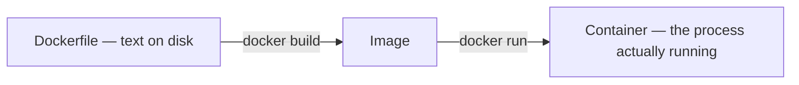
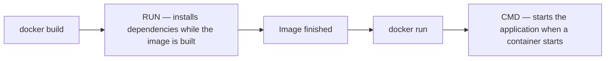

**Every image used so far was built by somebody else.** Building one means writing down the instructions yourself, in a file that Docker reads top to bottom. That file is called a Dockerfile, and the file is literally named `Dockerfile` with no extension.

# The smallest possible one

```dockerfile
1  # Dockerfile
2  FROM node
3
4  CMD ["node", "-e", "console.log(100)"]
```

**`FROM` sets the base image.** Almost nothing is built from nothing: the Node.js image is itself Debian with Node.js installed on top, and this file takes that whole thing as its starting point and adds to it.

**`CMD` sets the command a container runs when it starts.** It takes an array, and the rule for filling it in is short: the first element is the program, every element after it is an argument handed to that program. Splitting is your job — no shell reads this line, so nothing downstream will break a string apart on your behalf.

| Element | What it is |
| --------------------- | ------------------------------------------------------- |
| `node` | the program to start |
| `-e` | an argument, read by `node` itself |
| `console.log(100)` | another argument, the code that `-e` asks for |

> [!important] **Only one `CMD` takes effect.** A Dockerfile may contain several, but the last one wins, so writing more than one is a way to confuse yourself rather than a way to run two commands.

> [!info] Instruction keywords are written in capitals by convention — `FROM`, `CMD`, `COPY`. Everything else is ordinary text and its case matters where the underlying command cares.

---

# Building it

```bash
1  docker build .
```

Two moving parts: the subcommand `build`, and one positional argument, the dot. What it does is go to that folder, find the file named `Dockerfile` inside it, read it top to bottom, carry out each instruction, and save the result as an image. The dot is the **build context** — the folder handed over to the builder, which is the only place `COPY` can read from. A dot means the folder you are standing in; a path can be given instead.

The output is numbered, and each number maps onto something in the file:

```text
#1 [internal] load build definition from Dockerfile
#1 transferring dockerfile: 87B done

#2 [internal] load metadata for docker.io/library/node:latest

#3 [internal] load .dockerignore
#3 transferring context: 2B done

#4 [1/1] FROM docker.io/library/node:latest@sha256:f5d1cc40abc1…
#4 CACHED

#5 exporting to image
#5 exporting layers done
#5 exporting config sha256:1864bb253585…
#5 naming to moby-dangling@sha256:a1765d802202…
```




**Building never runs your application.** It produces an image and stops. Starting it is a separate command.

# An image with no name

Read the last line of that build output again:

```text
#5 naming to moby-dangling@sha256:a1765d802202…
```

`moby-dangling` is not a name you can use. It is Docker's internal word for an image with nothing written on it, and it is what you get when you build without saying what to call the result. The listing agrees:

```text
docker images

REPOSITORY   TAG       IMAGE ID   SIZE
```

Empty — while a finished 1.78 GB image sits on the disk. `docker images` lists **named** **images**, so this one has to be asked for specifically:

```text
docker images -a

REPOSITORY   TAG       IMAGE ID       SIZE
<none>       <none>    142eafa2ce3a   1.78GB
```

> [!important] **Every image is addressable by its id, always.** That is the floor, and it is unusable on its own: twelve random characters, to be read off `docker images -a` before every run.

# Giving it a name

Same Dockerfile, same folder, one flag added:

```bash
  docker build -t my-basic-image .
```

```text
#5 naming to docker.io/library/my-basic-image:latest done
```

Docker had a name to write down this time, so it wrote that instead of falling back to `moby-dangling`, and the image turns up in the ordinary listing.

**The name is not made of the image — it is stuck onto it.** So it can be stuck on afterwards, to an image that already exists. The unnamed one from the section above was still sitting there:

```text
docker tag 142eafa2ce3a rescued-image

REPOSITORY       TAG       IMAGE ID       SIZE
<none>           <none>    a1765d802202   1.78GB
my-basic-image   latest    a8cc88463e08   1.78GB
rescued-image    latest    142eafa2ce3a   1.78GB
```

`142eafa2ce3a`, the same id as before, the same 1.78 GB. Nothing was copied and nothing was rebuilt — it has a name now, and the name works:

```text
docker run --rm rescued-image

100
```

That is the same `docker tag` from [[07-Working-With-Containers]], arriving from the other side. **`-t` is `docker tag` folded into the build**, so it does not have to be a second step.

> [!info]- **Why three builds of one file produced three different ids**
> Building that Dockerfile three times gave `142eafa2ce3a`, `a1765d802202` and `a8cc88463e08`, which looks like three different images. They are not. All three report the same layers, the same creation timestamp, the same `Cmd` and the same architecture, and every build printed the identical `exporting config sha256:1864bb253585…`.
>
> What moved is a wrapper. Alongside the image, each build also writes an **attestation** — a record of who built it, when, and from what — and that line reads `exporting attestation manifest sha256:…` with a different digest every time, because it contains a build timestamp. The ID column shows the digest of the bundle holding image plus attestation, so the bundle moves even when the image inside does not.
>
> Turning it off makes that visible. `docker build --provenance=false` twice over produced `d0c27b2e64ee` both times — one id, two builds. The build is reproducible; the attestation is what was changing.

# One name holds one image

Change the Dockerfile to print `200` instead of `100`, then rebuild under the name it already had:

```text
docker build -t my-basic-image .

REPOSITORY       TAG       IMAGE ID
<none>           <none>    a1765d802202
my-basic-image   latest    9a943008b0a7
```

```text
docker run --rm my-basic-image

200
```

The build that printed `100` is not in that listing under any name. **A name points at exactly one image, so pointing it somewhere new means it stops pointing where it was** — and nothing else was holding the old one, so it went.

That is the problem to solve. Both builds are wanted, and one name cannot carry them.

**So the label has two halves, separated by a colon.**

```bash
1  docker build -t my-basic-image:v1 .
2  docker build -t my-basic-image:v2 .
```

```text
REPOSITORY       TAG       IMAGE ID
my-basic-image   latest    9a943008b0a7
my-basic-image   v2        8d484bfad122
my-basic-image   v1        a5b4f77694af
```

```text
docker run --rm my-basic-image:v1
100

docker run --rm my-basic-image:v2
200
```

| Half | In `my-basic-image:v1` | What it is |
| ---------- | ---------------- | ----------------------------------------------------------------- |
| Repository | `my-basic-image` | The name of the thing. Every version of it sits under this prefix. |
| Tag        | `v1`             | Which version.                                                     |

**A repository is not a folder and not a place on disk.** It is the grouping half of the label, which is what the `REPOSITORY` column has been showing all along — three rows, one repository, three tags. `node:22` and `ubuntu:24.04` from [[06-Hub-And-Tags]] are the same shape: `node` is the repository, `22` is the tag.

A tag is a plain string. `v1`, `2.1.7`, `debian`, `friday-build` — Docker attaches no meaning to any of them.

# What latest actually is

Nobody typed `latest` anywhere above, and it keeps appearing. It is the word Docker fills in when the tag half is left blank:

```text
docker run --rm my-basic-image
200

docker run --rm my-basic-image:latest
200
```

Identical instruction. The same fill-in happens on the build side, which is why `-t my-basic-image` produced a row reading `latest`.

> [!warning] **`latest` does not mean newest.** It is an ordinary tag with no special power, and nothing keeps it current. Point it at an older build and it stays there:
>
> ```text
> docker tag my-basic-image:v1 my-basic-image:latest
>
> REPOSITORY       TAG       IMAGE ID
> my-basic-image   v2        8d484bfad122
> my-basic-image   latest    a5b4f77694af
> my-basic-image   v1        a5b4f77694af
> ```
>
> ```text
> docker run --rm my-basic-image
> 100
> ```
>
> `v2` is still there and still newer. `latest` now resolves to the older build, and a bare `my-basic-image` prints `100`. Docker raised no objection, because to it `latest` is a five-letter string like any other. The only reason it usually does point at the newest thing is that people tag their newest release that way by hand.

That listing shows one more thing. `latest` and `v1` both read `a5b4f77694af` — **one image wearing two labels**, which is what `docker tag` produced back in [[07-Working-With-Containers]]. And the row for `9a943008b0a7` is gone, because `latest` was the only label on it and moving that label away left nothing holding it.

---

# A real application

A bare command is not an application. The rest of a Dockerfile is about getting a project inside the image and installing what it needs.

The project is a small FastAPI application. Three files, and no framework machinery beyond the one route:

```python
1  # main.py
2  from fastapi import FastAPI
3
4  app = FastAPI()
5
6
7  @app.get("/")
8  def home():
9      return {"message": "hello from inside the container"}
```

```toml
1  # pyproject.toml
2  [project]
3  name = "app"
4  version = "0.1.0"
5  requires-python = ">=3.13"
6  dependencies = ["fastapi[standard]"]
```

`uv lock` turns that dependency list into a `uv.lock` recording the exact version of every package, direct and indirect. Those three files are what the image needs.

```dockerfile
1  # Dockerfile
2  FROM ghcr.io/astral-sh/uv:python3.13-bookworm-slim
3
4  WORKDIR /app
5
6  COPY . .
7
8  RUN uv sync --locked
9
10 ENV PORT=3000
11
12 CMD ["uv", "run", "fastapi", "run", "main.py", "--port", "3000"]
```

**Line 2 is a base image with `uv` already in it**, published by uv's own authors. `FROM python` would work too, but then installing `uv` becomes the first thing every build has to do.

**`WORKDIR` sets the directory to work in, inside the container.** If it does not exist it is created, and every instruction after it runs from there.

**`COPY <source> <destination>`** copies from the build context into the image. The first dot is the current directory on the machine doing the build; the second is the working directory inside the image.

**`RUN` executes a command while the image is being built.** Here it installs the project's dependencies.

**`ENV`** sets an environment variable that will exist inside the container.

> [!info] `ENV PORT=3000` is the documented form. Older files write `ENV PORT 3000` with a space, which still works but is the legacy syntax.

It is built and named exactly as the two-line one was:

```bash
1  docker build -t my-fastapi-server .
```

`my-fastapi-server` is the name [[09-Ports-And-Signals]] goes on to use.

# Why --locked

`uv sync` on its own is allowed to update the lockfile. If `pyproject.toml` asks for something the lock does not cover, it resolves the dependency afresh and writes a new lock — which means the image you build today may not contain what the image you built last week contained.

**`--locked` forbids that.** It installs strictly what `uv.lock` records, and if the lockfile does not match `pyproject.toml` it stops rather than improvising:

```text
error: The lockfile at `uv.lock` needs to be updated, but `--locked` was provided.

hint: To update the lockfile, run `uv lock`.
```

For an image, exact reproduction is the whole point — the reason to build one at all is that everybody gets the same environment. A build that silently resolves a different version defeats it, so `--locked` is the right default and the error above is the flag doing its job.

# RUN and CMD happen at different times

These two are easy to mix up, and the difference is when they run.



**`RUN` is build time.** Whatever it does becomes part of the image, and it does not happen again when a container starts.

**`CMD` is start time.** It is what the container does when it comes up, and it runs afresh for every container.

# The same shape in another language

Nothing above is specific to Python. A Node.js project is the same file with different names in it, and it is the one [[10-Building-From-A-Repository]] and [[11-Bind-Mounts-And-Volumes]] go on to use.

```dockerfile
1  # Dockerfile
2  FROM node
3
4  WORKDIR /developer/nodejs/node-bind-mount-project
5
6  COPY . .
7
8  RUN npm ci
9
10 ENV PORT=3000
11
12 CMD ["npm", "start"]
```

Built and named the same way, as `my-node-server`:

```bash
1  docker build -t my-node-server .
```

`FROM node` instead of a uv base image, `npm ci` instead of `uv sync --locked`, `npm start` instead of `uv run`. The structure — base image, working directory, copy, install, start command — does not change.

**`npm ci` is the same idea as `--locked`.** `npm install` resolves versions afresh and may pick up something newer; `npm ci` performs a clean install from `package-lock.json`, reproducing exactly what is recorded there. Every ecosystem has this pair, and for an image you always want the second one.

> [!info] **A server inside a container must bind to `0.0.0.0`, not `localhost`.** Bound to `localhost` it accepts connections only from inside that container, which makes it unreachable from the machine running it. `0.0.0.0` accepts them on every interface. FastAPI's `fastapi run` already binds that way; a hand-written server usually has to be told. How the connection is made at all is the subject of [[09-Ports-And-Signals]].
