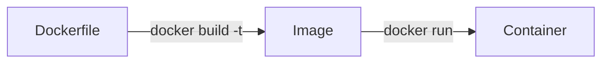
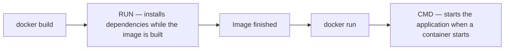

**Every image used so far was built by somebody else.** Building one means writing down the instructions yourself, in a file that Docker reads top to bottom. That file is called a Dockerfile, and the file is literally named `Dockerfile` with no extension.

# The smallest possible one

```dockerfile
1  # Dockerfile
2  FROM node
3
4  CMD ["node", "-e", "console.log(100)"]
```

**`FROM` sets the base image.** Almost nothing is built from nothing: the Node.js image is itself Debian with Node.js installed on top, and this file takes that whole thing as its starting point and adds to it.

**`CMD` sets the command a container runs when it starts.** It takes an array — the program, then each argument as its own element. Here `node -e "console.log(100)"` runs a single JavaScript statement without opening a prompt or writing a file.

> [!important] **Only one `CMD` takes effect.** A Dockerfile may contain several, but the last one wins, so writing more than one is a way to confuse yourself rather than a way to run two commands.

> [!info] Instruction keywords are written in capitals by convention — `FROM`, `CMD`, `COPY`. Everything else is ordinary text and its case matters where the underlying command cares.

# Building and running it

```bash
1  docker build -t my-basic-image .
2  docker run -it my-basic-image:latest
```

`-t` gives the image a tag, so it appears under a name you chose instead of no name at all. The trailing dot is the **build context** — the directory Docker reads the Dockerfile and the files from. A dot means the current directory; a path can be given instead.



Enter that container with `bash` and `cat /etc/issue` reports Debian, because the base image is Node.js and the Node.js image is built on Debian. What was added is the command it runs.

# A real application

A bare command is not an application. The rest of a Dockerfile is about getting a project inside the image and installing what it needs.

```dockerfile
1  # Dockerfile
2  FROM node
3
4  WORKDIR /developer/nodejs/node-bind-mount-project
5
6  COPY . .
7
8  RUN npm ci
9
10 ENV PORT=3000
11
12 CMD ["npm", "start"]
```

**`WORKDIR` sets the directory to work in, inside the container.** If it does not exist it is created, and every instruction after it runs from there.

**`COPY <source> <destination>`** copies from the build context into the image. The first dot is the current directory on the machine doing the build; the second is the working directory inside the image.

**`RUN` executes a command while the image is being built.** Here it installs the project's dependencies.

**`ENV`** sets an environment variable that will exist inside the container.

> [!info] `ENV PORT=3000` is the documented form. Older files write `ENV PORT 3000` with a space, which still works but is the legacy syntax.

# Why npm ci rather than npm install

`npm install` resolves the dependency versions afresh and may pick up something newer. `npm ci` performs a clean install from `package-lock.json`, reproducing exactly the versions recorded there.

For an image, exact reproduction is the point — the entire reason for building one is that everybody gets the same environment. `npm ci` is the better default.

# RUN and CMD happen at different times

These two are easy to mix up, and the difference is when they run.



**`RUN` is build time.** Whatever it does becomes part of the image, and it does not happen again when a container starts.

**`CMD` is start time.** It is what the container does when it comes up, and it runs afresh for every container.

# When the working directory and the copy disagree

Setting `WORKDIR` to one directory and copying the project into a subdirectory of it produces a build failure that looks unrelated to either instruction. `npm ci` complains that it can only install with an existing `package-lock.json`.

The cause is that `RUN` executes in the working directory, and the project is not there — it is one level down, in the folder `COPY` was told to create. Opening a shell in the built image and listing the working directory shows an empty folder beside the project folder, which is exactly what was described.

> [!important] **Make the working directory the directory you copy into.** Line 4 and line 6 above have to agree, or every instruction after them runs somewhere the project is not.

# The same shape in another language

Nothing above is specific to Node.js. A Flask application is the same file with different names in it.

```python
1  # app.py
2  from flask import Flask
3
4  app = Flask(__name__)
5
6  @app.route('/home')
7  def execute():
8      return 'hello'
9
10 if __name__ == '__main__':
11     app.run(host='0.0.0.0', port=3005)
```

```dockerfile
1  # Dockerfile
2  FROM python
3
4  WORKDIR /developer/pythonproject/flask-app
5
6  COPY . .
7
8  RUN pip install --no-cache-dir flask
9
10 CMD ["python3", "app.py"]
```

`FROM python` instead of `FROM node`, `pip install` instead of `npm ci`, `python3 app.py` instead of `npm start`. The structure — base image, working directory, copy, install, start command — does not change.

> [!info] **On line 11 of `app.py`, the host is `0.0.0.0` rather than `localhost`.** A server bound to `localhost` inside a container accepts connections only from inside that container, which makes it unreachable from the machine running it. Binding to `0.0.0.0` accepts them on every interface. How that connection is made at all is the subject of the next note.
