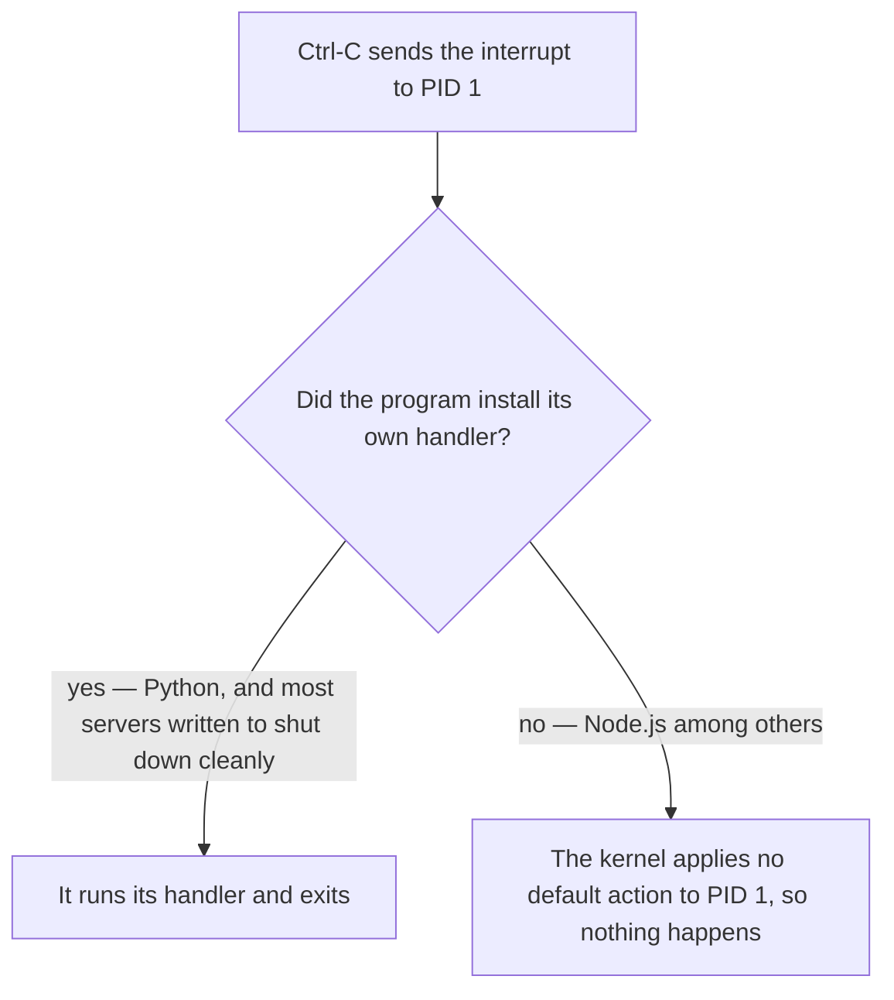

**The image from [[08-Writing-A-Dockerfile]] builds, and a container started from it reports that the server is listening.** Open a browser at that port on the host machine and there is nothing there. The language inside the container is beside the point here — everything below is about Docker, and would read the same with any application in the image.

# The container is not on your machine's network

```bash
  docker run -it my-fastapi-server:latest
```

```text
INFO:     Started server process [10]
INFO:     Waiting for application startup.
INFO:     Application startup complete.
INFO:     Uvicorn running on http://0.0.0.0:3000 (Press CTRL+C to quit)
```

The server says it started, and it is bound to `0.0.0.0` so it is not refusing outside connections. Yet nothing on the host can reach it.

That is **isolation** working as designed. **The container has its own network**, and port 3000 inside it has no relationship to port 3000 on the host. Nothing crosses that boundary until it is asked to. `docker ps` says as much — the ports column is empty:

```text
PORTS: []
```


# Publishing a port

```bash
  docker run -it --publish 3001:3000 my-fastapi-server:latest
```

**`--publish`** builds the route the diagram was missing. It takes two ports separated by a colon.

```text
--publish 3001:3000
          │    │
          │    └── the port inside the container
          └─────── the port on the host machine
```

Now the ports column has something in it, and the host port answers:

```text
PORTS: 0.0.0.0:3001->3000/tcp, [::]:3001->3000/tcp
```

```text
curl http://localhost:3001/
{"message":"hello from inside the container"}
```


**The host port comes first.** Getting the second number wrong produces a container that looks entirely healthy and serves nothing. Publishing `3001:5000` when the server is on 3000 inside:

```text
Up 6 seconds | 0.0.0.0:3001->5000/tcp, [::]:3001->5000/tcp
```

Running, published, and silent — every request to host port 3001 is delivered to container port 5000, where nothing is listening. No error explains why, because from Docker's point of view nothing went wrong.

`-p` is the short form and means exactly the same thing:

```bash
  docker run -it -p 3001:3000 my-fastapi-server:latest
```

--- 

# Letting the image name the port

A Dockerfile can declare which port its application listens on:

```dockerfile
1  # Dockerfile
2  FROM ghcr.io/astral-sh/uv:python3.13-bookworm-slim
3
4  WORKDIR /app
5
6  COPY . .
7
8  RUN uv sync --locked
9
10 ENV PORT=3000
11
12 EXPOSE 3000
13
14 CMD ["uv", "run", "fastapi", "run", "main.py", "--port", "3000"]
```

**`EXPOSE` documents the port the container serves on. It publishes nothing by itself.** A container built from this and started with no flags is exactly as unreachable as before.

```bash
  docker run -it -P my-fastapi-server:latest
```

> **`-P` in capitals publishes every exposed port — but to a randomly chosen host port**, not to the matching number. So `localhost:3000` still shows nothing, and you have to look up where it landed:

```text
PORTS: 0.0.0.0:55001->3000/tcp
```

`docker port` answers that question directly, which beats reading it out of a wide listing:

```text
docker port <container>
3000/tcp -> 0.0.0.0:55001
```

> [!important] **Lowercase `-p` and uppercase `-P` are different commands.** `-p 3001:3000` maps a port you chose. `-P` maps every exposed port to whatever host ports happen to be free, which you then have to look up. When a specific host port matters, `-p` is the one to use.

---

# Stopping it, and the PID 1 trap

Ctrl-C in the terminal running the container stops this one. That is worth knowing precisely, because for a large class of images it does not, and the reason has nothing to do with Docker's networking.

**Ctrl-C sends the interrupt signal, and the signal does arrive.** What happens next depends on where the application sits in the container's process table.

**Every process has a default action for each signal it has not explicitly handled**, and the default action for the interrupt is to terminate. That is why Ctrl-C kills things. **PID 1 is exempt from that rule**: the kernel refuses to apply default actions to the first process, on the grounds that killing it takes everything down with it. So a program that never installed its own interrupt handler is not killable by Ctrl-C for as long as it occupies that slot.

Whether that bites you depends entirely on the program:

| Application as PID 1, sent the interrupt | Result |
| ---------------------------------------- | ------------------ |
| A Node.js server | Keeps running |
| A bare Python process | `Exited (130)` |
| This FastAPI application under `uv` | `Exited (0)` |

Python installs a handler for the interrupt when the interpreter starts, so it is never relying on the default action and the exemption never applies. Node.js installs none, so it sits in PID 1 and ignores the signal entirely. **The same container, the same signal, opposite outcomes — decided by the application, not by Docker.**



**`--init` is the fix for the second row**, so it has to be shown against an image that actually has the problem — the Node.js one from [[08-Writing-A-Dockerfile]], not the FastAPI image this note has been using:

```bash
1  docker run -it --init my-node-server:latest
```

It works by moving your application out of the PID 1 slot entirely. In its place goes a small program called `tini`, which does **install signal handlers** and whose whole job is to pass on what it receives. Your application becomes an ordinary child process, the ordinary rules apply again, and Ctrl-C ends it.

```text
without --init    PID 1 is  node
with --init       PID 1 is  docker-init
```

Exit codes tell you which happened. A container killed by the interrupt exits with **130**, which is 128 plus 2, and 2 is the interrupt. One that caught the signal and shut itself down cleanly exits **0**.
