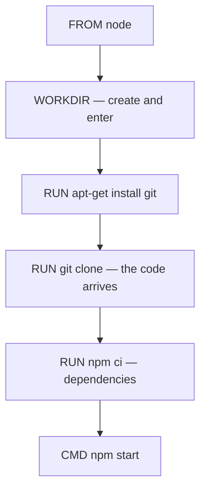
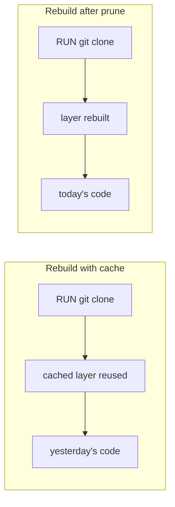

**`COPY` takes the project from the machine doing the build.** That means the machine has to have the project on it. An image can instead fetch the code itself, which turns the Dockerfile into a complete description of how to obtain and run the application.

# Installing a tool inside the image

The base image has whatever its publisher put in it and nothing more. The Node.js image does not include Git, so before the project can be cloned, Git has to be installed — inside the image, at build time.

```dockerfile
1  # Dockerfile
2  FROM node
3
4  WORKDIR /developer/nodejs/app_from_github
5
6  RUN apt-get update && apt-get install -y git
7
8  RUN git clone https://github.com/singhsanket143/Dockerizing_node_project.git .
9
10 ENV PORT=7000
11
12 RUN npm ci
13
14 CMD ["npm", "start"]
```

**Line 6 installs Git the way the base distribution expects.** The Node.js image is built on Debian, so its package manager is `apt-get`. `update` refreshes the package lists and `install` fetches the package. The `-y` answers yes to the confirmation prompt automatically, which matters because a build has nobody at the keyboard to answer it.

**Line 8 clones the repository into the working directory.** The trailing dot is the destination: clone into here, rather than into a new folder named after the repository.

**Line 12 installs the dependencies of the code that was just cloned**, and line 14 starts it.



Nothing from the machine running the build ends up in this image. Handing somebody the Dockerfile alone is enough.

---


# Environment variables the clone does not carry

The application reads its port from an environment variable, loaded from a `.env` file by a library such as dotenv:

```javascript
1  // index.js
2  const express = require('express');
3  require('dotenv').config();
4
5  const app = express();
6
7  app.get('/home', (req, res) => {
8      return res.json({message: 'OK'});;
9  });
10
11 app.listen(process.env.PORT, () => {
12     console.log('started the server');
13 });
```

That file is deliberately not committed — `.env` sits in `.gitignore` alongside `node_modules`, so pushing the project sends `index.js` and `package.json` and leaves the secrets behind.

Which creates a gap: the clone inside the image has no `.env`, so `process.env.PORT` is undefined.

**Line 10 of the Dockerfile closes it.** `ENV PORT=3000` sets the variable inside the image directly, so the application finds a value whether or not a `.env` file was ever there.

To confirm it took effect, open a shell in the container and ask:

```bash
  docker exec -it <container> bash
  env
```

The listing includes `PORT=7000`.

---

# The build cache will serve you stale code

This is the trap in the whole arrangement.

Push a change to the repository, rebuild the image, start a container, and read the file inside it — and it is the old version. Nothing about the build reported an error.

Docker caches each instruction as a layer and reuses the cached layer when it believes the instruction has not changed. 

> The **text** of `RUN git clone ...` has not changed, so Docker **reuses the layer it built last time**, along with the code that clone brought down. It has no way of knowing the remote repository moved on.



```bash
  docker system prune -a
```

This clears the images and the build cache, and the next build genuinely runs the clone again — visibly, because it also has to pull the base image afresh. The container then holds the current code.

> [!warning] **A build that succeeds is not evidence that it used your latest code.** When a change fails to appear and nothing errors, the cache is the first thing to suspect, and clearing it is how to be certain.
