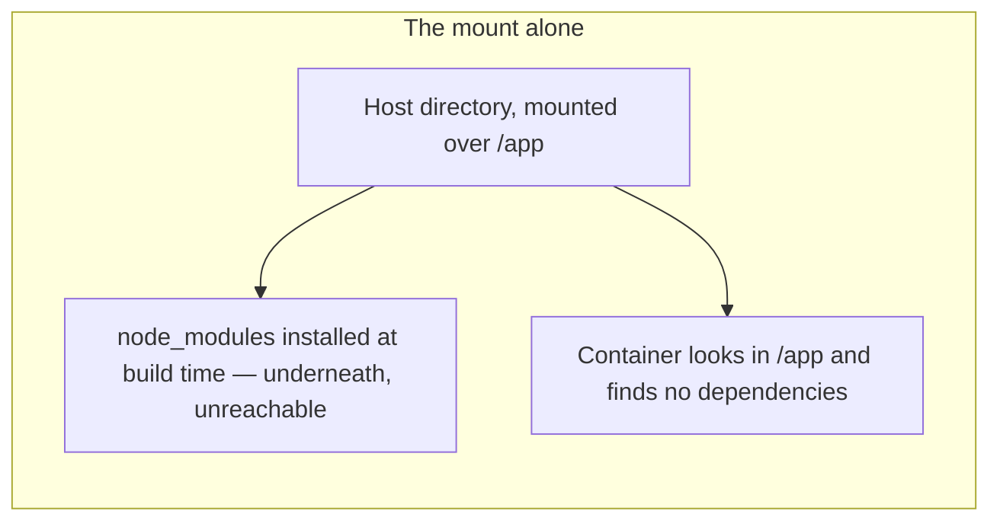
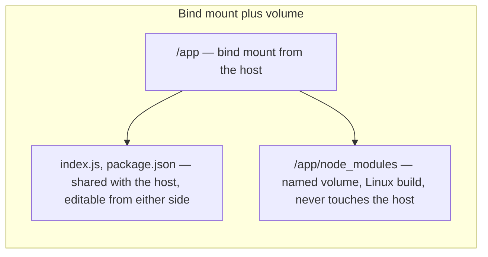

**`COPY` runs once, while the image is being built.** Everything that follows from that fact — why editing a file changes nothing, and why the fix for it breaks dependency installation — is the subject of this note.

# The edit that does nothing

The smallest project that shows it — one file that answers with a version string, and a Dockerfile that copies it in.

```javascript
1  // server.js
2  const http = require('http');
3  http.createServer((q, r) => {
4      r.end(JSON.stringify({ message: 'version one' }));
5  }).listen(3000);
```

```dockerfile
1  # Dockerfile
2  FROM node
3
4  WORKDIR /app
5
6  COPY . .
7
8  CMD ["node", "server.js"]
```

Build it, and start a container with the port published:

```bash
1  docker build -t copy-demo .
2  docker run -d --rm --name demo -p 4500:3000 copy-demo
```

The server listens on 3000 inside, because that is what `server.js` says. 4500 is just a free port on the host — any unused number would do, and only the number on the right has to match the server.

```text
curl http://localhost:4500/
{"message":"version one"}
```

**Now edit `server.js` on the host machine**, changing `version one` to `version TWO`, and confirm the edit really landed:

```text
grep -o "version [A-Z]*" server.js
version TWO
```

Then ask the running container again:

```text
curl http://localhost:4500/
{"message":"version one"}
```

Unchanged. And the reason is visible from inside:

```text
docker exec demo grep -o "version [a-z]*" /app/server.js
version one
```

**There are two files.** The one on the host says TWO, the one in the container says ONE, and nothing connects them.

`COPY . .` ran during `docker build` and has not run since. It took the directory as it stood at that moment and wrote it into a layer of the image, and that layer is frozen — being frozen is what makes it an image. The container started from that layer, so it holds the copy.

**The container is not running your project. It is running a photograph of your project**, taken at build time, and every edit afterwards happens outside the photograph.


Rebuilding after every edit does work, and for a deployment it is exactly right. For development it is unusable: a rebuild for every keystroke.

---

# Binding a directory

Same image as above. Nothing rebuilt. One flag added:

```bash
1  docker run -d --rm --name demo -p 4500:3000 -v "$(pwd)":/app copy-demo
```

**`-v <host path>:<container path>` maps a directory on the host onto a directory in the container.** `$(pwd)` is the directory you are standing in on the host; the second path is the working directory inside the image.

> [!info] `$(pwd)` is shell syntax, not Docker syntax, and it is the one part of this that is not portable. PowerShell wants `${PWD}` and the Windows command prompt wants `%cd%`. An absolute path works everywhere and is the safe thing to write down.

The host file says `version TWO` after the edit above, while the image layer still has `version one` frozen into it. Which one answers:

```text
curl http://localhost:4500/
{"message":"version TWO"}
```

**The image's own copy is still in there and the container is not reading it.** The mount covers `/app`, so what the container finds at that path is the host's directory. Edit the host file again, to `version THREE`, and both sides agree:

```text
host file:          version THREE
container's /app:   version THREE
```

One directory, two views. No copy, no synchronising, no rebuild. **This is called a bind mount.**

# What the mount does not do

Ask the running server after that last edit and it has not moved:

```text
curl http://localhost:4500/
{"message":"version TWO"}
```

The file says THREE and the server says TWO, which looks like the mount failing. It is not, and the reason has nothing to do with Docker.

**A program reads a file once, when it starts.** After that it is working from memory:

```javascript
1  // show.js
2  const fs = require('fs');
3  const text = fs.readFileSync('greeting.txt', 'utf8');   // read ONCE, at startup
4  setInterval(() => console.log('server says:', text), 1000);
```

With `greeting.txt` containing `hello`, run it, then change the file on disk to `goodbye` while it keeps running:

```text
server says: hello
--- greeting.txt on disk now says: goodbye ---
server says: hello
server says: hello
```

The file changed and the program did not, because line 3 already ran. Stop it and start it again and line 3 runs afresh:

```text
server says: goodbye
```

**Two separate things are involved, and it is easy to blur them:**

| The thing | Lives | Can an edit change it? |
| --------------- | ---------------------------- | ------------------------------------ |
| `greeting.txt` | on disk | Yes, that is what editing is |
| `text` | in the running program's memory | No — it was set once, at startup |

So the bind mount does its job completely: the container sees the real file. What it cannot do is reach inside a running process and update its variables.

```text
docker restart demo
curl http://localhost:4500/
{"message":"version THREE"}
```

**Restarting the container is what re-runs the read.** And a restart is a second, against the rebuild that copying demanded. Applications that watch their own files — `node --watch`, nodemon, `uvicorn --reload` — remove even that step, but that is the application's doing, not the mount's.

| | With `COPY` | With `-v` |
| ---------------- | -------------------- | -------------------------------------------------- |
| To see an edit | Rebuild the image | Restart the container, or nothing if the app watches |
| Files | Two, unrelated | One, two views |

---

# It runs both ways

Every edit so far went from the host into the container. It works in the other direction too, and nothing on the host does the writing:

```bash
1  docker exec demo sh -c "sed -i 's/version THREE/version FOUR/' /app/server.js"
```

```text
container's /app/server.js:   version FOUR
host's server.js:             version FOUR
```

**The file on the host machine changed, and nothing on the host machine touched it.** A process inside a Linux container wrote to it.

Nor is it limited to editing what already exists. A file created inside the container simply appears on the host, owned by the host user:

```bash
1  docker exec demo sh -c "echo 'made inside the container' > /app/from-container.txt"
```

```text
-rw-r--r--  1 home  wheel  26  3 Sep 12:07 from-container.txt
made inside the container
```

**This is what the word mount is doing.** `-v` does not copy in one direction and it does not keep two copies in step. There is one directory on one disk, and the container has been given a second doorway onto it. A write through either doorway lands on the same bytes, because there is only one set of bytes.

Which is why nothing had to be built for the container to see the host's edits. There was never anything to transport.


> [!important] That is what makes it a development environment rather than a deployment artifact. A new person on the team clones the project, builds the image, runs it with the bind mount, and works normally — editing on their own machine while the code runs inside Linux. Whether their laptop is Windows, Linux or a Mac stops being a question anybody has to ask, and nothing has to be copied out of the container to commit it, because the files were never in the container to begin with.

Two consequences follow, and both matter later:

- **A command run inside the container writes into the host's project.** `npm install` from a shell in the container puts `node_modules` on the host machine. Sometimes that is wanted; the section below is what happens when it is not.
- **A container can destroy your work.** `rm -rf` in the working directory of a bind-mounted container deletes the real files on the host, and Docker has no undo for it.

**Appending `:ro` makes the mount read-only**, which is the guard against that second point wherever the container has no business writing:

```bash
1  docker run -v "$(pwd)":/app:ro api
```

The container can read every file and change none of them:

```text
sh: 1: cannot create /app/should-fail.txt: Read-only file system
```

That is the right setting for a container that only consumes the directory — reading config, serving static files — and the wrong one during development, where the whole point is that both sides can write.

# But the image is read-only

Both of those should be impossible. [[04-Containers]] established that an image is read-only and that everything a container writes goes into its own writable layer, which disappears when the container does. So how does a write inside a container reach the host at all?

**Because the writable layer only governs paths that came from the image.** Writing two files from inside one container shows the split immediately — one into the mounted directory, one into a path the image supplied:

```bash
1  docker exec demo sh -c "echo hi > /app/inside-mount.txt; echo hi > /opt/outside-mount.txt"
```

The container sees both. The host sees one:

```text
/app/inside-mount.txt     PRESENT on host
/opt/outside-mount.txt    absent on host
```

Then destroy the container and start a fresh one from the same image with the same mount:

```text
/app/inside-mount.txt     written into /app            ← survived
/opt/outside-mount.txt    No such file or directory    ← gone with the container
```

**`/opt` is the familiar case.** It comes from the image, the image is read-only, so the write landed in that container's writable layer and died with it.

**`/app` never came from the image.** The mount replaced it. When the container starts, Docker attaches the host directory at that path, and from then on `/app` is the host directory — the image's own `/app` is still there underneath, hidden and untouched. Nothing at that path goes through the writable layer, because there is no image content there to copy on write.

| Path in the container | A write goes to | Survives the container? |
| ------------------------------------------ | ------------------------------ | ----------------------- |
| Anything from the image — `/opt`, `/usr` | the container's writable layer | No |
| A bind-mounted path | the host's real filesystem | Yes — it was never in the container |
| A named volume path | storage Docker manages | Yes |

**The writable layer is the machinery that lets one read-only image be shared by many containers.** A mount is not part of the image, so it needs none of that machinery — and gets none of its protections either. That is precisely why `rm -rf` in a bind-mounted directory really does delete your files: there is no layer between the container and the disk to absorb it.

---

# The dependency that will not install

Everything above used a project with no dependencies. Add one and the mount stops being free.

```javascript
1  // index.js
2  const express = require('express');
3  const app = express();
4  app.get('/', (q, r) => r.json({ message: 'express is working' }));
5  app.listen(3000);
```

```dockerfile
1  # Dockerfile
2  FROM node
3
4  WORKDIR /app
5
6  COPY . .
7
8  RUN npm ci
9
10 CMD ["node", "index.js"]
```

**Run it with no mount, the way the first section did, and it is fine:**

```bash
1  docker build -t api .
2  docker run -d --rm --name api-1 -p 4501:3000 api
```

```text
curl http://localhost:4501/
{"message":"express is working"}
```

The dependencies really are in the image, put there by line 8 at build time:

```text
docker exec api-1 ls /app/node_modules

accepts
array-flatten
body-parser
...
67
```

**Now the identical image and the identical command, with the mount added:**

```bash
1  docker run -d --name api-2 -p 4501:3000 -v "$(pwd)":/app api
```

```text
curl http://localhost:4501/
(no answer — the server is not running)
```

```text
Error: Cannot find module 'express'
```

The container did not even stay up. Nothing was rebuilt, nothing in the Dockerfile changed, `npm ci` still installed its 67 packages. **The one flag that fixed editing has broken dependency resolution.**

The cause is the rule from the section above. The mount replaces `/app` with the host directory, and the host directory contains this:

```text
Dockerfile
index.js
package-lock.json
package.json
```

**No `node_modules`.** It was never installed on the host — it was installed inside the image. The moment the mount covers `/app`, the image's `/app` goes underneath it with `node_modules` inside, and the container looks up to find only the four files that actually exist on the host.

The 67 packages are still in the image. They are simply unreachable, buried under your directory.



**Editing and installing now want opposite things at the same path**, and that conflict is the rest of this note.

# The other half of the problem

There is a second failure hiding behind the first, and it appears the moment you try the obvious fix of running `npm install` on the host so that `node_modules` exists there too.

Now `express` is found. And something else fails instead — typically a natively compiled package such as bcrypt.

`COPY . .` copies everything in the project directory, and that includes `node_modules` when it is present. Those packages were installed on a Mac, and they are being copied into a Linux container.

**Most packages are plain JavaScript and survive the trip. Native ones do not.** They are compiled for the platform they were installed on, so a build made for macOS is not a build that runs on Debian.

Nobody ever wanted a macOS build of a dependency inside a Linux container. The whole point of the container was that the dependency gets installed the same way everywhere.

# Two fixes that do not work

**Delete `node_modules` before building.** It works once, and depends on remembering every time.

**Add `node_modules` to a `.dockerignore` file**, which excludes it from `COPY` the way `.gitignore` excludes files from a commit. That is closer, and still not enough.

Delete the folder, ignore the folder, rebuild cleanly, and you are back at the first failure exactly: the container still cannot find its dependencies, because the mount is still covering the place they were installed.

**Neither fix touches the real problem.** They stop a macOS build reaching the image, which is worth doing on its own account — but the mount hides the image's `node_modules` whether or not the host has one of its own.

# Mounting a volume over the gap

The fix is to cover that one path with something else, so the bind mount does not reach it.

```bash
1  docker volume create api-node-modules
```

> [!info]- **Named and anonymous volumes**
> Giving the volume a name is what makes it findable later. Leave the name off — `-v /app/node_modules`, with a container path only — and Docker still creates a volume, but names it for you:
>
> ```text
> volume  c10f8c604a1eb3cc93f2d28e45a22b8877b6f1fb3573c9477e31d9821284dedc
> ```
>
> That is an anonymous volume. It works identically, and it is unreferenceable by anything except that container — you cannot mount it into a second one, and you will not recognise it in `docker volume ls`. It is also the kind `docker system prune --volumes` removes. Name anything you intend to keep.

```bash
1  docker run -d --name api-3 -p 4501:3000 \
2    -v "$(pwd)":/app \
3    -v api-node-modules:/app/node_modules \
4    api
```

```text
curl http://localhost:4501/
{"message":"express is working"}
```

**Line 2 covers `/app` with the host directory.** **Line 3 covers `/app/node_modules` with a named volume.** Line 3's path is deeper, so it wins there and only there, and the working directory ends up assembled from two sources:

```text
docker exec api-3 ls /app

Dockerfile
index.js
node_modules        ← from the volume
package-lock.json   ← from the host
package.json        ← from the host
```

```text
docker exec api-3 ls /app/node_modules | wc -l
67
```

All 67 packages are reachable again, and they are the Linux ones `npm ci` built inside the image — never the host's. Editing still flows through, which was the entire reason for the mount:

```text
edit index.js on the host, then docker restart

{"message":"express is STILL working"}
```



> [!info]- **Why an empty volume ends up full, and why a `node_modules` folder appears on your host**
> A named volume mounted at a path that has content in the image starts by copying that content in, provided the volume is empty. So the first run seeds the volume with whatever `npm ci` installed, and every run afterwards reuses it — which is also why later start-ups are quicker.
>
> The folder that appears on the host is a mount point, not your dependencies. Docker has to create `/app/node_modules` before it can mount anything there, and because `/app` is the host directory, creating it creates it on the host disk. It stays empty:
>
> ```text
> host's node_modules:       0 entries
> container's node_modules:  67 entries
> ```

| Path | Covered by | Holds |
| -------------------- | ------------ | ---------------------------------------------------- |
| `/app` | bind mount | your real source files, editable from either side |
| `/app/node_modules` | named volume | Linux-built dependencies, isolated from the host |

> [!info]- **`-v` and `--mount` are two spellings of the same thing**
> `-v` is the older shorthand, and its meaning depends on what you put on the left: a path makes a bind mount, a bare name makes a volume. `--mount` says which it is:
>
> ```bash
> 1  docker run \
> 2    --mount type=bind,source="$(pwd)",target=/app \
> 3    --mount type=volume,source=api-node-modules,target=/app/node_modules \
> 4    api
> ```
>
> Longer, and harder to get wrong — a typo in a `-v` host path silently creates an empty directory and mounts that, while `--mount` refuses. Docker's own documentation uses `--mount`; `-v` is what you will meet in other people's commands.

# What a volume is

A **volume** is storage Docker manages, kept separately from any container.

Because it does not live inside the container, it **survives the container being removed or replaced**. Stop a container, delete it, start another from the same image with the same volume, and the contents are still there. Which is the second benefit here: dependencies are not reinstalled every time a container is brought up.

A volume can also be **shared between containers**, which is the other reason they exist.

Volumes are managed independently of any container, so they are listed and removed on their own:

```bash
1  docker volume ls
2  docker volume rm <volume>
3  docker volume create <volume>
```

**They survive more than you might expect, including the prune that clears everything else.** `docker system prune -a` does not touch volumes at all:

```text
-a, --all      Remove all unused images not just dangling ones
    --volumes  Prune anonymous volumes
```

Removing them takes `--volumes` explicitly, and even that only takes the anonymous ones. **A named volume survives both**, which is the point of naming it — data you meant to keep is hard to lose by accident, and `docker volume rm` is the deliberate act that removes it.

> [!important] **A bind mount and a volume solve opposite halves of the same problem.** The bind mount exists so the container sees the host's files. The volume exists so one directory inside the container is protected from exactly that.
