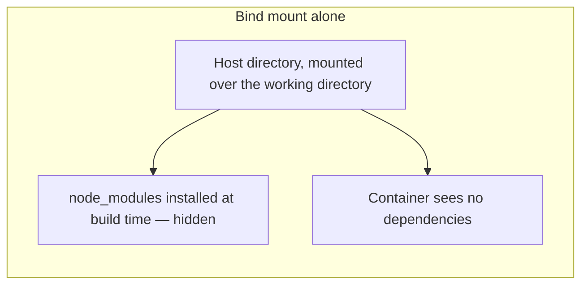
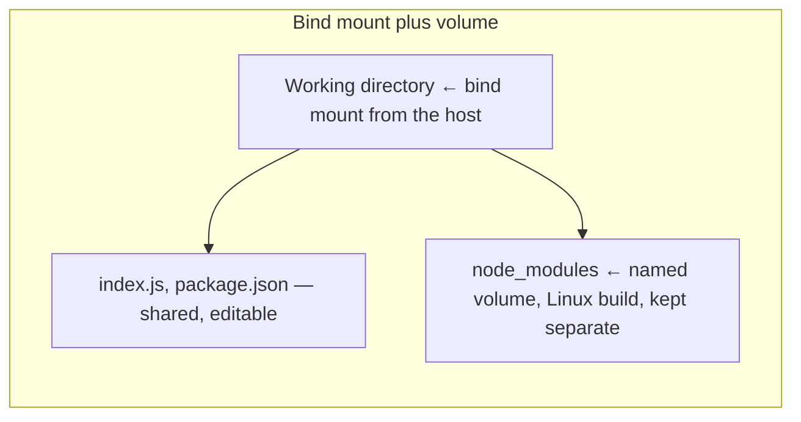

**`COPY` runs once, while the image is being built.** Everything that follows from that fact — why editing a file changes nothing, and why the fix for it breaks dependency installation — is the subject of this note.

# The edit that does nothing

A container is running the server, published on a port, reachable from the browser. Add a route to the project on the host machine:

```javascript
1  // index.js
2  app.get('/info', (req, res) => {
3      return res.json({ message: 'info' });
4  });
```

Save it. The server does not restart, and `/info` returns nothing.

That is correct behaviour. The change was made on the host. The server is running inside the container, on a copy of the project taken when the image was built. The two files have nothing to do with each other any more.


# Binding a directory

```bash
1  docker run -it --init -p 3002:3000 \
2    -v "$(pwd)":/developer/nodejs/node-bind-mount-project \
3    app-bind-mount-node:latest
```

**`-v <host path>:<container path>`** maps a directory on the host onto a directory in the container. `$(pwd)` is the current directory on the host; the second path is the working directory inside the image.

Now the container is not looking at a copy. It is looking at the host's own files. Add the `/info` route and the server inside the container restarts and serves it, because the file it is watching is the file being edited.

This is called a **bind mount**.

# It runs both ways

The mapping is not one-directional. Open a shell in the container, install an editor, and change the file from inside:

```bash
1  docker exec -it <container> bash
2  apt-get update && apt-get install -y vim
3  vim index.js
```

Save from inside the container and the change appears in the editor open on the host machine.


That is what makes it a development environment rather than a deployment artifact. A new person on the team clones the project, builds the image, runs it with the bind mount, and works normally — editing on their own machine while the code runs inside Linux. Whether their laptop is Windows, Linux or a Mac stops being a question anybody has to ask.

# The dependency that will not install

The same setup applied to a larger project fails immediately. The container starts and the server dies:

```text
Error: Cannot find module 'express'
```

The Dockerfile runs `npm ci`. Opening a shell in the container shows `node_modules` sitting right there in the working directory. And the identical Dockerfile, applied to a second project, works.

The first clue is what happens after deleting `node_modules` on the host and reinstalling it. `express` is now found — and a different dependency fails instead, this time a native one such as bcrypt.

# Why it fails

`COPY . .` copies everything in the project directory, and that includes `node_modules` if it is present. Those packages were installed on a Mac. They are being copied into a Linux container.

Most packages are plain JavaScript and survive the trip. Native ones are compiled for the platform they were installed on, so a build made for macOS is not a build that runs on Debian. That is the bcrypt failure.

Nobody ever wanted a macOS build of a dependency inside a Linux container. The point of the container was that the same dependency gets installed the same way everywhere.

# Two fixes that do not work

**Delete `node_modules` before building.** It works once, and depends on remembering every time.

**Add `node_modules` to a `.dockerignore` file**, which excludes it from `COPY` the way `.gitignore` excludes files from a commit. That is closer, and still not enough.

Delete the folder, ignore the folder, rebuild cleanly, and the container still cannot find its dependencies.

The reason is the bind mount. `-v "$(pwd)":/developer/nodejs/api-gateway` maps the host directory over the container's working directory — **the whole directory**, including a `node_modules` that the host does not have. Whatever `npm ci` installed into the image at build time is hidden underneath the mount. The container looks in the working directory, sees the host's contents, and finds no dependencies at all.



# Mounting a volume over the gap

The fix is to cover that one directory with something else, so the bind mount does not reach it.

```bash
1  docker volume create api-gateway-node-modules
```

```bash
1  docker run -it --init -p 3001:3001 \
2    -v "$(pwd)":/developer/nodejs/api-gateway \
3    -v api-gateway-node-modules:/developer/nodejs/api-gateway/node_modules \
4    api-gateway:latest
```

**Line 2 is the bind mount** — the project directory, shared with the host, so edits still flow both ways.

**Line 3 is a named volume mounted at exactly the `node_modules` path.** It is more specific than line 2, so it wins there. The dependencies inside the container are the ones installed inside the container, and the host's copy — or its absence — is irrelevant.



The server starts, and the published port serves as expected.

# What a volume is

A **volume** is storage Docker manages, kept separately from any container.

Because it does not live inside the container, it **survives the container being removed or replaced**. Stop a container, delete it, start another from the same image with the same volume, and the contents are still there. Which is the second benefit here: dependencies are not reinstalled every time a container is brought up.

A volume can also be **shared between containers**, which is the other reason they exist.

Volumes are managed independently of any container, so they are listed and removed on their own:

```bash
1  docker volume ls
2  docker volume rm <volume>
3  docker volume create <volume>
```

They also survive more than you might expect. `docker system prune -a` removes them along with everything else, so a project that depends on named volumes needs them recreated afterwards — which is a good argument for declaring them somewhere the project remembers rather than in your shell history.

> [!important] **A bind mount and a volume solve opposite halves of the same problem.** The bind mount exists so the container sees the host's files. The volume exists so one directory inside the container is protected from exactly that.
