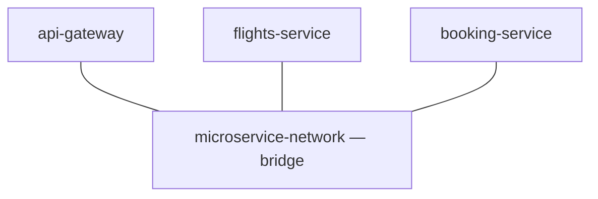
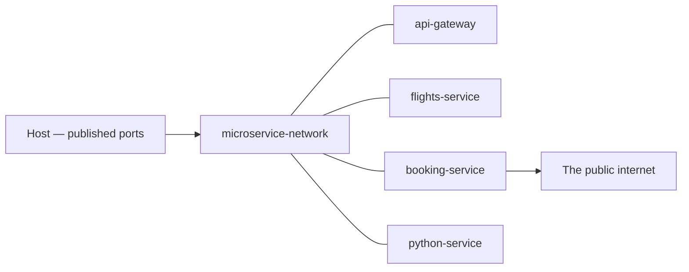

**The previous note made a container's files reachable from the host.** This one is about containers reaching each other, which is a separate problem with a separate answer — and the reason it is a problem at all is the isolation the first note established.

# Three services that need each other

Consider three applications, each in its own container:

- an **API gateway**, which acts as a reverse proxy and forwards requests on to the others
- a **flights service**
- a **booking service**


This is what a set of microservices looks like: one service per container, and traffic between them.

# Pointing one at the other, naively

The gateway forwards `/flights-service/api/v1/info` to the flights service. Configure that target the way it would be configured on a single machine:

```text
http://localhost:3000
```

The gateway starts. The flights service starts. A request through the gateway fails:

```text
Error occurred while trying to proxy
```

Requesting the flights service directly from the browser works, because its port is published to the host. The gateway cannot reach it at all.

**Inside a container, `localhost` means that container.** The gateway asking for `localhost:3000` is asking itself, and it has nothing on port 3000. Two containers cannot talk to each other by default — that is precisely what isolation means.

# A bridge between them

The mechanism is a network the containers join. Docker calls the default kind a bridge, and every container attached to one can reach the others on it.

```bash
1  docker network ls
```

The listing already contains a few: a default `bridge`, plus `host` and `none`.

> [!info] **Create your own rather than using the default bridge.** It is the general recommendation, and a named network of your own keeps one project's containers separate from everything else on the machine.

```bash
1  docker network create microservice-network
```

The command prints a unique hash, and `docker network ls` now shows the new network with the `bridge` driver — the driver being the machinery that makes that kind of network work.



# Naming a container is not joining it

Containers on a network find each other by name, so each one needs a name of its own rather than the one Docker invents:

```bash
1  docker run -it --init -p 3000:3000 \
2    --name flights-service \
3    -v "$(pwd)":/developer/nodejs/flights-service \
4    -v flights-service-node-modules:/developer/nodejs/flights-service/node_modules \
5    flights-service:latest
```

`docker ps` shows the chosen name. And the gateway still cannot reach it.

```bash
1  docker inspect microservice-network
```

The configuration object comes back with its list of containers **empty**. Naming a container says what to call it; it does not attach it to anything.

# Joining it

```bash
1  docker run -it --init -p 3000:3000 \
2    --name flights-service \
3    --network microservice-network \
4    -v "$(pwd)":/developer/nodejs/flights-service \
5    -v flights-service-node-modules:/developer/nodejs/flights-service/node_modules \
6    flights-service:latest
```

**Line 3 is the missing piece.** `docker inspect microservice-network` now lists `flights-service` among its containers.

Start the gateway the same way — its own name, the same network — and point it at the container name instead of at `localhost`:

```text
http://flights-service:3000
```

The request through the gateway now reaches the flights service.

> [!important] **The container name resolves inside the network and nowhere else.** `http://flights-service:3000` typed into a browser on the host still fails. The host reaches containers through published ports; containers reach each other by name. These are two different routes and neither one substitutes for the other.

# It is not a proxy trick

Reverse proxying might look like a special case, so it is worth seeing an ordinary outbound call do the same thing. Inside the booking service:

```javascript
1  // index.js
2  const axios = require('axios');
3
4  app.get('/calling-flights-service', async (req, res) => {
5      const response = await axios.get('http://flights-service:3000/api/v1/info');
6      return res.json({ message: response.data });
7  });
```

Requesting `/calling-flights-service` on the booking service's published port returns the flights service's response. One container made an ordinary HTTP request to another by name.

> [!info] `response.data` on line 6 rather than `response` — returning the whole axios response object serialises far more than intended.

# The language does not matter

Nothing above is specific to Node.js. Build the Flask application from an earlier note, and start it with a name on the same network:

```bash
1  docker run -it --init -p 3005:3005 \
2    --name python-service \
3    --network microservice-network \
4    -v "$(pwd)":/developer/pythonproject/flask-app \
5    python-app:latest
```

Change the booking service to call `http://python-service:3005/home` instead, and it returns `hello` from the Flask route. Three services in Node.js and one in Python, all reaching each other across the same bridge, none of them aware of what the others are written in.

# Outward as well as sideways

A container is not sealed off from the internet. The same booking service can call a public API — `https://fakestoreapi.com/products`, for instance — and return what comes back. Outbound requests work without configuration; it is inbound and container-to-container traffic that has to be arranged.


