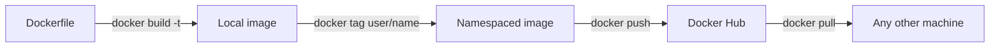

**Every image built so far exists only on the machine that built it.** Docker Hub was the place images were pulled from; it is also the place they can be pushed to, which is what turns a Dockerfile into something a colleague can run without building anything.

# Signing in

```bash
1  docker login
```

It asks for a username and a password.

> [!warning] **It wants the username, not the email address.** An email address is not accepted here even though it identifies the same account. The username is shown on the Docker Hub profile page.

The command reports that login succeeded.

# The push that gets refused

```bash
1  docker image ls
2  docker push app-setup-from-github
```

The push starts and then stops:

```text
denied: requested access to the resource is denied
```

The image builds, runs, and works. Nothing is wrong with it. The problem is its name.

**An image name with nothing in front of it refers to an official image** — `node`, `python`, `mysql` are all names of that shape, and they belong to the organisations that maintain them. Pushing to a bare name means asking to publish as one of those, which is refused.

A published image has to sit under the account publishing it.

```text
singhsanket143/github-app
│              │
│              └── the image name
└───────────────── the account it belongs to
```

# Tagging, then pushing

The image already exists under its local name, so the fix is to give it a second name in the right shape:

```bash
1  docker tag app-setup-from-github singhsanket143/github-app
2  docker push singhsanket143/github-app
```

**`docker tag <existing image> <new name>`** does not rebuild or copy anything. It attaches another name to the image that is already there.

The push now runs through and the image appears on the account's Docker Hub profile.



A version can be included, and is worth including:

```bash
1  docker tag app-setup-from-github singhsanket143/github-app:1.0.0
2  docker push singhsanket143/github-app:1.0.0
```

Pushing without a tag publishes it as `latest`.

# What the other side gets

From any machine with Docker installed and no access to the source:

```bash
1  docker pull singhsanket143/github-app
2  docker run -it singhsanket143/github-app bash
3  cat index.js
```

The file inside is the one that went into the image. The whole environment — the base operating system, the runtime, the dependencies, the application — arrives set up, with nothing to install and nothing to configure.

That is the round trip the first note was arguing for. A project that used to come with instructions about which versions to install now comes as an image, and behaves the same way on every machine that pulls it.
