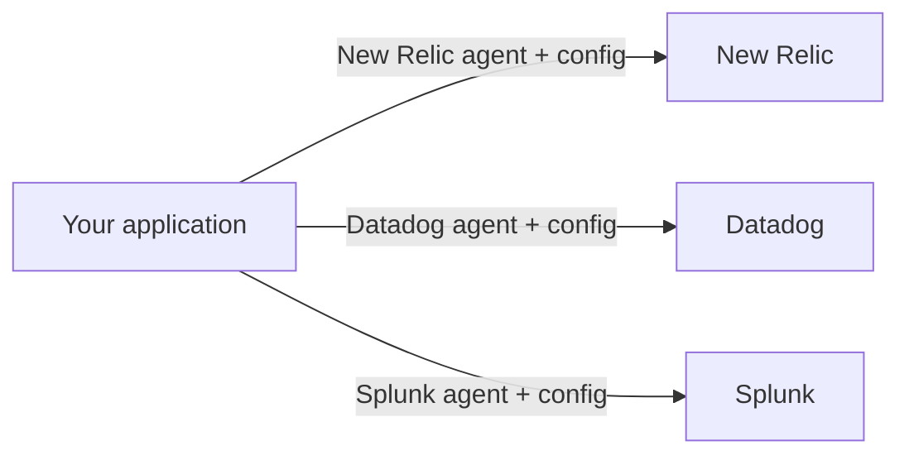
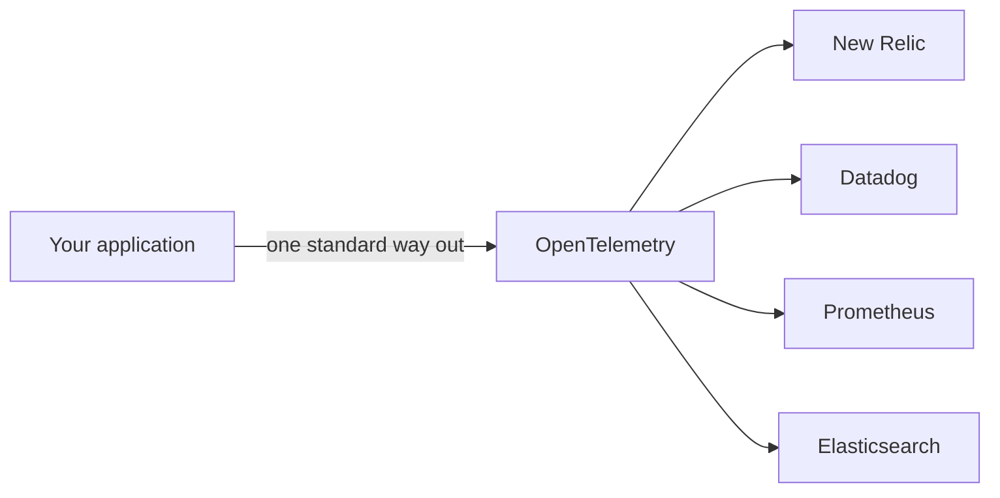
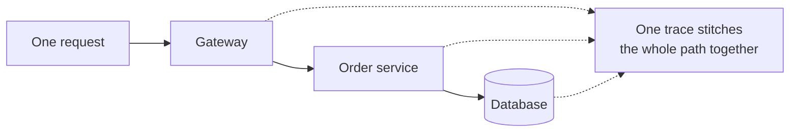
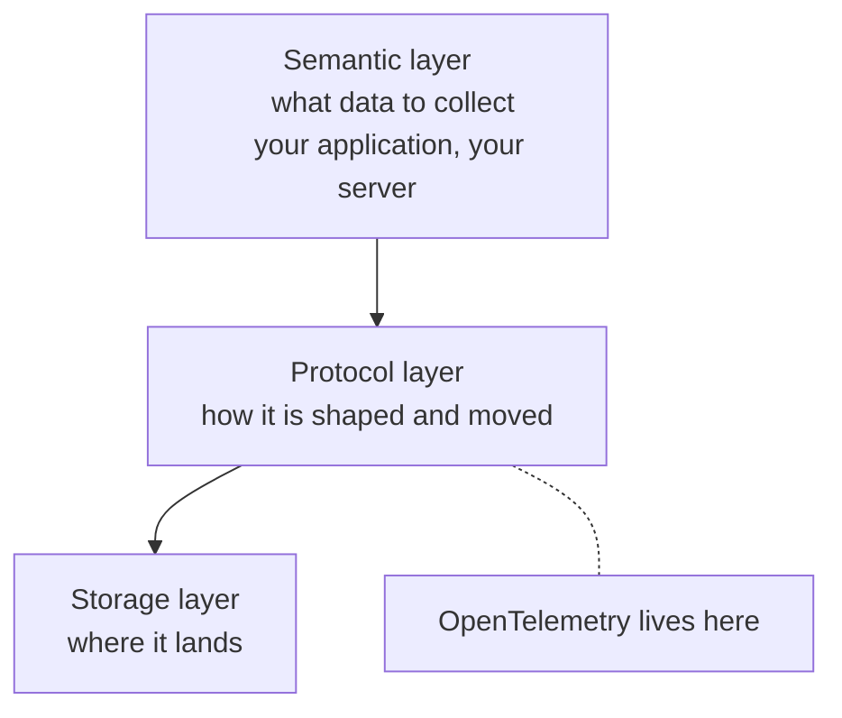
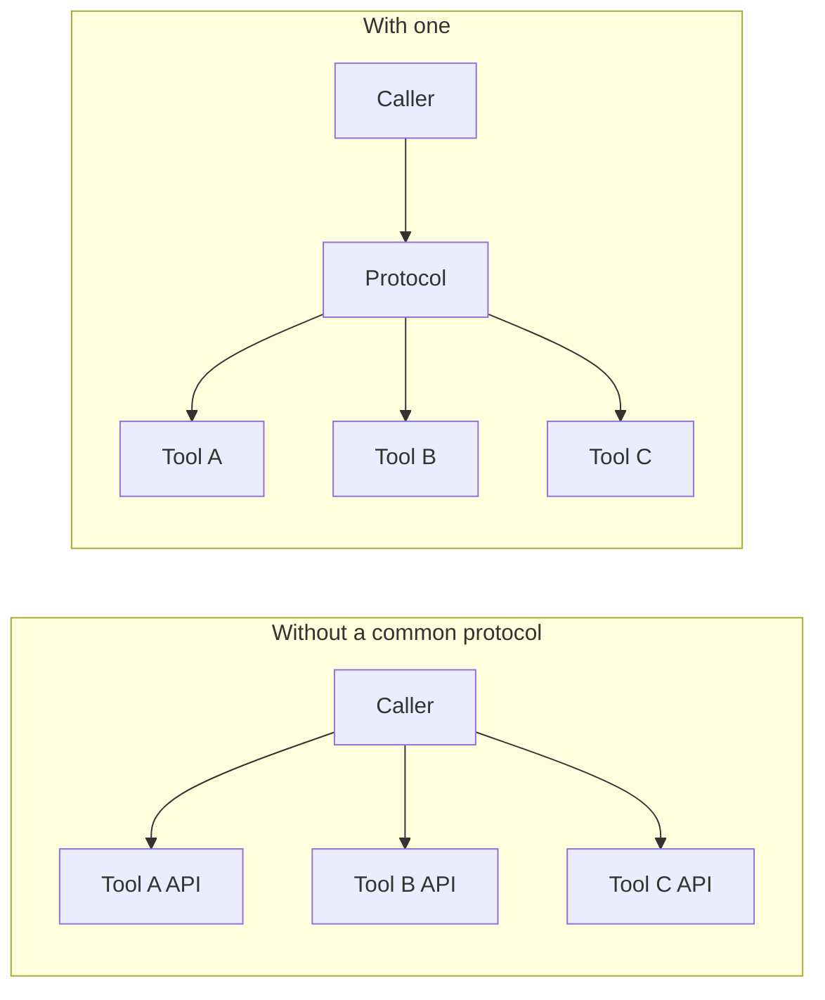
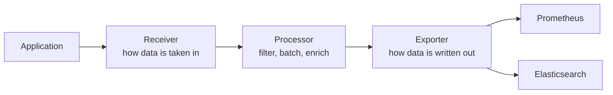

Tests tell you the code was right before it shipped. Observability is how you find out what it actually does afterwards, under real traffic — and the first pass at it leaned on a managed service that did the collecting for you. This folder is about running that machinery yourself, starting with the standard that makes it possible to swap any piece of it out later.

# One agent per vendor

Before there was a standard, every observability product came with its own way in. New Relic had an agent, Datadog had a different one, Splunk had another, and each carried its own configuration format, its own set of libraries and its own idea of what the data should look like.

That is tolerable while you only use one. It stops being tolerable the moment you want to change.

Moving from one to another is not a matter of changing a hostname. The agent is ripped out and a different one installed, the configuration is rewritten, and anywhere the application talks to the observability layer directly, that code changes too. The cost of switching is paid in engineering time, which means in practice the choice made on day one tends to stick long after it stopped being the right one.

# What OpenTelemetry is

OpenTelemetry is an open-source observability framework, and it is abbreviated **OTel**. What it contributes is **vendor neutrality**: a single common way to produce and move observability data, which every compliant tool on the receiving end understands.

The application is instrumented once. Where the data ends up becomes a configuration decision rather than a rewrite, and switching backends stops being a project.

# The three pillars

OTel defines three kinds of data, and everything it does is in service of carrying these three.

| Pillar | What it is | Examples |
|---|---|---|
| **Logs** | Statements recording discrete events as they happen | A request arrived, a lookup failed, a value was cached |
| **Metrics** | Numerical values collected over a period of time | CPU usage, requests per second, memory consumption, latency, error rate |
| **Traces** | The journey of one single request through the system | This request entered at the gateway, called two services, spent 40 ms in the database |

Logs and metrics are already familiar. A **trace** is the one worth pausing on: it follows a single request from the moment it arrives to the moment it is answered, across every service it touches on the way. In a single application that is mildly useful. In a system split across several services it is often the only way to answer where the time went, because no individual service can see the whole path.

# The three layers, and which one OTel owns

Splitting the problem into layers makes it clear what the standard is actually for.

**The semantic layer** is where data originates — your application deciding what is worth recording.

**The protocol layer** is the transport: what shape the data takes and how it travels.

**The storage layer** is where it is kept, and it is usually more than one place. Metrics go to a time-series database such as Prometheus; logs go somewhere searchable such as Elasticsearch or OpenSearch.

**OTel concerns itself with the middle layer only.** This boundary is worth stating plainly, because it explains what the standard will and will not do for you.

> [!info] **Guarantees:** that telemetry leaving your application has a defined shape and a defined way of travelling, so any compliant backend can receive it. **Does not guarantee:** what you choose to record, where you send it, how long it is kept, or what you do with it once it arrives. Those decisions stay yours.

# The same idea, elsewhere

The shape of the problem is not unique to observability, and it may be easier to recognise in a setting where the same fix was applied.

A language model with the ability to use tools has to talk to software outside itself — a mail and calendar suite, a messaging tool, a payments service, a weather API. Every one of those exposes its own API, designed without any thought for the model that wants to call it, and there are millions of such tools. Wiring the model separately to each one does not scale, and it is why a model built by one company tends to integrate smoothly with that company's own products and awkwardly with everyone else's.

The Model Context Protocol solves that by inverting the burden. Rather than the caller learning every tool, each tool exposes itself through one common protocol, and the caller only has to speak that.

OTel is that same move for telemetry. Data may be produced in Java, Python or C#, and may be destined for a time-series database, a log store or a paid service run by someone else. A middleman in between says to the application: do not worry where this is going, just hand it to me in my shape. And it says to the storage: do not worry where this came from, it will arrive in a shape you can read.

# The collector

That middleman has a name. The **OpenTelemetry Collector** is a vendor-agnostic proxy that sits between the application and the storage, and it has three parts.

**The receiver** knows how to accept data from the client. **The processor** does whatever work happens in between — aggregating, filtering, reshaping. **The exporter** knows how to write into a particular storage backend.

The collector is optional. Data can be sent straight to a backend that is capable of receiving it, and the collector earns its place when you want aggregation or filtering to happen outside the application.

In practice you rarely assemble these parts by hand. Tools built on top of OTel — the stacks in the notes that follow — already have them wired up.

# OTLP, the wire protocol

The protocol itself is **OTLP**, the OpenTelemetry Protocol. It is what makes the standard concrete: it specifies both how the data is carried and how it is encoded.

| Concern | What OTLP specifies |
|---|---|
| What it carries | The three pillars: traces, metrics, logs |
| Transport | gRPC by default, which runs on HTTP/2 and allows multiplexed, persistent connections |
| Encoding | Protocol Buffers, or JSON |

The reason for the choice is throughput. Shipping telemetry means a constant stream of network calls, so a persistent connection that carries many messages at once beats opening a new one each time.

This is internal machinery. Once a stack is integrated you see dashboards and search results rather than protocol buffers, and the only reason to know it is there is to understand what is being agreed on when a tool advertises itself as OTel-compliant.

> [!info] The pieces have distinct roles that are easy to blur together. The **API** is what instrumented code calls to emit data. The **SDK** implements that API and configures how data is collected and exported. The **collector** is the optional proxy in between. The **protocol** is OTLP, the agreement about the wire.
