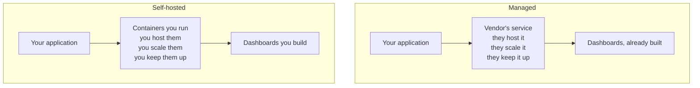
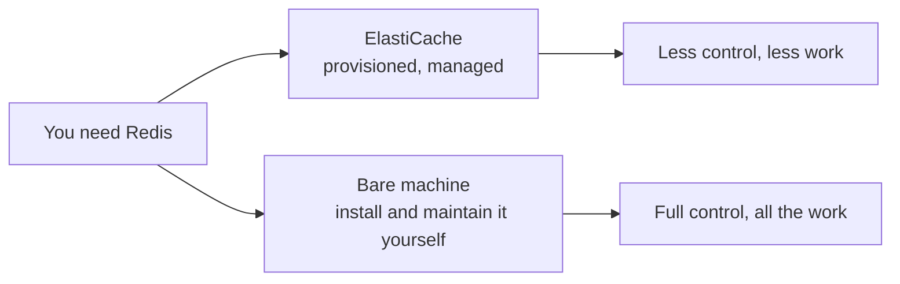

If the protocol is settled and any compliant backend will do, the next question is which one — and the real fork is not which product, but whether somebody else runs it for you.

# Two stacks you assemble yourself

Teams that want granular control tend to build the observability layer from open-source parts rather than buying it. Two combinations come up repeatedly, and each is named after its pieces.

| Stack | Stands for | Notes |
|---|---|---|
| **ELK** | Elasticsearch, Logstash, Kibana | Elasticsearch stores and searches, Logstash ingests, Kibana visualises |
| **LGTM** | Loki, Grafana, Tempo, Mimir | Loki for logs, Grafana for dashboards, Tempo for traces, Mimir for metrics |

The fourth letter of LGTM moves around — Mimir and Prometheus both fill the metrics slot, so the stack is sometimes written LGTP. The letters matter less than the shape, which is the same in both: something ingests, something stores, something draws.

Both are built on top of OpenTelemetry, which is exactly the point of the previous note. Neither is a world of its own; they are backends that speak the standard.

# What a managed service does instead

A managed observability product is the same picture with the ownership line drawn somewhere else. You pay, you integrate, and the running of it is not your problem.

The difference is not capability. A managed service is also built on OTel underneath, so the data and the concepts are the same on both sides. What you are buying is somebody else's operational attention — when the log ingestion pipeline is congested because traffic spiked, that is their pager, not yours.

The second difference shows up sooner and stings more: **dashboards**. A managed service arrives with a great deal already drawn. A self-hosted stack gives you the raw data and an empty canvas, and every panel you want is a panel you build.

# The same trade, one layer down

The pattern is not specific to observability, and it may be more familiar from infrastructure.

If you want Redis on AWS, you can provision ElastiCache — a managed service that installs Redis, configures it sensibly, and handles the surrounding operational work. Or you can rent a plain machine, install Redis on it yourself, configure it yourself, and maintain it yourself: watch it, replace it when it dies, stand up a secondary, wire up replication, and keep all of that working.

Choosing the second is not irrational. It buys granular control, and it avoids paying a premium for something you are capable of running. It costs the time you spend running it.

# Which one, and when

There is no correct answer, only a trade that different teams price differently.

**Reasons a team self-hosts.** They want control over configuration that a managed product does not expose. They are unwilling to pay per-seat or per-gigabyte pricing at their volume. Or the choice is not theirs at all — a company running **bare metal**, meaning without a public cloud provider, has to set up everything itself by definition.

**Reasons a team buys.** Moving fast matters more than control, and every hour spent maintaining a log pipeline is an hour not spent on the product. A common path is to start on a managed service and migrate to a self-hosted stack later, once the volume makes the bill hurt and the team is large enough to absorb the maintenance.

> [!info] The cloud providers also collect this data themselves — AWS CloudWatch gathers logs and metrics directly for anything running on AWS. It is another point on the same line: convenient, tied to one provider, and not an option at all if you are not on that provider.

The notes that follow take the self-hosted path, because it is the one where you have to understand every piece. Building the stack by hand makes visible what a managed service is doing for you, which is worth knowing whichever you eventually pay for.
