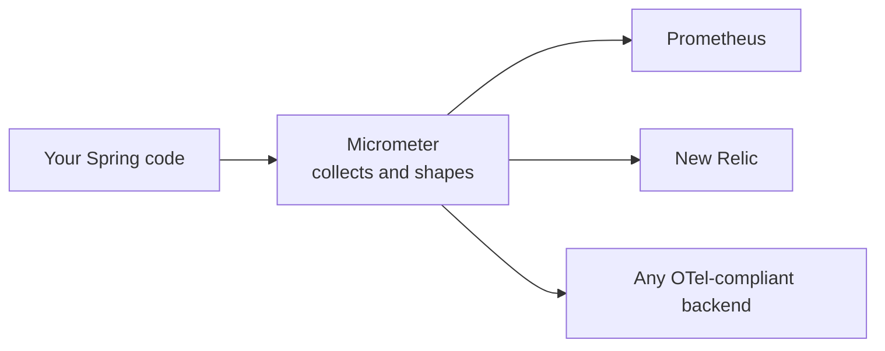
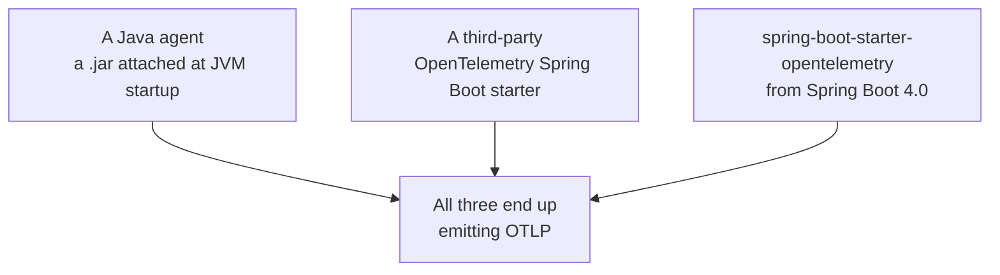

Having chosen to run the stack yourself, the application still has to produce the data. In a Spring Boot project that job is already largely done for you, by a library most people never configure directly.

# Micrometer

**Micrometer is a vendor-neutral observability facade.** A facade here means a single interface your code writes against, behind which the actual destination can be swapped without the code noticing — **the same idea as OpenTelemetry, implemented as a library inside the Spring ecosystem.**

It is easiest to describe as Spring's take on OpenTelemetry: it collects telemetry and processes it in a form compliant with the standard, so that whatever backend you point it at can read it.



> [!info] Micrometer is not Spring Boot Admin, which is a separate project offering a management UI for running applications. Micrometer is a library that gathers the numbers; it draws nothing.

Because Micrometer is already present across the Spring ecosystem, a great deal of instrumentation exists without anyone asking for it. The important consequence is that the enabler is the **protocol**, not any one library — once the data leaves in OTLP shape, the choice of what receives it is open.

# Three ways to get OpenTelemetry into a Spring application

The routes accumulated over time, and older projects still use the older ones.



**The Java agent** is a jar attached when the JVM starts, which instruments the application from the outside without any change to its code. This is the mechanism behind the vendor agents — attaching a vendor's jar and letting it collect everything is exactly this route. We used this when we configured **New-Relic**

**A third-party starter** was for a long time the way to do it inside the build file rather than at the command line.

**`spring-boot-starter-opentelemetry`** is the current answer, and it is a Spring project rather than a third-party one. It arrived in Spring Boot **4.0**, so any project on 4.0 or later can pull it in directly:

```groovy
1  // build.gradle
2  dependencies {
3      implementation 'org.springframework.boot:spring-boot-starter-opentelemetry'
4  }
```

No version is given because the **Spring Boot Gradle plugin manages it**.

> [!warning] This is available from Spring Boot 4.0 onward and not before. A project below 4.0 still has to take one of the two older routes — the Java agent, or a third-party starter.

The project used through these notes runs Spring Boot 4.0.2, which clears that bar.

# What this note does not cover yet

Setting up the starter is how metrics and traces will reach a dashboard, and that is the subject of later notes.

The stack built in the next few notes takes a narrower path deliberately. It is concerned with **logs only**, and it moves them using the logging framework already present in every Spring Boot application rather than through the OpenTelemetry starter. That is the shortest route to a working log pipeline, and it makes each piece visible before more machinery is added on top.
