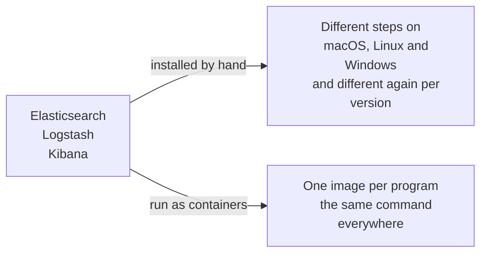

The first stack to build is ELK, which is the easier of the two to get running and the better one to learn the shape on. Its three letters are three separate programs, each doing one job.

# The three pieces

**Elasticsearch** stores the data and searches it. It is a full-text search engine, meaning it can find records containing a word or phrase quickly rather than scanning everything, and it does that using an inverted index — see [[03-The-Inverted-Index]]. For the purposes of this stack it is also the database: the logs live inside it.

**Logstash** is a server-side data processing pipeline that ingests data. It is the piece that takes logs from your application and puts them into Elasticsearch.

**Kibana** is a data visualisation dashboard built specifically for Elasticsearch. It is where you actually look at and search the logs. Its equivalent in the other stack is Grafana.

# How they fit together

Read left to right, the whole stack is one sentence: the application produces logs, Logstash collects them and hands them to Elasticsearch, Elasticsearch indexes them so they can be searched quickly, and Kibana is the window you search through.

Each arrow is a piece of configuration you will write. Logstash has to be told where logs come from and where they go. Kibana has to be told where Elasticsearch is. The application has to be told to send its logs to Logstash at all. Nothing here happens by default.

# Elasticsearch is not only for logs

It is worth separating the tool from this particular use of it, because Elasticsearch is a general search engine and logs are just one thing you can put in it.

| What you store | What you search for |
|---|---|
| Product titles and descriptions | A shopper looking for a product by name |
| Questions and answers on a discussion site | Someone checking whether their question was already asked |
| Application logs | An engineer looking for every line mentioning a request id |

The pattern is identical in all three: text that people need to search across, in volumes where scanning row by row is too slow. Logs qualify — there are a great many of them, and the thing you want to do with them is search. That is what makes Elasticsearch a sensible place to keep them rather than a surprising one.

# Why this is run in Docker

All three programs have to be running before any of this works, and installing all three by hand is where the time goes. Elasticsearch, Logstash and Kibana each install differently on macOS, Linux and Windows, and the instructions differ again between versions.

Containers remove that variance entirely: the image already contains a correct installation, so starting the program is the same command everywhere. All three also need to talk to each other, and a Docker network gives them a private space in which to do it — the machinery covered in [[08-Container-Networking]].

Three containers, each with ports, environment variables, storage and a network to join, is more than is comfortable to start by hand. That is what Docker Compose is for, and writing that file is the next note.

> [!info] Docker has to be running on your machine before any of this works.
