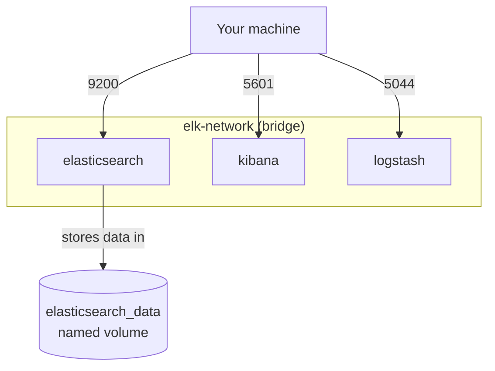

Three containers have to come up, find each other, and keep their data across restarts. Compose describes all of that in one file, so the whole stack starts with a single command.

# Elasticsearch

```yaml
1  elasticsearch:
2    image: elasticsearch:8.17.1
3    container_name: elasticsearch
4    restart: always
5    ports:
6      - 9200:9200
7    volumes:
8      - elasticsearch_data:/usr/share/elasticsearch/data
9    environment:
10     - xpack.security.enabled=false
11     - discovery.type=single-node
12     - ES_JAVA_OPTS=-Xms256m -Xmx256m
13   networks:
14     - elk-network
```

**`image`** names a published image rather than building one. Widely used software — databases, message brokers, this stack — already has official images, so there is no Dockerfile to write. The tag `8.17.1` pins the exact version, and all three services here use the same one deliberately: the pieces of the stack are built to work together at matching versions.

**`container_name`** fixes the container's name instead of letting Docker generate one, which makes it easier to find in `docker ps` and in the Docker Desktop window.

**`ports`** maps port 9200 on your machine to port 9200 inside the container, which is where Elasticsearch listens by default. Host first, container second — the same order as `--publish`.

**`volumes`** points a named volume at the **directory** where Elasticsearch keeps its data. This one matters more than it looks: without it, every index lives inside the container's writable layer and disappears when the container is replaced. With it, a container that crashes and restarts finds its indexes already there instead of rebuilding them from nothing.

**`environment`** carries three settings:

| Variable                         | Effect                                                                                                          |
| -------------------------------- | --------------------------------------------------------------------------------------------------------------- |
| `xpack.security.enabled=false`   | Turns off authentication. **Acceptable for local development**, and not something to carry to a real deployment |
| `discovery.type=single-node`     | Tells Elasticsearch it is running alone rather than looking for a cluster to join                               |
| `ES_JAVA_OPTS=-Xms256m -Xmx256m` | Caps the JVM heap at 256 MB, minimum and maximum both                                                           |

The heap cap is there because **Elasticsearch is a Java program that will happily take a large default share of the machine's memory**. Three containers of this stack running at once on a laptop makes that a real constraint.

# Kibana

```yaml
1  kibana:
2    image: kibana:8.17.1
3    container_name: kibana
4    restart: always
5    ports:
6      - 5601:5601
7    environment:
8      - ELASTICSEARCH_HOSTS=http://elasticsearch:9200
9    depends_on:
10     - elasticsearch
11   networks:
12     - elk-network
```

Kibana listens on **5601**, which is the address you open in a browser to reach the dashboard.

It draws nothing on its own, so it has to be told where the data is, and that is what `ELASTICSEARCH_HOSTS` does. The interesting part of that value is the hostname:

```
http://elasticsearch:9200
```

`elasticsearch` is the **service name** — the key that opens the Elasticsearch block above. Containers on the **same Docker network** resolve each other by **name**, so no IP address is needed and nothing has to be looked up after the containers start. Note also that the port is **9200, not the published port on your machine** — this connection is **container to container**, entirely inside the Docker network, and never goes out to the host.

`depends_on` says **Kibana must not start before Elasticsearch**. Without it the two start together, Kibana reaches for a database that is not listening yet, and fails.

# Logstash

```yaml
1  logstash:
2    image: logstash:8.17.1
3    container_name: logstash
4    ports:
5      - 5044:5044
6    environment:
7      - LS_JAVA_OPTS=-Xmx256m -Xms256m
8    depends_on:
9      - elasticsearch
10   networks:
11     - elk-network
12   volumes:
13     - ./logstash/:/logstash_dir
14   command: logstash -f /logstash_dir/pipeline/logstash.conf
```

Logstash listens on **5044**, and that port is **published** because the thing sending logs to it is your Spring Boot **application running on the host**, not inside the network.

`LS_JAVA_OPTS` caps its heap the same way, for the same reason — Logstash is also a Java program.

The last two lines are the ones that make this service different from the other two.

`volumes` here is a **bind mount**, not a **named volume**. It maps the `logstash/` directory in your project to `/logstash_dir` inside the container, so a configuration file written on your machine appears inside the container without rebuilding anything.


**`command`** replaces whatever the image would run by default, and starts Logstash pointed at that configuration file with `-f`. The path is the one inside the container, which is why it begins with `/logstash_dir` rather than `./logstash`.

The file it names does not exist yet. Writing it is the next note.

# The two top-level blocks

```yaml
1  networks:
2    elk-network:
3      driver: bridge
4
5  volumes:
6    elasticsearch_data: {}
```

`networks` declares **the network the three services join**. Because it is declared here, Compose creates it — nothing has to be set up by hand first.

The **bridge** **driver** creates an **isolated private network that the containers share**. It behaves like a software-defined switch: **containers attached to the same bridge can talk to each other, and are isolated from networks they are not part of.**

It is also the default — Docker creates a bridge network named `docker0` on its own unless told otherwise.

There are other drivers, and it is worth knowing they exist so the choice reads as a choice:

| Driver    | What it does                                                                    |
| --------- | ------------------------------------------------------------------------------- |
| `bridge`  | An i**solated private network** the containers share. The default               |
| `host`    | The container shares the **host machine's network directly, with no isolation** |
| `overlay` | A **network spanning multiple Docker hosts**                                    |
| `none`    | No networking at all                                                            |

`volumes` declares the **named volume** Elasticsearch uses. The empty braces mean take all the defaults — Docker decides where and how to store it. Declaring it is not optional: the Elasticsearch block above refers to `elasticsearch_data`, and referring to a named volume without declaring it here fails.



# Restart policy, and what it hides

`restart: always` tells Docker to **start a container again whenever it stops**. If it crashes, it comes back.

That is useful for a service you want to stay up. It is actively unhelpful while you are still getting the configuration right, because a container that crashes on startup and restarts forever looks, from the outside, a lot like a container that is running. The stack appears to be up, and the reason nothing works is buried.

> [!warning] Notice that Logstash has **no** `restart: always` in the file above, while Elasticsearch and Kibana do. That is deliberate. Logstash is the service whose configuration you are actively writing, and leaving the policy off means a mistake shows up as a container that has plainly exited rather than one quietly restarting in a loop.

# The whole file

```yaml
1  # docker-compose.yml
2  services:
3    elasticsearch:
4      image: elasticsearch:8.17.1
5      container_name: elasticsearch
6      restart: always
7      ports:
8        - 9200:9200
9      volumes:
10       - elasticsearch_data:/usr/share/elasticsearch/data
11     environment:
12       - xpack.security.enabled=false
13       - discovery.type=single-node
14       - ES_JAVA_OPTS=-Xms256m -Xmx256m
15     networks:
16       - elk-network
17
18   kibana:
19     image: kibana:8.17.1
20     container_name: kibana
21     restart: always
22     ports:
23       - 5601:5601
24     environment:
25       - ELASTICSEARCH_HOSTS=http://elasticsearch:9200
26     depends_on:
27       - elasticsearch
28     networks:
29       - elk-network
30
31   logstash:
32     image: logstash:8.17.1
33     container_name: logstash
34     ports:
35       - 5044:5044
36     environment:
37       - LS_JAVA_OPTS=-Xmx256m -Xms256m
38     depends_on:
39       - elasticsearch
40     networks:
41       - elk-network
42     volumes:
43       - ./logstash/:/logstash_dir
44     command: logstash -f /logstash_dir/pipeline/logstash.conf
45
46 networks:
47   elk-network:
48     driver: bridge
49
50 volumes:
51   elasticsearch_data: {}
```

Fifty lines, and now that you have been through all of them, the thing worth saying plainly: there is no logic anywhere in it. Configuration is not a puzzle to reason your way through, **it is a set of values that either match what the software expects or do not.** When something here does not work, the fault is almost always a value copied wrong rather than an idea misunderstood.

> [!warning] **Do not start the file with `version:`.** Older compose files begin with a line like `version: '3.8'`. Current versions of Compose ignore it and warn that it should be removed, so new files leave it out.


# Bringing it up

```bash
1  docker compose up --build -d
```

Compose pulls the three images if they are not already present, creates the network and the volume, and starts all three containers detached. `docker ps`, or the Docker Desktop window, will show them running.

Once they are up, the Kibana dashboard is at `http://localhost:5601`. It will load, and it will have no logs in it — nothing is sending any yet, which is the subject of the next note.
