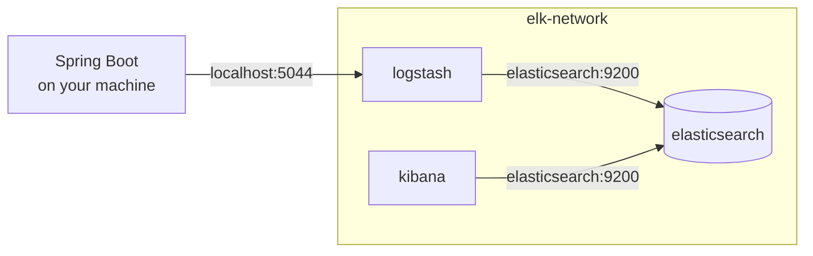
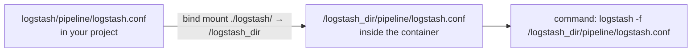

The stack is running and empty. Three things now have to be written: a dependency that can speak to Logstash, a logging configuration that uses it, and the Logstash pipeline that decides what to do with what arrives.

# The encoder dependency

Spring Boot logs through **SLF4J**, which is an **interface**, backed by **Logback**, which is the implementation that actually writes the lines out. Logback can write to a **console** or a **file** **out of the box**. It **cannot** **send** structured **records over a network socket**, and that is what this stack needs.

```groovy
1  // build.gradle
2  dependencies {
3      implementation 'net.logstash.logback:logstash-logback-encoder:8.0'
4  }
```

This library adds **Logback encoders**, **layouts and appenders that emit JSON** and the other formats Jackson supports. In plain terms: it **teaches** the **logging framework** already in the project **how to produce structured output and push it to Logstash**.

# The logging configuration

Logback is configured with an XML file placed in the resources directory. Spring Boot picks up a file named `logback-spring.xml` automatically.

```xml
1  <!-- src/main/resources/logback-spring.xml -->
2  <configuration>
3      <appender name="LOGSTASH" class="net.logstash.logback.appender.LogstashTcpSocketAppender">
4          <destination>localhost:5044</destination>
5          <encoder class="net.logstash.logback.encoder.LogstashEncoder"/>
6      </appender>
7
8      <appender name="CONSOLE" class="ch.qos.logback.core.ConsoleAppender">
9          <encoder>
10             <pattern>%d{yyyy-MM-dd HH:mm:ss} %-5level %logger{36} - %msg%n</pattern>
11         </encoder>
12     </appender>
13
14     <root level="INFO">
15         <appender-ref ref="LOGSTASH" />
16         <appender-ref ref="CONSOLE" />
17     </root>
18 </configuration>
```

**An appender is a destination for log lines.** A configuration can declare several, and every line goes to all of the ones the root refers to.

**`LOGSTASH`** on line 3 is a **TCP socket appender**. It opens a connection to `localhost:5044` and writes each record through it, encoded as JSON by `LogstashEncoder`.

**`CONSOLE`** on line 8 is the **ordinary console output, kept so that logs still appear in the terminal while you work**. Its pattern is the format of each printed line: timestamp, then level padded to five characters, then the logger name shortened to 36, then the message and a newline.

**`root level="INFO"`** sets the threshold — anything at INFO or above is emitted — and the two `appender-ref` lines send it to both destinations at once.

> [!info] A third appender writing to a file is a common addition and is deliberately not here. Logs are already going to Elasticsearch, which is the thing that makes them searchable; a file on disk adds a copy nobody reads. Two appenders is the smaller configuration that does the job.

# Two addresses, and why they differ

The two configuration files each name a host and a port, and they do not match. This is the detail most likely to cause confusion, so it is worth setting out directly.

| Written in           | Address                     | Why                                                                                                                         |
| -------------------- | --------------------------- | --------------------------------------------------------------------------------------------------------------------------- |
| `logback-spring.xml` | `localhost:5044`            | The Spring application runs on your machine, outside Docker. **It reaches Logstash through the port published to the host** |
| `logstash.conf`      | `http://elasticsearch:9200` | Logstash runs inside the Docker network. It reaches Elasticsearch by service name, without leaving that network             |



The rule underneath is the one from [[08-Container-Networking]]: **service names resolve only inside the Docker network, and anything outside it has to come in through a published port.**

# The Logstash pipeline

Logstash needs two things defined: how data comes in, and where it goes out.

```ruby
1  # logstash/pipeline/logstash.conf
2  input {
3      tcp {
4          port => 5044
5          codec => json
6      }
7  }
8
9  output {
10     elasticsearch {
11         hosts => ["http://elasticsearch:9200"]
12         index => "logs-%{+YYYY.MM.dd}"
13     }
14 }
```

**The input block** opens a TCP listener on 5044 and **expects each message to be JSON** — which is exactly what `LogstashEncoder` on the other end produces. Logstash can **also read from files**, and TCP is the better choice here because it is a persistent connection rather than something polling a file on disk.

**The output block** writes to Elasticsearch, and `index` decides which index each record lands in. `logs-%{+YYYY.MM.dd}` expands to a name like `logs-2026.08.30`, so a new index is created each day.

Splitting by date is a small decision with a large payoff. Searches that only care about recent data touch only recent indexes, and deleting old logs becomes dropping whole indexes rather than deleting records from inside one.

The path of that file matters, because the compose file already named it:



# Two things that stopped it working

Both failures below are worth walking through, because neither error message points at its cause.

**The application refused to start**, complaining that an appender of that type failed to instantiate. Reading it literally, Logback could not find the class named on line 3 of the XML — which is true, because the dependency had been added to `build.gradle` but the project had not been rebuilt, so the jar was not on the classpath yet. Building it first fixes it:

```bash
1  ./gradlew build -x test
2  ./gradlew bootRun
```

`-x test` skips the tests, which are not what is being checked here.

**Logstash crash-looped on a trailing comma.** With the application running and Kibana open, no logs arrived. Elasticsearch answered on 9200, so storage was fine. Kibana loaded, so the dashboard was fine. Checking the containers showed Logstash starting, exiting, and starting again — **the bridge between the application and Elasticsearch was never up long enough to carry anything**.

The cause was a stray comma inside the output block of `logstash.conf`. That file is not YAML or JSON and does not want commas between settings; one left in is a syntax error, and Logstash exits on a configuration it cannot parse.


> [!warning] This is the crash loop that `restart: always` hides. From the outside the container looks like it is running, because it genuinely is — briefly, over and over. Removing the restart policy while debugging turns the symptom into a container that has plainly exited, which is far easier to notice. If a container appears healthy but nothing it should be producing arrives, check whether its uptime keeps resetting.

With the comma removed and the stack brought up again, logs start arriving in Elasticsearch and Kibana has something to show.
