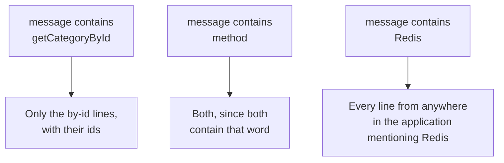
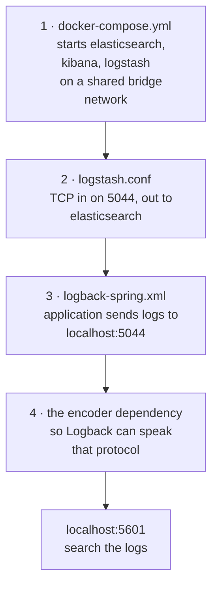
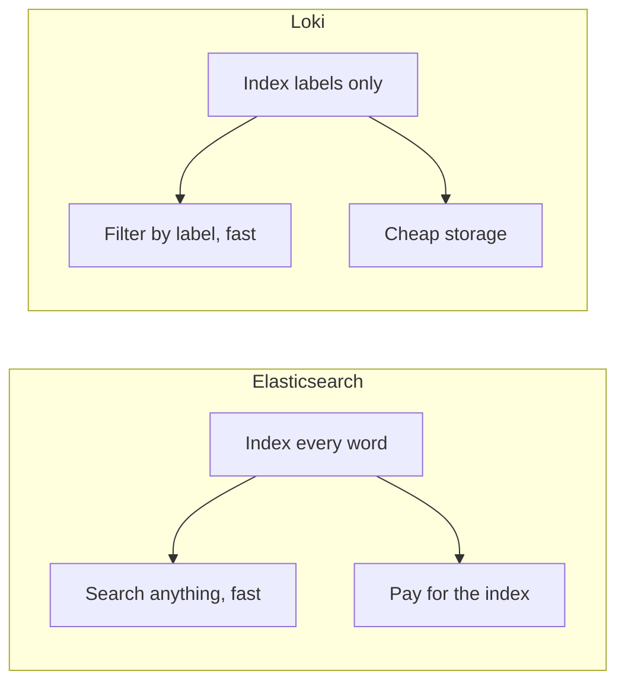

Logs are now flowing into Elasticsearch. What makes that worth the setup is what you can do with them once they are there, which is search rather than scroll.

# Producing logs worth searching

A service is a good place to add log lines, because it is where the work happens.

```java
1  // src/main/java/com/example/FakeCommerce/services/CategoryService.java
2  @Slf4j
3  @Service
4  @RequiredArgsConstructor
5  public class CategoryService {
6
7      private final CategoryRepository categoryRepository;
8
9      public List<Category> getAllCategories() {
10         log.warn("getAllCategories method called");
11         return categoryRepository.findAll();
12     }
13
14     public Category getCategoryById(Long id) {
15         log.info("getCategoryById method called with id {}", id);
16         return categoryRepository.findById(id)
17             .orElseThrow(() -> new ResourceNotFoundException("Category with id " + id + " not found"));
18     }
19 }
```

**`@Slf4j`** is a Lombok annotation that generates the `log` field, which is why it can be used on lines 10 and 15 without being declared anywhere.

**`{}` on line 15 is a placeholder.** The value of `id` is substituted in when the line is written. This is worth preferring over building the string yourself with `+`, because the substitution only happens if the line is actually going to be emitted at the current level, and because the structured output keeps the value as a field rather than as text baked into a sentence.

The two levels are deliberately different — one `warn` and one `info` — so that filtering by level has something to distinguish.

Restart the application, then call both endpoints a few times so there is something to look at. Calling `getCategoryById` with an id that does not exist is useful too: it produces a log line and a 404, and both are visible afterwards.

# Finding them

Kibana at `http://localhost:5601` has a **Logs** section with a log explorer in it. Two controls do most of the work.

**The time range** decides how far back the view reaches. It defaults to a recent window, and when a log you just produced does not appear, the range is the first thing to check — not the pipeline.

**Filters** narrow what is shown. Adding a filter on level is the simplest case:

| Filter | What comes back |
|---|---|
| level is `WARN` | Only `getAllCategories method called` |
| level is `INFO` | Only the `getCategoryById` lines |
| no filter | Both, interleaved in time order |

That much any log viewer can do. The part that is specific to Elasticsearch is the next one.

# Searching the message

Filtering on `message` searches the text of the log line itself.



The third query is the one that shows what this is for. Nobody planned in advance to search for Redis. The lines mentioning it were written at different times, by different parts of the application, for unrelated reasons — and asking for all of them at once takes a moment, across however many log lines exist. Kibana also reports how many records matched, which turns a vague question into a number.

Filters combine, so a level filter and a message search apply together: every `WARN` line containing a given word, in a given time window.

This is the payoff of putting logs in a search engine rather than a file. Elasticsearch built an inverted index over the message text when the line arrived, so finding every occurrence of a word does not mean reading every line — see [[03-The-Inverted-Index]].

> [!info] How far back you can search is decided by **retention**: how long indexes are kept before being deleted. That is a storage decision, not a search one. Indexing every log line forever is possible and expensive, which is why the date-based index naming from the previous note matters — it makes dropping old data cheap.

# What the whole setup was

Stepping back, the entire stack came down to four pieces of configuration.



None of it contains logic. It is configuration that either matches what each program expects or does not, and once it matches it keeps working without further attention. That is the reason not to spend a long time reasoning about it: get the values right, once.

# When Elasticsearch is the wrong choice

The other stack stores logs in Loki rather than Elasticsearch, and the difference between them is a real trade rather than a matter of taste.

| | Elasticsearch | Loki |
|---|---|---|
| What is indexed | The full text of every log line | Only metadata — labels attached to each stream |
| Index size | Large, because an inverted index over all text is large | Tiny |
| Where log content lives | On disk, in the index | Compressed chunks in object storage such as S3 |
| What you can ask | Any word or phrase in any message | Filters on labels, then a scan within the matches |
| Storage cost | High | Low |



**Choose Loki** when the questions you ask are of the form show me everything from this service, at this level, in this window — label filtering, answered quickly, over log volumes that would be expensive to index fully.

**Choose Elasticsearch** when you need to search the content of the messages themselves, and the storage is worth it.

The stacks are not mutually exclusive in practice, and the distinction is worth holding onto because it explains why two tools that both appear to be log viewers are priced and sized so differently.
