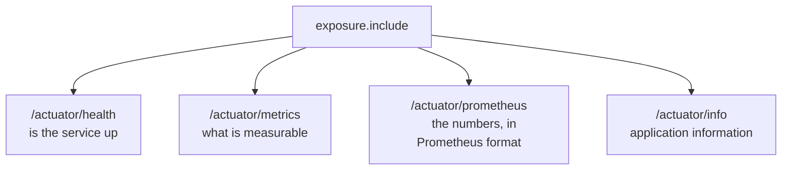

Logs now flow into Elasticsearch and can be searched. Metrics are the second pillar, and they need something to produce them — because unlike logs, an application emits no metrics at all unless something is counting.

# What you would otherwise write yourself

Consider what it takes to answer how many requests failed in the last minute. Something has to count every request, classify each response, time each one, and hold those numbers somewhere they can be read. Then the same again for memory, for threads, for connection pool usage.

That is a large amount of code that has nothing to do with the product, and it is identical in every application ever written.

**Spring Boot Actuator is that code, already written.** It adds production-ready features to an application: metrics, health checks, and environment information, collected without anything being asked of the business logic.

| It provides | Examples |
|---|---|
| Metrics | CPU usage, memory usage, request counts, request durations, error counts |
| Health checks | Is the service up, is the database reachable |
| Environment | The configuration properties the application is running with |


Actuator is the **data source** for everything in the notes that follow. It produces the numbers; a time-series database stores them; a dashboard draws them.

# Adding it

```groovy
1  // build.gradle
2  dependencies {
3      implementation 'org.springframework.boot:spring-boot-starter-actuator'
4  }
```

> [!warning] A new dependency does nothing until the project is rebuilt. Adding the line and restarting is not enough — the jar has to be on the classpath first, which is the same trap that stopped the application booting in the previous folder's Logstash work.

# Nothing is exposed by default

With the starter added and the application restarted, this still fails:

```text
  GET http://localhost:8080/actuator/metrics
  → 500 Internal Server Error
```

That is deliberate. These endpoints report on the internals of a running system, so **none of them are reachable over HTTP until named explicitly.** Anything you have not asked for is not there to be found.

```yaml
  # src/main/resources/application.yml
  management:
    endpoints:
      web:
        exposure:
          include: health, metrics, prometheus
```

Each name in that list turns on one endpoint.



# The endpoints

**`/actuator/metrics`** lists the names of everything being measured — a long list, most of it there without being asked for. Naming one returns its current value.

**`/actuator/health`** answers whether the application is alive:

```text
1  {"status":"UP"}
```

Which is exactly what an external checker wants: something to call on a schedule, where a success response means the service is running. Load balancers and container orchestrators use this to decide whether to send traffic to an instance at all.

By default that is the whole answer. One more setting makes it useful to a human:

```yaml
  # src/main/resources/application.yml
  management:
    endpoint:
      health:
       show-details: always
```

Now the response breaks down by component — whether MySQL is reachable, how much disk space remains, and the state of anything else the application depends on. The difference matters: `UP` tells you the process is running, while the detail tells you whether it can actually do its job.

**`/actuator/info`** returns application information, and is empty until you supply some. Asking for it before exposing it returns the same 500 as any unexposed endpoint, which is a useful way to confirm that the exposure list is what controls this.

**`/actuator/prometheus`** is the one the rest of this folder depends on. It publishes the same metrics in the text format Prometheus expects, which is what makes them collectable by something outside the application.

> [!info] With New Relic, all of this arrived on its own — the agent instrumented the application and started reporting, and nothing had to be added to produce the numbers. Self-hosted, the application has to be told to produce the data and told where to publish it. Actuator is the first concrete instance of the extra effort that choice costs.
