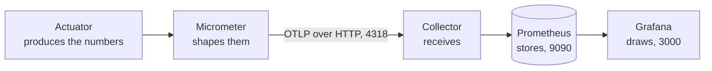
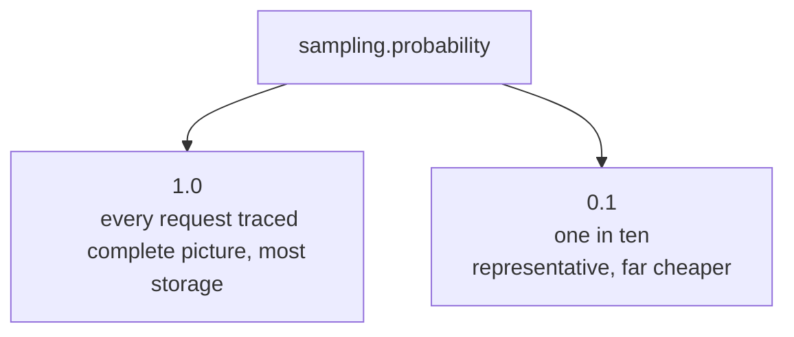

Actuator is producing metrics and publishing them at an endpoint. Nothing is collecting them yet, and nothing is drawing them. That takes one container and three dependencies.

# One image, four services

The other stack could be assembled the way ELK was, a container per component. There is a shorter route: a single image with the whole thing already wired together.

```yaml
1  # docker-compose.yml
2  services:
3    grafana-lgtm:
4      image: 'grafana/otel-lgtm:latest'
5      ports:
6        - 3000:3000
7        - 9090:9090
8        - 4317:4317
9        - 4318:4318
```

Four ports, because four things are running inside it.

| Port | What answers there |
|---|---|
| 3000 | Grafana, the dashboard |
| 9090 | Prometheus, the time-series database |
| 4317 | The OpenTelemetry collector, over gRPC |
| 4318 | The OpenTelemetry collector, over HTTP |

The last two are the collector from the first note in this folder, made concrete. It accepts telemetry on both transports, and which one you use is a configuration choice rather than a difference in what arrives.

That gives the full path a metric takes, end to end, with a named component at every step:



**Actuator measures, Micrometer shapes, the collector receives, Prometheus stores, Grafana draws.** Five pieces, each replaceable, because the joins between them are the standard rather than a private arrangement.

# Three dependencies

```groovy
1  // build.gradle
2  dependencies {
3      implementation 'org.springframework.boot:spring-boot-starter-opentelemetry'
4      implementation 'io.micrometer:micrometer-registry-prometheus'
5      implementation 'org.springframework.boot:spring-boot-docker-compose'
6  }
```

**The OpenTelemetry starter** is the one from earlier in this folder — it sets up the export machinery so telemetry can leave in OTLP shape.

**The Prometheus registry** is the Micrometer piece that shapes metrics for Prometheus specifically. Micrometer collects; a registry decides what the collected numbers look like on the way out.

**`spring-boot-docker-compose`** is a convenience introduced in **Spring Boot 3.1** for local development. It automates the bridge between the application and its containers: it detects the project's compose file and brings the containers up when the application starts, so `docker compose up` is no longer a separate step you have to remember, and so are the environment variables and connection details that would otherwise be wired by hand.

> [!warning] The docker-compose integration did not start the containers in practice, even with the dependency present and the configuration below in place. Running `docker compose up` by hand works and is what the rest of these notes assume. Treat the automatic route as a convenience to verify rather than to rely on.

```yaml
1  # src/main/resources/application.yml
2  spring:
3    docker:
4      compose:
5        enabled: true
6        file: docker-compose.yml
```

# Telling the application where to send things

Everything else is one block of configuration, and it is worth reading a piece at a time.

```yaml
1  # src/main/resources/application.yml
2  management:
3    otlp:
4      metrics:
5        export:
6          url: http://localhost:4318/v1/metrics
7          step: 10s
8          histogram-flavor: explicit-bucket-histogram
9    opentelemetry:
10     tracing:
11       export:
12         otlp:
13           endpoint: http://localhost:4318/v1/traces
14   tracing:
15     export:
16       enabled: true
17     sampling:
18       probability: 1.0
19   metrics:
20     distribution:
21       percentiles-histogram:
22         http.server.requests: true
```

**Lines 6 and 13 are the same collector, different paths.** Metrics go to `/v1/metrics`, traces to `/v1/traces`. Both use port 4318, the HTTP transport. And both say `localhost` because the application runs on your machine while the collector runs in a container — reachable only through the published port.

**`step: 10s`** is how often the application batches up its metrics and pushes them. It is why a dashboard does not react instantly: a change takes up to ten seconds to leave the application, before Prometheus has even seen it.

**`histogram-flavor`** and **`percentiles-histogram`** are the same idea from two directions, and they exist to make percentile latency answerable. Recording only a running total and a count gives you an average, which hides everything interesting. A histogram records how many requests fell into each duration bucket, and from buckets you can ask what the 90th or 99th percentile was. Without these two settings the percentile queries later in this folder have nothing to compute from.

**`tracing.export.enabled`** is a master switch — false means no traces are produced at all, regardless of the endpoint above.

**`sampling.probability: 1.0`** means every single request is traced. That is right for local work and often wrong in production, where tracing every request of a high-traffic service costs storage that buys little. A probability of 0.1 traces one request in ten, which is usually enough to characterise behaviour.



# Two settings that are not about telemetry

```yaml
1  # src/main/resources/application.yml
2  server:
3    shutdown: immediate
4  logging:
5    level:
6      com.example.FakeCommerce: INFO
7      org.springframework.boot.docker.compose: DEBUG
```

**`shutdown: immediate`** makes the application stop accepting requests and exit as soon as it is asked to, rather than waiting for in-flight work.

**Logging levels are set per package.** Line 6 says the application's own code emits `INFO` and anything more severe — so `INFO`, `WARN` and `ERROR` are recorded, and `DEBUG` is discarded. Line 7 raises one specific library to `DEBUG`, which is how you get detail from one component without drowning in it from all of them.

> [!info] Raising the docker-compose package to `DEBUG` is a deliberate debugging move: it is the component whose behaviour is in question, so it is the one turned up.

# What to expect when it starts

With the containers up and the application running, Prometheus answers at `http://localhost:9090` and Grafana at `http://localhost:3000`. Grafana arrives with some dashboards already built, several of them for the JVM.

Two things are worth knowing before the next note, because both cost time here.

**Small configuration mistakes fail silently.** A misspelled key is not rejected — it is simply a key nothing reads, so the export it was meant to configure never happens and no error says so. Two such typos, one in the histogram flavour and one in a tracing key, each produced the same symptom: an application that starts perfectly and a dashboard with no data.

**Grafana's built-in dashboards stayed empty even once data was arriving.** A panel built by hand against the same Prometheus data source drew immediately. So an empty built-in dashboard is not evidence that the pipeline is broken, and checking with a panel of your own is the faster diagnosis.
