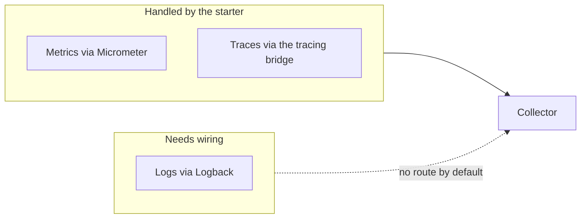
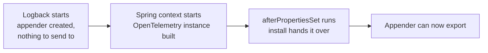
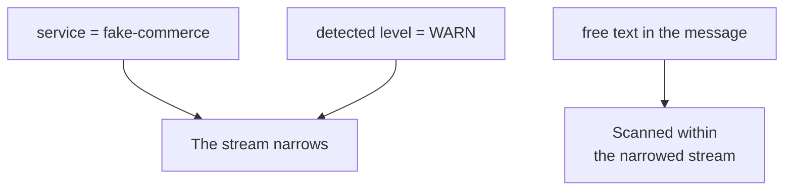

With that configuration in place, metrics arrive and traces arrive. Logs do not — and the reason is worth understanding, because it explains something about how the three pillars actually reach a backend.

# Why two of three worked

Metrics and traces are produced by the framework. Micrometer counts requests and times them; the tracing machinery observes requests as they pass through. Both are things Spring itself does, so pointing the OpenTelemetry starter at a collector is enough to send them.

**Logs are different: they are produced by a logging framework that predates all of this.** Your code calls SLF4J, Logback writes the line out, and neither has any idea OpenTelemetry exists. Nothing connects one to the other by default.



The fix is the same shape as the ELK wiring earlier in this folder: **an appender**. There, an appender was added so Logback could speak to Logstash. Here, one is added so Logback can speak to OpenTelemetry. Logback writes to as many destinations as you configure, and each destination needs its own.

# Three pieces

**The dependency**, which supplies the appender class:

```groovy
1  // build.gradle
2  dependencies {
3      implementation 'io.opentelemetry.instrumentation:opentelemetry-logback-appender-1.0:2.21.0-alpha'
4  }
```

**The endpoint**, alongside the metrics and traces endpoints from the previous note:

```yaml
1  # src/main/resources/application.yml
2  management:
3    opentelemetry:
4      logging:
5        export:
6          otlp:
7            endpoint: http://localhost:4318/v1/logs
```

Same collector, same port, third path. The pattern is now complete: `/v1/metrics`, `/v1/traces`, `/v1/logs`.

**The appender itself**, in the Logback configuration:

```xml
1  <!-- src/main/resources/logback-spring.xml -->
2  <configuration>
3      <include resource="org/springframework/boot/logging/logback/base.xml"/>
4
5      <appender name="LOGSTASH" class="net.logstash.logback.appender.LogstashTcpSocketAppender">
6          <destination>localhost:5044</destination>
7          <encoder class="net.logstash.logback.encoder.LogstashEncoder"/>
8      </appender>
9
10     <appender name="OTEL" class="io.opentelemetry.instrumentation.logback.appender.v1_0.OpenTelemetryAppender">
11         <captureExperimentalAttributes>true</captureExperimentalAttributes>
12         <captureKeyValuePairAttributes>true</captureKeyValuePairAttributes>
13     </appender>
14
15     <root level="INFO">
16         <appender-ref ref="CONSOLE" />
17         <appender-ref ref="LOGSTASH" />
18         <appender-ref ref="OTEL" />
19     </root>
20 </configuration>
```

**Line 3 replaces the hand-written console appender.** Spring Boot ships a base configuration that already defines `CONSOLE` with sensible formatting, so including it and referring to the name on line 16 is less to maintain than declaring one.

**Lines 11 and 12** tell the appender to carry more than the message text — the structured key-value pairs attached to a log event travel with it, which is what makes filtering by field possible on the other end.

**Three appenders on the root now.** The same log line goes to the console, to Logstash for Elasticsearch, and to OpenTelemetry for Loki. That is not redundancy for its own sake; it is what lets the two stacks be compared on identical data.

# One more piece, which is easy to miss

The appender exists and is configured, and it still sends nothing. It needs to be handed the OpenTelemetry instance the application built at startup:

```java
1  // src/main/java/com/example/FakeCommerce/config/OpenTelemetryAppenderInitializer.java
2  @Component
3  public class OpenTelemetryAppenderInitializer implements InitializingBean {
4
5      private final OpenTelemetry openTelemetry;
6
7      public OpenTelemetryAppenderInitializer(OpenTelemetry openTelemetry) {
8          this.openTelemetry = openTelemetry;
9      }
10
11     @Override
12     public void afterPropertiesSet() {
13         OpenTelemetryAppender.install(this.openTelemetry);
14     }
15 }
```

The reason this class has to exist is an ordering problem. **Logback starts before Spring does.** It has to, since Spring's own startup produces log lines. So when the appender is created there is no application context yet and no OpenTelemetry instance to attach to.



`InitializingBean` gives a bean a method that runs once its dependencies are injected, and `install` passes the instance to the waiting appender. After that, log lines export.

> [!warning] Adding a dependency again requires a rebuild before the class exists on the classpath. A complaint about a missing class here means the build has not caught up, not that the configuration is wrong.

# Filtering in Loki

With logs arriving, Grafana's log view has the same job Kibana had, approached differently.

Loki attaches metadata to each line and filters on that: the service name, the severity, and any fields the appender carried across. Filtering to a single level, or to one service, is immediate.



Searching the message text also works, but it is scanning rather than an index lookup — which is the trade from the end of the ELK material made tangible. **Loki filters by label quickly and searches text slowly; Elasticsearch does the reverse and pays in storage for it.** Having both fed from the same three appenders is a good way to feel the difference on your own data.
