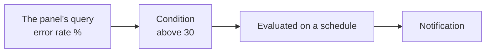
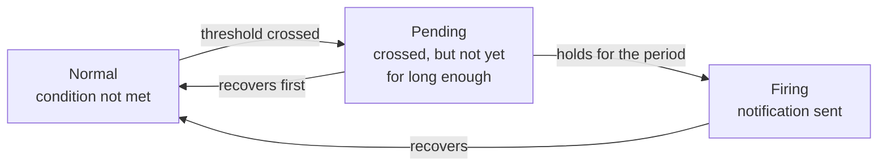
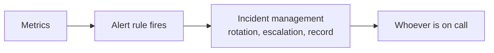
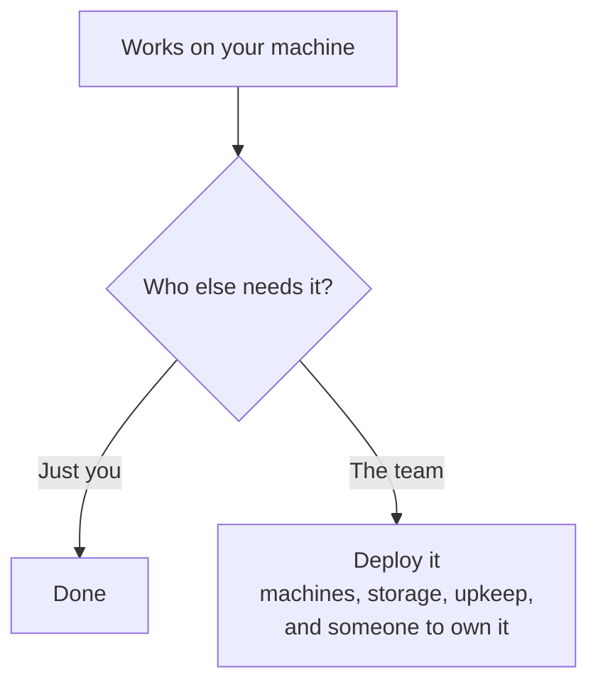

A dashboard answers questions when somebody is looking at it. Most of the time nobody is, and the failures that matter happen at night. An alert is the part that does the looking for you.

# A rule is a query with a threshold

An alert rule starts from a panel you have already built, which is why the dashboard came first. The panel's query is carried over, and a condition is attached to it.

```
when the query result is above 30 → alert
```

That is the whole idea. The query already produces a number — error rate as a percentage, say — and the rule fires when the number crosses a line you choose.



# Grouping and evaluation

Two pieces of structure come with the rule.

**A folder and labels** organise rules. Labels — a severity, a name for what is wrong — are what let notifications later be routed differently: a warning to a chat channel, something severe to a phone.

**An evaluation group sets the rhythm**, and it is the more interesting one. It defines how often the rule is checked and, crucially, how long the condition must hold before the alert is real.

That second part is what stops alerts being useless. A momentary spike above the threshold is not an incident — it is one slow second. Requiring the condition to persist for a minute filters those out, and it is the difference between an alert people trust and one they learn to ignore.

# Normal, pending, firing

The duration requirement produces three states, and watching them move is the clearest explanation of what the evaluation period does.



**Pending is the useful state.** It means the threshold has been crossed but the rule is waiting to see whether it stays crossed. A brief spike goes to pending and returns to normal without ever notifying anyone. Only a condition that persists becomes firing.

Driving the error rate to 100 percent with a load test of failing requests walks the rule through all three: normal, then pending as soon as the rate passes 30, then firing once it has held.

# Contact points

Firing decides that something is wrong. A contact point decides who hears about it.

| Contact point | Typical use |
|---|---|
| Email | Low urgency, a record |
| Slack or Discord | Team visibility during working hours |
| PagerDuty | Waking somebody up |
| Cloud notification services | Feeding other automation |

A notification carries a message you write, and it should contain the current value rather than only the fact that a threshold was crossed. Two percent over the line and ten times over it are different situations, and the responder should not have to open a dashboard to tell them apart. A link to a runbook — the written procedure for this specific alert — belongs there too.

> [!warning] A firing alert does not deliver itself. Email needs an SMTP server configured, Slack needs an API integration. Without one, the rule fires correctly and the notification goes nowhere — which is a failure mode worth testing on purpose, because it looks identical to an alert that never fired.

# What the alert is actually for

Alerts are the input to on-call: the arrangement where somebody is responsible, at any hour, for responding when something breaks.

**Incident management software is where that lives.** PagerDuty is the common one — sometimes called ICM, for incident and change management, and sometimes just called on-call — and it holds the on-call rotation, decides who is currently responsible, escalates when they do not respond, and keeps the record of what happened. Open it and you see the currently open on-call tickets. Those tickets are not raised by people; they are raised by exactly the kind of alert built above, whether that alert came from a stack you run or from a managed service.

Grafana has its own product in this space as an alternative to PagerDuty, so the choice of alerting stack does not force the choice of on-call tool.



This is the honest answer to why the observability stack was worth building. Dashboards are for investigating. **Alerts are the part that runs when nobody is watching**, and the setup only starts paying for itself once something is watching on your behalf.

# The paid alternatives, and why teams still pick them

New Relic is not the only managed option. **Datadog** is the other name that comes up constantly, and it covers the same ground — observability dashboards, alerting, the lot — for a bill.

The reason to name it is a difference that has appeared recently and is easy to miss. **These vendors are building AI capabilities directly into their products**, so a paying team gets them out of the box: anomaly detection, natural-language querying, automated root-cause suggestions, whatever the vendor has shipped this quarter.

A self-hosted stack does not. Getting comparable behaviour out of Grafana and Prometheus means building custom integrations yourself, or waiting for the open-source projects to ship their own equivalents. That is a genuine reason teams choose to pay, and it is a newer reason than cost or convenience — it did not exist a few years ago and it will keep moving.

> [!info] This cuts the same way as everything else in this folder. The gap is not in the data — both sides are collecting the same three pillars over the same standard. The gap is in what has been built on top of that data, and that is the part you either buy or build.

# The cost that only appears later

One thing this whole folder has quietly avoided: everything built here runs on one machine, the one it was built on.

Making it available to a team means deploying it — renting machines, running Prometheus and Grafana on them, keeping them up, storing the data somewhere durable, and dealing with it when the observability stack is itself the thing that breaks. That work is invisible while it all runs locally and unavoidable afterwards.



Which is the trade from the start of this folder, arriving with a number attached. A managed service is a bill. A self-hosted stack is a bill plus somebody's attention, permanently — the machines it runs on, the storage it fills, and a person who owns it when the observability stack is itself the thing that broke.

With a managed product none of that exists. You create accounts for the people who need access, and they have dashboards.
