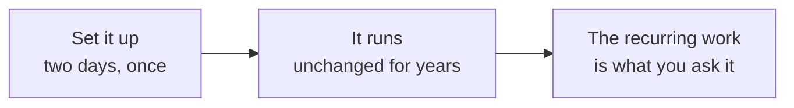
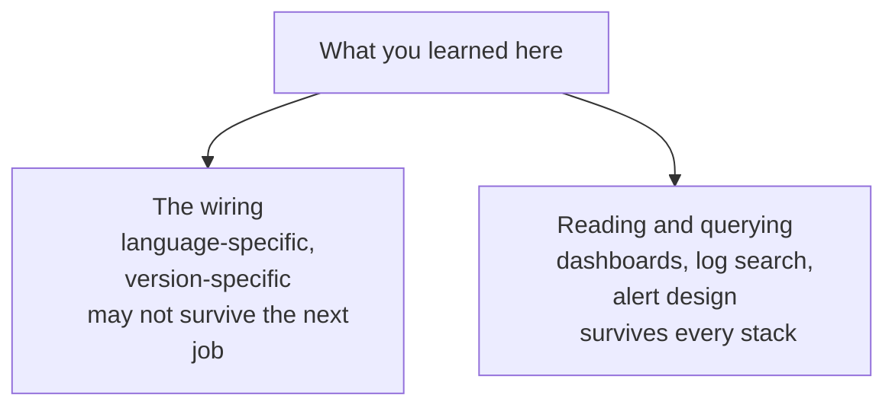
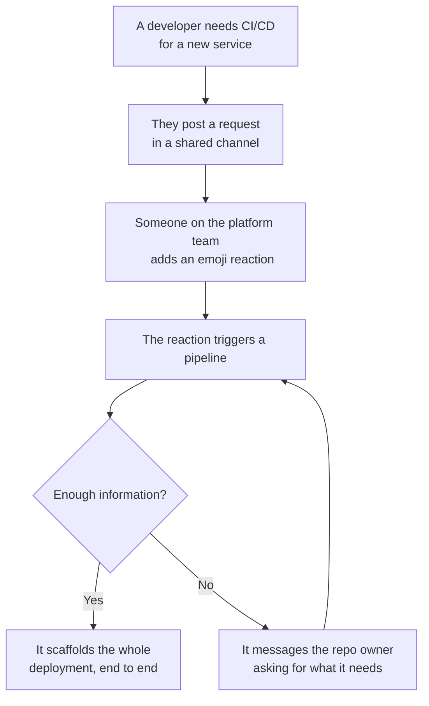

Twelve notes of setup are behind you, and almost none of it is work you will do again. That is worth saying explicitly, because it changes what was worth learning here and what was only worth doing once.

# Most of this is a one-time cost

Setting up an observability stack, setting up a deployment, wiring CI — **eighty to ninety percent of this kind of work happens once.** Once it is done, most of it does not change for a very long time. A repository might take two days to fully instrument and dashboard, and then sit untouched for years.

It is also almost entirely documentation-driven. There is no logic in any of it. You read what the tool expects, you supply those values, and it either matches or it does not. Nothing in the last twelve notes required an idea; it required a correct string in the correct place.

Both of those facts point the same way. Work that is fully documented and has been done identically thousands of times before is exactly the work that automated tooling absorbs first — and increasingly does. Being the person who can perform that setup is not, on its own, a durable thing to be.

# Where the engineering actually is

The value is not in standing the stack up. It is in what you do once it is standing.

Given a specific problem, in a specific system, with specific data and specific scale — can you navigate to a solution? That question does not have a documented answer to look up. Every component you will ever own, whether it is payments, notifications, search, or whatever the business actually sells, has interesting problems of that kind, and they are shaped by the data and the load rather than by a configuration reference.

Applied to this folder, the split is clean:

| One-time, documented | Recurring, judgement |
|---|---|
| Writing `docker-compose.yml` | Deciding which metrics matter for this service |
| Wiring Logback to Logstash | Writing the query that exposes a real problem |
| Exposing Actuator endpoints | Choosing a threshold that fires on incidents and not on noise |
| Pointing OTLP at a collector | Reading a dashboard during an incident and knowing what to look at |

**The left column does not transfer. The right column does.**

# What survives a change of job

Be concrete about what happens next. You learn this stack in a Java project. You join a company writing Python, where the log setup does not involve Logback at all and never will. Or you stay in Java and the tooling moves on — a future version drops `logback-spring.xml`, or replaces the appender arrangement with something else entirely. There is no guarantee that the configuration you just wrote is the configuration anyone writes in five years.

What is not lost is the other half: **knowing how to build a dashboard, and knowing how to search logs efficiently.** Those are the same regardless of the language the service is written in, and they are the same whether the backend is one you run or one somebody bills you for. A dashboard is a dashboard.

# In most companies you will not do this at all

There is a further reason not to over-invest in the setup: in an established company you are usually not the one doing it. Log ingestion and metrics are typically **existing internal tooling**, already standing, already owned. The task that reaches you is not stand up ELK, it is add a dashboard to the one we have.

Unless you are a founding engineer, or the company is moving to an entirely new stack, that is the normal shape of it.

Larger organisations formalise this further with a **developer experience team** — software engineers who are also well versed in operational tooling, and who own this work as a product for everyone else. What that looks like in practice, at a company of only three or four hundred engineers:

The developer who owns the service does not learn any of the deployment machinery. They ask, they answer one follow-up question if the pipeline needs something, and their service is deployed. **The setup knowledge lives in the pipeline, not in the engineer.**

# Do it once by hand anyway

None of which is an argument for skipping it, for three reasons.

**It does not go smoothly, even for people who have done it repeatedly.** Someone who has stood this exact stack up ten times will still hit something new each time — a trailing comma, a renamed metric, a container quietly crash-looping. Working through those is the part that builds the instinct for where to look, and it cannot be read.

**Doing it once makes the second time cheap.** After you have written this configuration yourself, you own a working reference. The next project, or a take-home exercise that wants observability, becomes copying from something you already understand rather than starting from documentation.

**It shows you what a managed service was doing.** Every step in these notes was a step somebody else's product performs silently. Having performed them, you know precisely what you would be buying, which is the only position from which the choice between buying and building is a real decision rather than a default.

# The honest recommendation

Starting a new team today, the reasonable default is the managed service — unless the bill is genuinely the blocking constraint.

Migrate to a self-hosted stack when two things are true at once: the volume makes the cost hurt, and there is enough bandwidth to have someone dedicated to observability rather than treating it as everyone's occasional side task. Both conditions matter. Self-hosting without the second one produces a stack nobody maintains, which is worse than the bill.

And once it is running, whichever way you went, the setup stops being the point. **The alerts are the point.** Everything in this folder exists so that something is watching when nobody is, and so that the person it wakes has enough on their screen to act. That is a permanent job. The configuration was a Tuesday.
