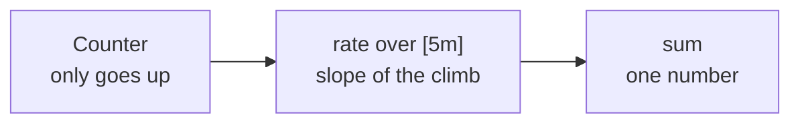
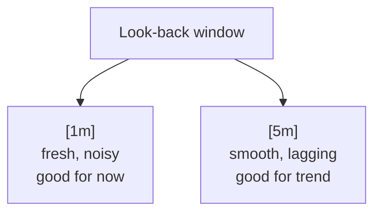

All three pillars now reach the stack. What remains is the part that is actually engineering rather than configuration: deciding what to show, and asking Prometheus for it.

# A panel is a query plus a shape

Every panel is two decisions. Which data source, and what to ask it — then how to draw the answer.

| Visualisation | Shows | Good for |
|---|---|---|
| **Stat** | One number, right now | Total requests, current error rate, latency |
| **Time series** | A line over the chosen window | The same values, but their shape over time |

Both usually want the same query. Building a stat and a time series from one expression is common, and worth doing — the number tells you where you are, the line tells you whether it is moving.

# Finding the metric name

The first query will probably return nothing, and the reason is a name:

```promql
  http_server_requests_seconds_count      # returns nothing
  http_server_requests_milliseconds_count # returns data
```

Micrometer exporting over OTLP records durations in **milliseconds**, and the unit is part of the metric name. The same metric scraped directly from Actuator's Prometheus endpoint would be in seconds. Nothing warns you; the query is valid, it just matches no series.

> [!warning] An empty panel means the query matched nothing, which is not the same as no data existing. Before suspecting the pipeline, check the metric name — Grafana's metric browser lists what actually exists, and the name it shows is the one to use.

# Counters, and why you rarely graph them raw

```promql
  http_server_requests_milliseconds_count
```

This is a **counter**: a number that only ever goes up, counting every request since the application started. Graphed raw it produces a line climbing forever, which answers how many requests have ever been served and almost nothing else.

It is still worth one stat panel, because a total that stops climbing is a service that stopped serving.

The interesting questions are about change, and PromQL has two functions for that.

# `rate` — how fast is it happening

```promql
  sum(rate(http_server_requests_milliseconds_count[5m]))
```

Read from the inside out.

**`[5m]` is a range vector** — a look-back window. It says take not the current value but every value in the last five minutes.

**`rate(...)`** computes the per-second average rate of increase across that window. It is a slope: how much the counter grew, divided by the time it took.

**`sum(...)`** collapses the separate series — one per endpoint, method and status — into a single number.

Together: requests per second, averaged over the last five minutes.



**The window length is a real trade-off.** A short window reacts quickly and jumps around; a long one is smooth and lags. With `[1m]`, a minute of no traffic sends requests per second to zero almost immediately. With `[5m]`, the same silence takes far longer to show, because four minutes of earlier traffic are still inside the window.



# `increase` — how many in this period

```promql
  increase(http_server_requests_milliseconds_count[5m])
```

Where `rate` gives a per-second slope, `increase` gives the total growth across the window — how many requests arrived in the last five minutes. It is the natural answer when the question is a count over a period rather than a speed.

# Error rate

```promql
  sum(rate(http_server_requests_milliseconds_count{status=~"5.."}[5m]))
  /
  sum(rate(http_server_requests_milliseconds_count[5m])) * 100
```

Failed requests over all requests, as a percentage. Two details carry it.

**`{status=~"5.."}` filters by label.** The `=~` is a regular-expression match and `5..` means a 5 followed by any two characters, so it selects every 500-series status.

**Widening it is a decision, not a detail.** `{status=~"4..|5.."}` counts client errors too — which means a 404 from someone requesting a product that does not exist becomes part of your error rate. Whether that belongs there depends on what the number is for. Counting only 5xx measures whether your service is broken; including 4xx measures whether requests are succeeding, which is a different question and a noisier signal.

Deleting a product that does not exist repeatedly is a quick way to drive the number up and confirm the panel responds.

# Latency percentiles

```promql
  histogram_quantile(0.90,
    sum(rate(http_server_requests_milliseconds_bucket[1m])) by (le))
```

This is the query the histogram configuration from the earlier note exists for. Note `_bucket` rather than `_count` — a different series, recording how many requests fell into each duration band.

**`by (le)`** groups by the bucket boundary label, `le` meaning less than or equal. **`histogram_quantile(0.90, ...)`** then works out which duration 90 percent of requests came in under.

Changing `0.90` to `0.99` gives P99. That single number is usually the more honest one: an average latency of 80 ms sounds healthy right up until you notice one request in a hundred takes four seconds.

> [!warning] Without `percentiles-histogram` enabled for `http.server.requests`, the `_bucket` series does not exist and this query silently returns nothing — the same empty panel as a wrong metric name, from a different cause.

# More panels worth having

The four above are the ones built from scratch here because each teaches something different. A fuller dashboard for a Spring Boot service usually carries these as well:

| Panel | What it tells you |
|---|---|
| Heap usage percent | How close the JVM is to its memory ceiling |
| Active threads | Whether request handling is backing up |
| CPU usage | Whether the machine, rather than the code, is the limit |
| Requests per second | Throughput, the `rate` query above |
| Error rate | Whether requests are failing, 5xx or 4xx-and-5xx |
| P99 latency | The same histogram query with `0.99` instead of `0.90` |
| Uptime | How long the service has been running, which makes restarts visible |

None of these need new configuration. Actuator already measures all of them; the work is knowing the metric name and choosing the visualisation.

# Traces need no dashboard

Metrics are the pillar you build panels for. Traces are not — Grafana has a view of its own for them, and there is nothing to construct.

Opening it lists recent traces, one row per request. Opening one shows **the complete lifecycle of that single request**: the URL, the HTTP method, every step it passed through, how long each step took, and the exception if it threw one. This is the pillar from the very first note in this folder, arriving as something you can actually look at.

The reason it needs no setup is that the tracing configuration from earlier already did the work. `sampling.probability: 1.0` means every request produces a trace, and the traces export sends them to the same collector as everything else.

> [!info] These same traces were in New Relic, arriving without anyone asking for them. They look the same here. The difference is that here you configured the sampling, the endpoint and the export switch yourself, and can therefore change any of them.

# Generating load to see any of it

An idle application produces flat panels. A load test in an API client — a fixed number of virtual users hitting a few endpoints for a few minutes — fills them.

Include a failing call deliberately. A dashboard where the error rate has never moved has not been tested; you have confirmed it renders zero, not that it can report a problem.

# Two practical things

**Save the dashboard.** Panels exist only in the browser until saved, and navigating away discards unsaved work — an easy way to lose a set of queries that took a while to get right. Save early and keep saving.

**Set the refresh and the range deliberately.** A refresh interval of a few seconds keeps panels live; the time range decides how much history is drawn. Neither changes the data, but both change what you notice — and given the ten-second export step from earlier, expect roughly that much delay before a change appears.

> [!info] The setup in this folder is a one-time cost. Once it works, the recurring work is this note's subject: deciding what to measure and writing queries to expose it. That part is not configuration, does not transfer from a copied file, and is where the value of running your own stack actually shows up.
