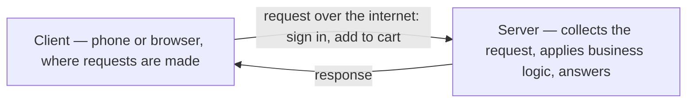
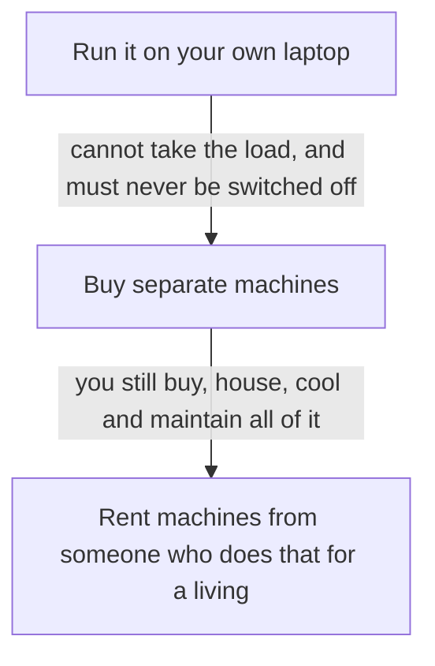

**An application is two halves, and only one of them runs on a machine you own.** The half your users touch runs on their phones. The other half has to run somewhere, and deciding where that somewhere is turns out to be the whole subject.

# The two halves

Open a food-delivery application like Zomato on your phone. You see a list of restaurants, and inside a restaurant a list of food items. You can add items to a cart. You can sign in.

**That screen is the client.** A client is any machine or piece of software capable of making a request — and signing in is a request, adding an item to the cart is a request, opening the restaurant list is a request. The client is also generally where the end user actually interacts. It does not have to be a phone: the same application in a browser is a client too.

**The other half is the server.** A server is any process or machine that can collect a request, process it — usually against some business logic — and send a response back.

**A server is software, not hardware.** It is a program, and it can be written in Python, Java, JavaScript or anything else. But a program has to run on a machine, and that is the question this note is about: whose machine?

# Your own laptop, and where it breaks

The obvious answer is your own laptop. Write the server, run it, and anyone who wants to use the application talks to your laptop, which passes the request to the program running on it.

It works. It just does not survive contact with real traffic.

**Consider the best machine you are likely to have at home** — 30 GB of RAM, a discrete GPU, an i9 processor, solid-state disks. Even at two or two and a half lakh rupees, that machine cannot absorb the load a Zomato or an Uber handles. There is a logical ceiling on how much computation any one machine can produce, and popular applications sit far above it. If your own application grows a hundredfold, you hit that ceiling too.

**And the ceiling is not the only problem.** The laptop has to be running at all times. Leaving the house means leaving it on. It needs looking after — a machine that is also your personal computer is now a piece of production infrastructure, and every restart, every update, every closed lid is an outage.

# Buying machines, and where that breaks

So do not use your personal laptop. Buy five or six separate desktops for the purpose, keep them apart from the machine you actually use, and add more when you need more computing power.

Better. Now look at what you have taken on:

- You are buying the machines, with the money up front and before you know how much you need.
- You are setting each one up.
- You are housing them somewhere. Machines handling heavy request loads generate a lot of heat, so that room needs cooling.
- You are maintaining all of it, forever.

None of this is your application. It is the cost of having somewhere to put your application.

# Renting instead

**What if somebody else buys and runs the machines, and you rent them?**

They own a lot of hardware. They rent it out — for a year, two years, five years, depending on what you pay — and you run your software on the machines you have rented. You never buy anything, never find a room, never manage the cooling. When you want more capacity you rent more.

**The companies in that business are called cloud providers.** The big ones are AWS, which stands for Amazon Web Services, Microsoft Azure, and Google Cloud Platform, usually shortened to GCP. They own enormous quantities of hardware and rent it to different users for different purposes.

# What the word cloud actually means

It has nothing to do with weather.

**Cloud is a remote place.** Remote means not directly accessible to you — you cannot decide one afternoon to go and visit it. These places are owned by companies like Amazon and Google, and they are somewhere real: the United States, Italy, Singapore, Mumbai. On that remote site sit actual physical machines, in a range of configurations, available to rent. The point of the arrangement is that you rent them without going anywhere, from home.

**The other word for the same thing is data center.** When you hear either word, picture a geographical place on earth full of powerful machines, not an abstraction and certainly not something in the sky.

![[Backend Engineering/Cloud-And-AWS/Images/data-center-server-racks.jpg]]

Racks of numbered machines in a room, each one a computer somebody can rent. That is the whole of it — a building, hardware, power and cooling.

The provider buys those machines, maintains them, cools them and replaces them. You rent one and use it. What you rent it for varies — storing data, or running the server half of your application, among many other things.

> [!important] **Cloud is a place. Cloud computing is the activity.** Accessing resources on those machines to do your work is what the phrase cloud computing refers to. Getting the two mixed up is what makes the whole vocabulary feel vague.

# The formal definition

**Cloud computing is a technology model that lets users access, store and manage computing resources over the internet.**

Read it against what you already have. Storing data on the cloud means storing it on real machines in a real data center. Renting machines to run your servers, or your databases, or your networking setup, is the same arrangement pointed at a different need. Cloud computing is the whole collection of technologies and tools that makes those data-center resources usable by someone sitting at home.

Three properties are worth naming, because they are what actually distinguishes it from owning hardware.

# On-demand service

**You get capacity when you ask for it, not when a delivery arrives.**

Start with ten users a day. That is small — your own machine would do. Then it becomes a million users a day, and your machine will not. So you go to the market and buy ten more machines, and things are fine again. Then traffic goes from one million to ten million, and your ten machines are not enough either. Buy more, set them up, maintain them.

With a cloud provider, none of that sequence happens. You do not buy a machine. You do not install an operating system on it, or drivers, or anything else. You ask, and within a minute or two you are given machines.

**A live cricket match makes the point concretely.** An IPL match is running. You planned for five machines. The match gets genuinely interesting, viewers climb, and suddenly the traffic is a hundred times what you expected. You cannot rush out to a shop mid-match. You can provision more machines in about a minute, and get on with it.

# Resource pooling

**A rented machine is not necessarily a whole machine.** Providers partition their hardware — one physical machine can be virtually divided so that more than one customer runs on it. That is how the resources get used efficiently instead of sitting idle inside one customer's allocation.

# Measured service

**You are charged for what you use, not a number somebody picked.** Low traffic means a low bill. High traffic means a higher one — but high traffic also means you have more users, so the bill scales with the thing that pays for it.

# What you get out of it

- **It is infrastructure for everybody.** A very powerful machine becomes available to anyone who can pay for it, from home, with no procurement.
- **Security is part of the service.** Providers run backups and defend against attacks on your application.
- **Availability is high.** It is uncommon for your application to go down because AWS or Azure went down.
- **Pricing follows usage**, as above.

Most applications you use on the internet are hosted this way. The remaining question is which provider, and what the pieces are actually called.
