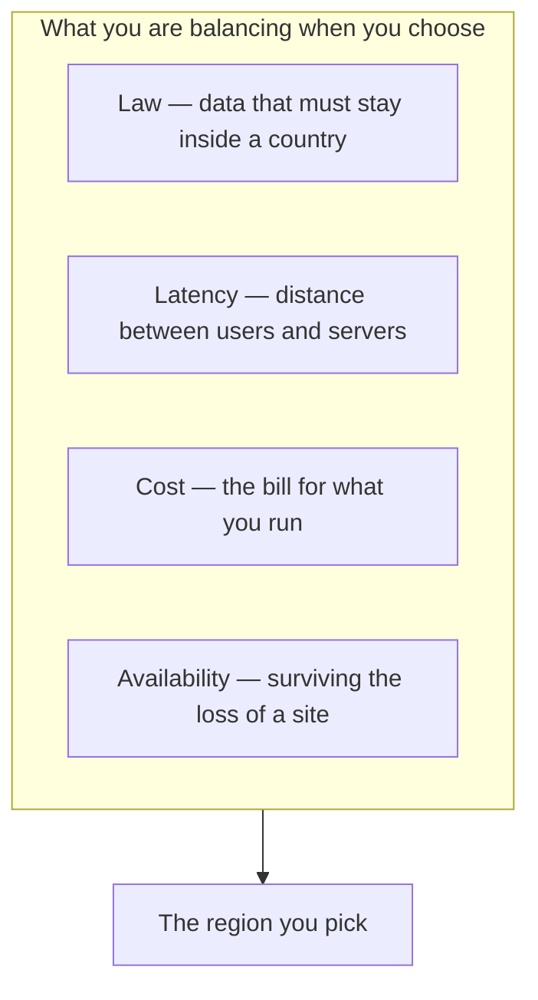
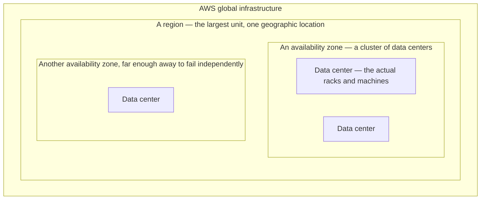

**[[02-What-AWS-Is]] left one question open: when you rent a machine, where on earth does it physically sit?** You choose, and the choice has legal, performance and financial consequences. Two words carry that choice, and they are the two most confused words in the vocabulary.

# Regions

**A region is a geographic region** — a part of the world where AWS has infrastructure. When you rent anything, you pick one.

Each has a human name and a short code, and both are used constantly:

| Code | Name |
| --------------- | ------------------------- |
| `ap-south-1` | Asia Pacific (Mumbai) |
| `ap-south-2` | Asia Pacific (Hyderabad) |
| `ap-southeast-2` | Asia Pacific (Sydney) |
| `eu-west-1` | Europe (Ireland) |
| `us-east-1` | US East (N. Virginia) |
| `me-south-1` | Middle East (Bahrain) |
| `ap-northeast-2` | Asia Pacific (Seoul) |
| `ca-central-1` | Canada (Central) |

Pick `ap-south-1` and the machines you rent are physically in Mumbai. Regions are spread across the globe, and **a single continent holds several of them** — North America has a number, Asia Pacific has more.

They are deliberately spread out rather than clustered. AWS does not put ten regions inside one country; that would be redundant and cramped, and it would defeat the purpose of having geography at all.

# Why the choice matters

Four separate reasons, and they can pull against each other.

## The application has to stay up

**Whatever is happening, the application should still answer.** You do not want to open Twitter and find you cannot post — regardless of how much traffic is arriving, or whether some database behind it is struggling. As an engineer on that system, the goal is availability as close to 100% as it can be got.

Geography is one of the levers for that, because a site can be lost entirely, and the rest of this note is about what that means.

## The law may decide it for you

**Some data is not allowed to leave the country it came from.** Indian government bodies have placed restrictions requiring that user payment data be stored within India.

So if you run a fintech company whose users are in India, you cannot put their payment data in Europe. You choose Mumbai, and the data centers holding it are then physically in India. The rule is about where the bytes sit, and the region is the control that determines it.

## Distance costs time

**Network requests travel through physical infrastructure, and physical distance shows up as delay.**

Suppose the client is a machine in India, and the servers are in the United States. Every request crosses continents, hops through many networks, reaches a data center, reaches the server inside it, gets processed, and comes back. Point the same client at a server in India and it is faster. Nothing clever is happening — the request simply has less world to cross.

**You can feel this directly.** Rent a machine in a US region, connect to it from your terminal, and type: there is a visible lag, roughly half a second between pressing a key and seeing it. Rent one in Mumbai and that lag all but disappears.

**Google Pay makes the stakes obvious.** If its logic were deployed in the United States while its users are in India, every payment would cross continents and come back. That is a great deal of latency for something a user expects to be instant.

So a practical criterion is: where are most of your users? And if they are spread across continents — some in Europe, some in India — then spread the deployment too, some in a European region and some in Asia Pacific.

## Cost is a real engineering goal

The third pressure is money, and it is not a footnote.

**Cost effectiveness can be the organisation's stated engineering objective.** Coinbase, a cryptocurrency exchange, runs a great many of its services on AWS and was carrying a correspondingly large bill; across 2023 and 2024 one of the engineering objectives for the whole organisation was reducing it — not a finance concern handed down to engineers, but an engineering goal in its own right. The reasoning is direct: a more cost-effective system clocks more profit, because less money is burned producing the same result.

**Placement itself is not what costs you.** As far as pricing goes, putting something in an Australian region rather than a US one is not specially charged. The cost comes from what you run and how much of it, not from where the pin lands.

# Availability zones

**Inside one region there is not one data center. There are several, and each is an availability zone.**

An availability zone is a physically distinct data center within a region. They are placed at some distance from each other inside the same region, and that distance is the point.

**Each zone is independent in the ways that matter:**

- Its own power supply, and its own backup generators
- Its own cooling
- Sited in low-risk locations — away from flood plains and areas prone to natural calamity

**So if one zone goes down**, whether from a natural cause or a power failure, the others in the region keep running and act as a backup. That is what makes an architecture fault tolerant rather than merely deployed.

**Zones within a region are connected to each other by dedicated, very high bandwidth physical connections**, so spreading across them does not cost you the latency that spreading across regions does.

They are named after their region with a letter suffix — `us-east-1a`, `us-east-1b`, and so on.

**You choose the region and the zone. You do not choose the data center or the machine.** AWS decides which specific hardware you land on behind the scenes.

# The hierarchy

Read it downward: **a region is the largest unit** and separates geographic locations. Inside it are availability zones, each a cluster of data centers. Inside a zone are the data centers themselves, where the physical AWS hardware and your rented machines actually live.

# The numbers

**The AWS cloud currently spans 124 availability zones within 39 geographic regions.** Older material puts it at 108 within 34 — the figure moves upward every year, so treat any specific number as a snapshot.

**Every region has at least three availability zones.** Most have exactly three: Mumbai has three, Hyderabad has three, Bahrain has three. The range runs from about two to six, with US East (N. Virginia) at six the largest.

> [!info]- **Mumbai and Hyderabad are two regions, not two zones of one region**
> It is easy to assume that because both are in India they are zones inside a single Indian region. They are not. Mumbai is `ap-south-1` and Hyderabad is `ap-south-2` — separate regions, three availability zones each. Two zones of one region would be, for instance, `ap-south-1a` and `ap-south-1b`, both in Mumbai.
>
> The distinction matters because the isolation rules in [[04-Services-And-Access]] are written in terms of regions and zones, and getting the boundary wrong there gives you the wrong answer about what can reach what.

# Global infrastructure, and what it buys

AWS operates a vast network of data centers across many continents, each with strong networking capability and each positioned strategically. That spread is the backbone of the service, and it is why large organisations are willing to put their computing on it.

Plotted on a map the regions group into North America, South America, Europe, the Middle East, Africa, Asia Pacific, and Australia and New Zealand — with Asia Pacific carrying more of them than any other grouping.

**What it lets you do is survive a region.** Suppose a serious natural disaster hits New Zealand, and you are a company operating mainly in the Australia and New Zealand area. If the data center holding your logic is hit, there is a real chance the nearby ones are affected too. Having your logic also deployed somewhere close but not adjacent — Singapore, or Jakarta — means you keep running, and because those places are not far, you do not pay much latency for the insurance.

The same reasoning applies at the smaller scale: keep your data in one data center, and keep a backup in another zone, or another region entirely. What you pick determines your latency and your overall performance, and both feed straight back into whether users find the application quick or shaky.
