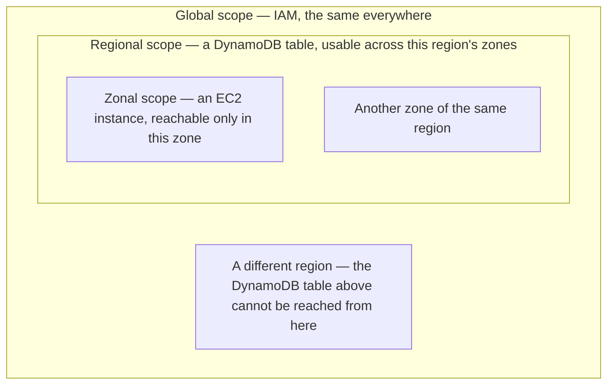

**[[03-Regions-And-Zones]] settled where things run. This note is what there is to run**, how far each thing reaches once it is running, and the three ways you talk to any of it.

# The catalogue

The full list of AWS services is exhaustive and there is no value in memorising it. What is worth having is the shape of the categories, so that when you need something you know which shelf to look on.

## Compute

**Compute means CPU-level resources — processing, not storage.** You rent a machine and do work on it.

| Service | What it is |
| --- | --- |
| **EC2** — Elastic Compute Cloud | Rent a scalable virtual machine. The most widely used service AWS has. |
| **ECS** — Elastic Container Service | Container management and orchestration, for running containerised workloads. |
| **Lambda** | Serverless computing. You write the logic and hand it over; there is no server for you to set up or manage. |

## Databases

| Service | What it is |
| --- | --- |
| **RDS** — Relational Database Service | Hosted relational databases — MySQL, PostgreSQL, and Amazon Aurora. |
| **DynamoDB** | Amazon's own in-house NoSQL database, built to scale. |
| **DocumentDB** | A managed document database with MongoDB compatibility. |

## Storage

Storage is for when you want to keep files rather than run a database management system.

| Service | What it is |
| --- | --- |
| **S3** — Simple Storage Service | Dumping ground for static files. Scalable and durable. |
| **EBS** — Elastic Block Store | Block storage, the equivalent of attaching an SSD to a machine. |
| **EFS** — Elastic File System | A file storage mechanism shared across machines. |

## Networking

| Service | What it is |
| --- | --- |
| **VPC** — Virtual Private Cloud | Networking capability around your machines — your own private network inside AWS. |
| **Route 53** | DNS. Everything to do with resolving names to addresses. |

## Security

| Service | What it is |
| --- | --- |
| **KMS** — Key Management Service | Somewhere to store secret keys, instead of leaving them in environment variables. |
| **IAM** — Identity and Access Management | Who is allowed to do what. |
| **WAF** — Web Application Firewall | Firewall configuration in front of a web application. |

**IAM is the one worth pausing on.** If your organisation has ten developers, you do not want all ten holding administrator access to the console. IAM is how access is separated per person and per action.

## Machine learning

A set of services offering machine learning capability — image analysis and video analysis among them.

## Management and monitoring

**These answer whether things are working**, rather than doing the work themselves. You can check whether your services are healthy and whether your resource inventory is what you expect — monitoring and observability of your own account.

**CloudFormation** belongs here too, and it is infrastructure as code: instead of clicking through the console to build your infrastructure, you write it down as code and it gets built for you. AWS also has its own mechanism for building CI/CD pipelines inside the platform, without needing Jenkins or GitHub Actions.

> [!info]- **Infrastructure as a service versus platform as a service**
> These categories draw a line through the catalogue. If you rent bare machines and do all the machine management yourself — writing everything from scratch and using AWS only for its computing power — you are treating AWS as infrastructure as a service. If instead you take a fully functional hosted database and never touch the machine underneath it, that is closer to platform as a service. Same provider, different amount of it doing the work.

# How far a service reaches

**A service is not automatically available everywhere.** Each one has a scope, and there are three.

| Scope | Reaches | Example |
| --- | --- | --- |
| **Global** | Every zone, every region | IAM |
| **Regional** | Every zone within one region, but not another region | DynamoDB |
| **Zonal** | One zone only | EC2 |



**Global.** IAM is the same across zones and across regions. It does not matter which region you have selected; your identities and permissions are identical.

**Regional.** A DynamoDB table can be used across the availability zones of its region. It cannot be used from a different region.

**Zonal.** An EC2 instance lives in one availability zone. Create one in `ap-south-1a` and you cannot reach that same instance from `ap-south-1b`, even though both are Mumbai and both are in the same region. The zones are different clusters of data centers, and the machine is in one of them.

> [!important] **These are isolation boundaries, and they do not bend.** Create a database in the London region and it is not reachable from Asia Pacific. So for every service you use, the question to answer first is: is this global, regional, or zonal? What you can do with it follows from the answer.

# Three ways in

## The console

The web interface. Sign in, navigate to a service, create things, inspect what you already have, manage it. Everything can be done here, and it is where the region selector in [[03-Regions-And-Zones]] lives.

## The command line

**The AWS CLI does the same things from a terminal.** On macOS the installation script is the current recommended route:

```bash
1  curl -fsSL https://awscli.amazonaws.com/v2/install.sh | bash
```

The alternative is the package installer, which downloads a `.pkg` and runs the standard macOS installer against it. This needs `sudo`, because it writes into `/usr/local`:

```bash
1  curl "https://awscli.amazonaws.com/AWSCLIV2.pkg" -o "AWSCLIV2.pkg"
2  sudo installer -pkg ./AWSCLIV2.pkg -target /
```

There is also a graphical installer, and equivalent instructions for Linux and Windows. Whichever route you take, two commands confirm it worked — the first says where the program ended up, the second says which version it is:

```text
which aws
/opt/homebrew/bin/aws

aws --version
aws-cli/2.26.6 Python/3.13.3 Darwin/25.6.0 source/arm64
```

> [!info] If `aws` is not found immediately after installing, open a new terminal tab. The shell caches where it found programs, so a freshly installed one may not be visible in the session that installed it.

## The SDKs

**AWS also publishes libraries for the major language ecosystems** — JavaScript, Java, Python and more — so your own code can talk to AWS directly. Uploading a file from your machine into an S3 bucket, for instance, can be done from a Python script rather than by hand.

Which of the three you want depends on the task: the console for looking around and setting things up, the command line for repeatable work, an SDK for anything your application has to do on its own.
