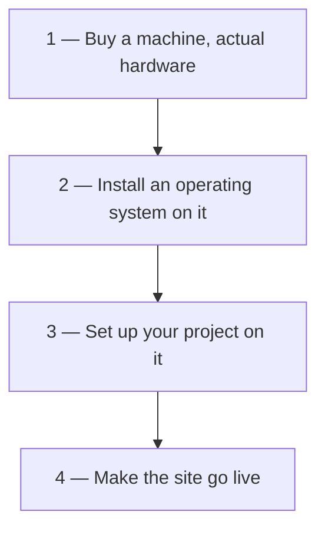
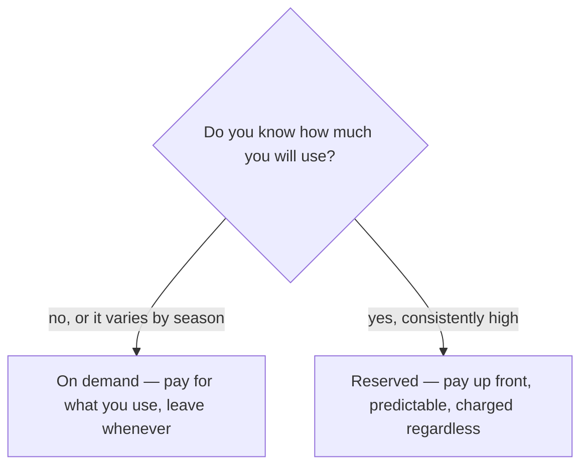

**[[04-Services-And-Access]] listed EC2 first among the compute services and moved on.** It is the one to start with, because renting a machine is the thing most people come to a cloud provider for, and every other service is easier to place once you have done it.

# What you would otherwise have to do

You have built an e-commerce application — front end, back end, all of it — and it is time to put it online. Without a cloud provider, that is four steps:

Steps 3 and 4 are your work. Steps 1 and 2 are not, and they are where all the trouble is:

- **Choosing a configuration.** There are endless combinations, and you are committing money to a guess.
- **Buying the thing**, which is an errand in the physical world.
- **Installing the operating system, and paying for it** where it is not free.
- **Keeping the machine alive.** It must not overheat, so wherever it sits has to stay cool, and the power supply has to be constant.

Then the site goes live, and **every request from every user arrives at that one machine**, which now has to be big enough for all of them.

## Where it breaks

Say you bought a machine with 8 GB of RAM — with what you knew, the best you could get. On day zero the launch goes well, traffic is enormous, and the machine cannot serve it.

So you scale up. Which means: go back to a shop, buy another machine, carry it home, assemble it, install an operating system, set up the project, take it live, and then split your traffic across the two. And when that is not enough either, do all of it again.

**The whole cycle exists because of steps 1 and 2.** Hand those to somebody else and everything above collapses into visiting a web page and asking for a machine.

# Elastic Compute Cloud

That is what EC2 is, and the name says it if you take it a word at a time.

| Word | Means |
| ----------- | ----------------------------------------------------------------------------------- |
| **Compute** | What you are renting is a computing engine — CPU, RAM, a whole computer. You just do not have it physically; you have borrowed it. |
| **Cloud** | The machine is real and it is somewhere — in the data centers and availability zones from [[03-Regions-And-Zones]]. |
| **Elastic** | Flexibility. Want five machines of the same configuration, you get five now. Want to give two back, you give two back now. |

**Renting one takes about two minutes.** No shop, no assembly, no operating system to install, no cooling to arrange, no power supply to keep constant.

And when one machine is not enough, the answer is no longer an errand. You rent more and spread traffic across them — AWS has separate services for that part, which is where load balancers come in.

# Why it is called scalable

Two directions, and EC2 gives you both:

- **Horizontally** — rent more machines and share the work between them.
- **Vertically** — rent a single more powerful machine in place of the one you have.

There is also a quieter advantage. Buy a machine of some configuration yourself, and rent one of the same configuration from AWS, and the rented one is likely to perform better anyway: better networking, better reliability, better maintenance, none of which you are doing.

**And nothing is paid for up front.** You are not buying hardware before you know whether you need it, which means getting started is fast and stopping is cheap. The two operations have names worth knowing: **provisioning** is renting a machine, **deprovisioning** is giving it back.

# What EC2 gives you

**Virtual computing resources.** Nothing you rent is a physical machine handed to you; it is a virtual one, which is exactly what makes the flexibility possible.

**A choice of configuration.** CPU, storage and RAM all vary, across a very long list of options, so you can match the machine to the job rather than to what a shop had.

**Secure access to a machine you cannot touch.** Your server is in some availability zone far away, and you still need to get into it. AWS issues a key pair for that, and you use it from home. [[07-Connecting-With-SSH]] is that whole procedure.

**Pre-configured AMIs.** AMI stands for **Amazon Machine Image**, and it is the operating system you want, prepared in advance. Any distribution of Linux, any Windows version, macOS — you pick one, and AWS installs it along with every driver and package that machine needs to run it. Step 2 of the four disappears entirely; you are left with your own project to set up.

# What it costs

For learning, the free tier covers it — run a machine, stay inside the published limits, and nothing is charged. Beyond that there are two pricing models, and they suit opposite situations.

## On demand

**You pay for what you use, with no fixed commitment.** The bill follows the traffic your instance actually handles, and the unit depends on the operating system:

| Instance | Billed |
| --- | --- |
| Linux | by the second |
| Windows | by the hour |

**This is the model for uneven demand.** If some months are quiet, a quiet month costs less. It is also the safer choice if you might leave — moving to another cloud provider later, or going bare metal and buying your own hardware after all — because you are never holding a contract you have already paid for.

## Reserved

**A contract with Amazon, for one, two or three years, paid up front.** You commit to a quantity of resource and pay for it in advance, and then use it.

It behaves like a prepaid plan: **the bill does not follow your traffic.** A month with no traffic at all costs exactly the same.

**That is the point of it.** If you know your traffic is consistently high, on demand can produce alarming spikes in a month that goes well, while reserved gives you one predictable number to plan around. Exceed the contracted terms and you can reissue the contract or fall back to on-demand pricing for the excess.

