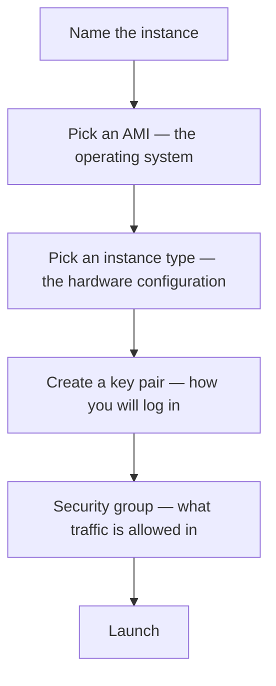

**[[05-What-EC2-Is]] argued that renting a machine should take about two minutes.** This is the two minutes. Everything below happens in the AWS console, and the whole exercise fits inside the free tier if you choose carefully at two specific points.

> [!info] **The console's appearance changes.** AWS, Azure and GCP all redesign their interfaces periodically, so buttons move and panels get renamed. The sequence of decisions does not change, and that sequence is what this note is about — if a screen looks different from the description, the same choice is still being asked for somewhere on it.

# Finding EC2

Sign in, and the console home appears. There is a search bar across the top: type `EC2` and it comes back first under services.

That opens the **EC2 dashboard**, which is the inventory of everything you are renting — how many instances are running, what load balancers exist, which security groups are defined. On a new account it is empty.

The yellow **Launch instance** button starts the form.

# The name

Free text, for your own benefit. It is how you will recognise this machine in a list later.

# The AMI

**This is the operating system to install on the machine you are renting**, and it is the step that disappeared from the four in the previous note. Amazon Linux, Ubuntu, Red Hat Linux, Windows, macOS — pick one and it arrives installed, with its drivers and packages already in place.

Ubuntu is a reasonable default and is what a great deal of production runs on. Choosing it then asks which version, from a long dropdown.

**Check the free-tier eligible label before choosing a version.** It is marked in the list. `Ubuntu 24.04 LTS` is one — **LTS stands for long term support**, meaning that release keeps receiving updates for years rather than months, which is what you want for a server.

# The instance type

**This is the hardware configuration** — how much CPU, how much RAM, how much disk. The list is enormous, from `t2.nano` upward, and at the top end it is genuinely large: `z1d.metal` carries 48 CPU cores and 384 GB of RAM.

**Only one type is free-tier eligible, and it is `t2.micro`:** 1 CPU core and 1 GB of RAM. Anything else starts charging immediately, and the per-hour rate is shown beside each entry.

> [!info] 1 GB of RAM sounds like nothing next to a laptop. It goes considerably further than it looks — the machine is doing one job, with no desktop, no browser and no background applications competing for it.

# The region

**Top right corner of the dashboard**, and it applies to what you are about to create. This is the choice from [[03-Regions-And-Zones]], arriving in practice: pick the region nearest your users, or the one your legal obligations require. Asia Pacific (Mumbai) is the close one from India.

# The key pair

The machine is going to exist in a data center in that region. You need a way in, and AWS's answer is a **key pair** — it issues a secret file, and possession of that file is what proves you are allowed in.

The form offers **Create new key pair**, and asks three things:

| Field | What to choose |
| --- | --- |
| Name | Anything; naming it after the instance keeps them together |
| Key pair type | `RSA` is the default |
| File format | `.pem`, the standard one |

**Creating it downloads the file to your machine, once.** That download is the only copy — AWS does not keep the private half. [[07-Connecting-With-SSH]] is what you do with it, and the first thing to do right now is move it somewhere deliberate rather than leaving it in Downloads.

# The security group

**A security group is a set of rules saying which network requests are allowed to reach the instance.** The form creates one by default.

The default allows **SSH traffic from anywhere** — meaning any address on the internet may attempt an SSH connection to this machine.

> [!info] **Anywhere is less alarming than it sounds, because reaching the door is not opening it.** An attempt still has to present the private key from the `.pem` file, and without it the connection is refused. The rule controls which traffic is allowed to arrive, not who is allowed in.

Storage and the remaining options can stay at their defaults.

# Launch

**Launch instance** configures the security rules and creates the machine, and the confirmation carries an **instance ID** — the identifier for this specific rented machine.

The instance state reads **pending** at first. Amazon is preparing the machine: installing the operating system you chose, provisioning the hardware, and arranging access. **Two to five minutes**, usually much less. Refresh and it reads **running**.

At that point you are renting a computer in another city.
