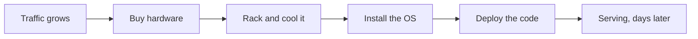
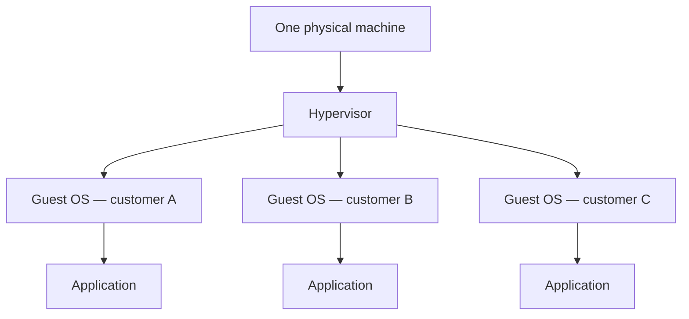
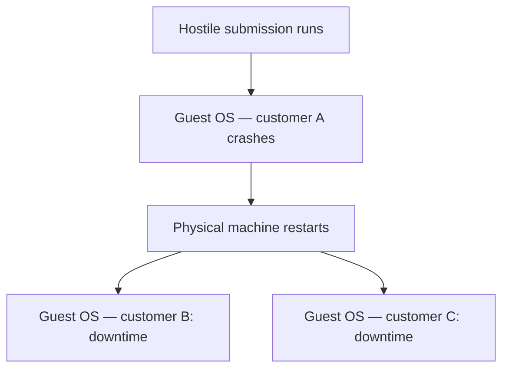

**A container is a way of running a program in an environment that is completely its own.** Why that is worth having is easier to see by starting from how software used to be deployed, and breaking each approach in turn.

# Owning the machine

In the early days, deploying a server meant preparing a physical machine and running the process on it. A university department hosting its own website did it exactly this way — a dedicated box in a room, not a rented one.

This works until the traffic grows. Suppose the application serves a thousand users a minute and then has to serve fifty thousand requests a second. Scaling means buying another physical machine, racking it, installing the operating system, loading the code and booting the server. That takes days, not seconds. And every machine that exists has to be maintained — cooled, patched, repaired — which takes people.

# Renting the machine instead

Public cloud platforms — AWS, Azure, Google Cloud Platform, DigitalOcean — solved the ownership half of the problem. They operate data centres full of powerful machines, and they rent them out.

The gain is that nobody using them has to know how to cool a room or wire a rack. Log into an account, do some configuration, and a server is running. The maintenance cost moves to the provider.

But the machines are still real and still finite. A provider cannot hand one entire computer to each customer, because there are more customers than computers. One physical machine has to be divided among several of them.

# Dividing a machine with virtual machines

A virtual machine is a whole operating system running inside another one. On a Windows desktop, software like VMware can boot Linux inside the running Windows — not alongside it as a dual boot, but inside it, with several Linux instances at once if you want them.

That is the division the cloud uses. One physical machine hosts several virtual machines, each rented to a different customer.

# Where virtual machines break

Two problems follow from tenants sharing hardware.

**The first is what one tenant can see.** Virtual machines on the same host share the machine's resources. If they can reach each other at all, then two customers who have no relationship are one mistake away from reading each other's data.

**The second is what one tenant can do.** Consider a site that accepts code from users and runs it — a competitive programming judge, for instance. Its whole job is to take a submission, execute it, and show the output. Somebody submits a fork bomb, or a query crafted to attack the database behind the judge. The code was not caught on the way in, so it runs. The virtual machine executing it falls over.

On shared hardware, that is not confined to the attacker. If several virtual machines sit on one physical box and one of them takes the box down with it, every other customer on that box goes down too — through no fault of their own.

# What containers change

A container is isolated from every other container by default. Nothing inside one is aware of anything inside another, and two containers cannot communicate until somebody configures them to. The same applies between a container and the machine hosting it.

That isolation is the security and resource-management property that shared virtual machines lack, and it holds without a separate operating system per tenant — which is what makes containers light enough to start in seconds rather than minutes.

> [!important] **Guarantees, and does not guarantee.** One container crashing does not bring down the host operating system, so the containers beside it keep running as though nothing happened. But if the physical machine itself restarts, no amount of container isolation helps — everything on it goes down together.
