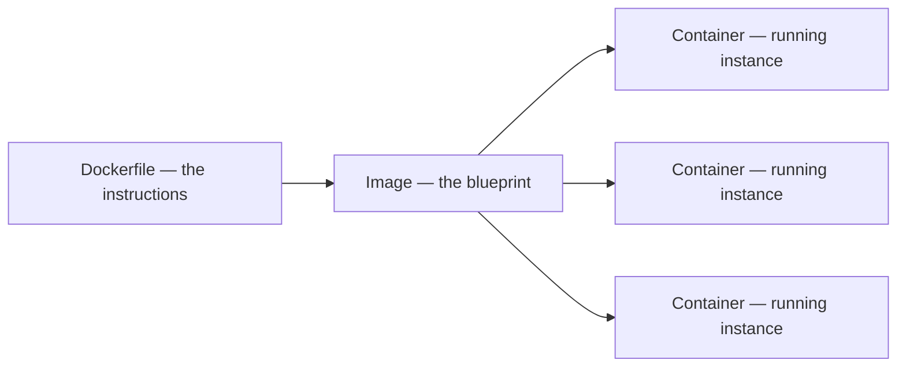
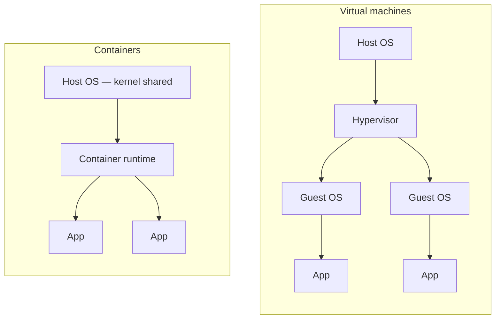

**Two words carry almost all of the vocabulary: image and container.** They are constantly confused, and the difference decides what every command later does.

# Blueprint and instance

An **image** is a snapshot of a complete environment for an application. It records everything the application needs in order to run — libraries, dependencies, configuration — and encapsulates the application together with those requirements. It is a design and nothing more: instructions describing what should be inside the environment and what should already be installed there.

A **container** is an actual running instance of the environment that an image describes. Running an image produces a live container.

Put as an analogy: the image is a drawing of a favourite toy, holding every detail of how the toy looks. The container is a box that reads the drawing and produces the toy itself. Put in programming terms, the image is the class and the container is the object.



One image can produce as many containers as you ask for, exactly as one class can produce many objects.

# Why they stay light

The previous note left containers described as isolated and lightweight without saying why the second is true.

Containers running on one machine **share the host operating system's kernel**. A virtual machine carries a full guest operating system of its own, which is what makes running Linux inside Windows such a heavy thing to do. A container carries only what sits above the kernel.



# What that buys

**Weight.** A container does not put the load on the machine that a virtual machine does.

**A consistent environment.** Dependencies are one of the most reliable ways to lose a day: a version works on one operating system and not on another, and a project that runs on one machine refuses to start on the next. If everyone runs the project inside the same Ubuntu container instead of on their own machine, the environment is identical for all of them. Docker handles the difference between a Windows host and a Linux host underneath; the container behaves the same either way, so the application behaves the same either way.

**Isolation.** A container is sealed off from the dependencies and processes installed on the host machine, and from every other container on it. Two containers can be made to talk to each other, and a container can be made to talk to the host — but only if that is configured deliberately. Nothing is open by default.

# Docker Desktop and Docker Hub

**Docker Desktop** is the application to install first, chosen for the operating system in use. Most of what is needed to run containers arrives with it, and it provides a window listing images and containers alongside the command line.

> [!info] **The window is convenient and the commands are the ones to learn.** Containers can be started, paused and deleted from it, but the moment the work happens over SSH on a server there is no window — only a terminal. Everything below is done with commands for that reason.

**Docker Hub** is the registry — a large pool of ready-made images, the equivalent for containers of what npm is for Node.js packages. Some are **official images** maintained by the organisation behind the software itself, which come with clear documentation and follow current practice. Others are published by third parties. Anyone with an account can publish their own.

There is an image for nearly anything worth running: Node.js, Python, MySQL, MongoDB, Ruby on Rails, and complete operating systems such as Ubuntu and Alpine Linux. Pull one and Docker can start a container in which that software is already installed and configured.

Size varies enormously between them, and it is worth knowing which you are pulling. **Alpine Linux is about 5 MB** — it provides the major functionality of Linux and deliberately none of the weight, which is why so many images are built on it. A full Ubuntu image is an entire operating system and costs accordingly.

# Tags

A **tag** is a label naming one particular version of an image.

```text
node:20-alpine
│    │
│    └── the tag — which version of this image
└─────── the repository — which image
```

Pull an image without naming a tag and the output says it is using the default tag, `latest`, which points at the most recently published version. Naming a tag pins a specific one: `alpine:3.18.2` is that release and nothing else.

Tags are not only version numbers. `node:slim` is a build of Node.js on a slim Debian 12 base; each tag on Docker Hub links to the file it was built from, so the exact contents of any tag can be read before pulling it.

> [!info] Tags do for images what tags do for commits in Git — they give a memorable name to a specific version, so nobody has to remember an exact identifier.
