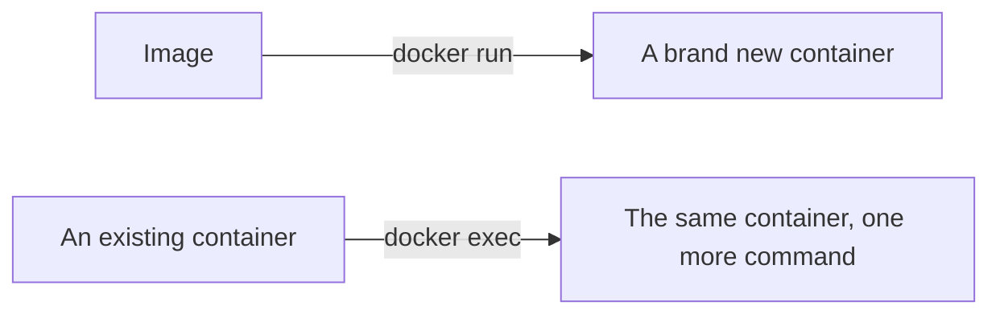

**With an image identified on Docker Hub, the next step is getting it onto the machine and turning it into something running.** That is a small set of commands, and the distinctions between them matter more than the flags do.

# Downloading an image

```bash
1  docker pull node
```

The output reports that it is using the default tag `latest`, then downloads the image. Run the same command again and nothing is downloaded — it recognises the image is already present and up to date, and does the work again only if the published image has changed.

> [!warning] **Images take real disk space.** They accumulate quietly and are easy to forget about. Clearing them out periodically is part of using Docker, not an optional tidy-up.

# Starting a container

```bash
1  docker run -it --rm node
```

That drops straight into a Node.js prompt. `console.log("hello")` works, and Node was never installed on the machine — it is running inside the container.

Two flags are doing the work:

- **`-it`** opens an interactive terminal attached to the container, so you can type into it. It is two flags written together: `-i` keeps input open, `-t` allocates a terminal.
- **`--rm`** deletes the container automatically when you exit it.

`--rm` is optional, and leaving it off shows why it is worth having. Exit a container started without it and the container is no longer running, but it still exists in an exited state, still taking up space, waiting to be removed by hand.

# Seeing what is running

```bash
1  docker ps
```

Each row is a container: its id, the image it was created from, the command it ran, its status, and its name. Docker invents a name for every container unless you supply one.

```bash
1  docker kill <container>
2  docker rm <container>
3  docker rmi <image>
4  docker rmi -f <image>
```

`kill` stops a running container. `rm` removes a stopped one. `rmi` removes an **image** rather than a container — and it refuses while any container built from that image still exists, which is what `-f` overrides.

# Running in the background

An interactive session ties up the terminal. To start a container and get the prompt back:

```bash
1  docker run -dit --name custom-node node
2  docker attach custom-node
```

`-d` (or `--detach`) starts the container in the background and prints its unique hash. It keeps running, and `docker ps` lists it. `docker attach` then steps into a detached container; exiting leaves it in an exited state.

`--name` replaces Docker's invented name with one of your own, which is what makes the container easy to refer to afterwards.

A running container can also be suspended rather than stopped:

```bash
1  docker pause <container>
2  docker unpause <container>
```

`docker ps` reports the status as paused, and unpausing puts it back to up.

# run and exec are not the same

This is the distinction worth being careful about.



**`docker run` takes an image and creates a new container from it.** Every invocation produces another container.

**`docker exec` takes a container that already exists and runs a command inside it.** It creates nothing.

That is why the two commands name different things — `run` is followed by an image, `exec` by a container:

```bash
1  docker exec -it <container> bash
2  docker exec <container> ls
```

# Looking around inside

Because a container runs on an operating system, that operating system can be explored. Instead of accepting the process the image starts by default, ask for a shell:

```bash
1  docker run -it node bash
```

```bash
1  pwd
2  whoami
3  cat /etc/issue
4  ps aux
5  touch test.py
```

`cat /etc/issue` prints the distribution. Both the official Node.js and Python images report Debian; the Ubuntu image reports Ubuntu 22.04 LTS — on a Mac host, in a session that behaves exactly like Ubuntu, where every Ubuntu command works as expected.

# Asking an image what it does

```bash
1  docker inspect node
```

This returns a large configuration object describing the image: the repository tags, the environment variables already set, the architecture it targets, and the command it runs by default.

That last field explains the behaviour above. The Node.js image runs `node` by default, and the Python image runs `python3`. So `docker run -it python` is equivalent to entering the container's operating system and typing `python3` — the image simply does it for you.

# Cleaning up

```bash
1  docker image prune
2  docker system prune -a
```

`docker image prune` removes dangling images — ones nothing is using any more. `docker system prune -a` is the heavier version: it deletes unused containers, networks, images and the build cache, and reports how much space it reclaimed.

> [!warning] **`docker system prune -a` deletes every image not currently in use, not just the unused layers.** Everything it removes has to be downloaded or rebuilt next time. It is the right tool for reclaiming space or forcing a genuinely fresh build, and the wrong one to run casually.
