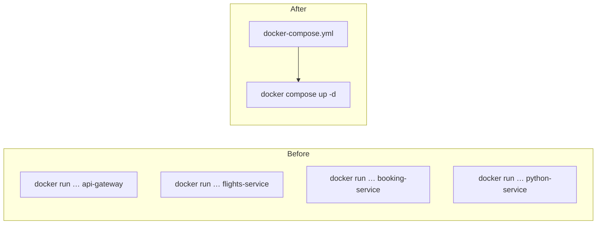

**Four services now run correctly, and starting them takes four commands like this one:**

```bash
1  docker run -it --init -p 3001:3001 \
2    --name api-gateway \
3    --network microservice-network \
4    -v "$(pwd)":/developer/nodejs/api-gateway \
5    -v api-gateway-node-modules:/developer/nodejs/api-gateway/node_modules \
6    api-gateway:latest
```

Each has to be typed in the right directory, with the right ports, the right mounts and the right network. Detaching them with `-dit` gets the terminals back but does not make the arrangement any smaller. Every port, every volume and every network lives in somebody's shell history rather than in the project.

# One file instead

Docker Compose describes the whole set in a single configuration file, and brings it all up in one command. It is written in YAML, which is a configuration format where **indentation is what defines the structure** — the same way it does in Python.

```yaml
1  # docker-compose.yml
2  networks:
3    micro-net:
4      driver: bridge
5
6  volumes:
7    api-gateway-node-modules:
8    flights-service-node-modules:
9    booking-service-node-modules:
10
11 services:
12   api-gateway:
13     build: ./API-Gateway
14     ports:
15       - "3001:3001"
16     volumes:
17       - ./API-Gateway:/developer/nodejs/api-gateway
18       - api-gateway-node-modules:/developer/nodejs/api-gateway/node_modules
19     networks:
20       - micro-net
21
22   flights-service:
23     build: ./Flights
24     ports:
25       - "3000:3000"
26     volumes:
27       - ./Flights:/developer/nodejs/flights-service
28       - flights-service-node-modules:/developer/nodejs/flights-service/node_modules
29     networks:
30       - micro-net
31
32   booking-service:
33     build: ./Flights-Booking-Service
34     ports:
35       - "4000:4000"
36     volumes:
37       - ./Flights-Booking-Service:/developer/nodejs/booking-service
38       - booking-service-node-modules:/developer/nodejs/booking-service/node_modules
39     networks:
40       - micro-net
41
42   python-service:
43     build: ./python-project
44     ports:
45       - "3005:3005"
46     networks:
47       - micro-net
```

Every flag from the run commands has a home in it.

**`services`** lists the containers to start. Each one gets a name, which is also the name it answers to on the network — the same name that was passed as `--name`.

**`build`** is the path to the directory holding that service's Dockerfile. Compose finds the file itself, so the directory is enough.

**`ports`** is `--publish`, in the same host-then-container order.

**`volumes`** carries both mounts from the previous note: line 17 is the bind mount, line 18 is the named volume over `node_modules`. The relative path replaces `$(pwd)`, which Compose no longer needs because it resolves paths from the file's own location.

**`networks`** is `--network`.

Notice that `python-service` has no `volumes` at all. It does not need the protection, so it does not get it — the file describes each service on its own terms.



# The two top-level blocks

**`networks` at line 2 declares the network itself**, with the bridge driver. Because it is declared here, Compose creates it if it does not exist — so the setup no longer depends on somebody having run `docker network create` first.

**`volumes` at line 6 declares the named volumes** the services refer to. Without this block, bringing the project up fails with a complaint about a missing volume, and the volumes have to be created by hand:

```bash
1  docker volume create api-gateway-node-modules
2  docker volume create flights-service-node-modules
3  docker volume create booking-service-node-modules
```

Declaring them in the file is the better answer for the same reason as the network: it moves a piece of required setup out of somebody's memory and into the project.

> [!info] A `depends_on` entry can be added to a service to say it should not start before another one, and an `environment` block can set environment variables — useful when they are not already coming from the Dockerfile or a `.env` file.

# Bringing it up and down

```bash
1  docker compose up -d
2  docker compose down
```

**`-d`** starts everything detached, the same as `-dit` on an individual container. Compose builds each image, creates the network and the volumes, and starts all four services — apparently in parallel, judging by the interleaved output.

Once it is up, every service answers on its published port, and the calls between them work exactly as they did when each was started by hand.

**`docker compose down`** stops and removes them all.

> [!warning] **`version:` at the top of the file is obsolete.** Older compose files begin with `version: "3"`, and current versions of Compose ignore it and warn that it should be removed. New files leave it out.

# What Compose is not for

Compose describes a fixed arrangement and starts it. That is exactly what is wanted when deploying, resetting, or handing the project to somebody who should not have to know any of the commands.

It is not the development loop. Editing code and watching the container pick up the change is what the bind mounts are for, and that work is still done by running the individual containers — which is why those commands are worth keeping alongside the compose file rather than replacing them with it.

> [!warning] **A rebuild after a code change can still serve the old image.** The build cache applies here as it does anywhere else. When a change refuses to appear, removing the images and bringing the project up again forces the rebuild — at the cost of downloading the base images once more.
