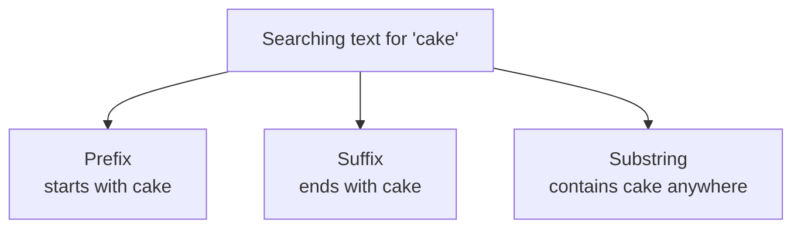
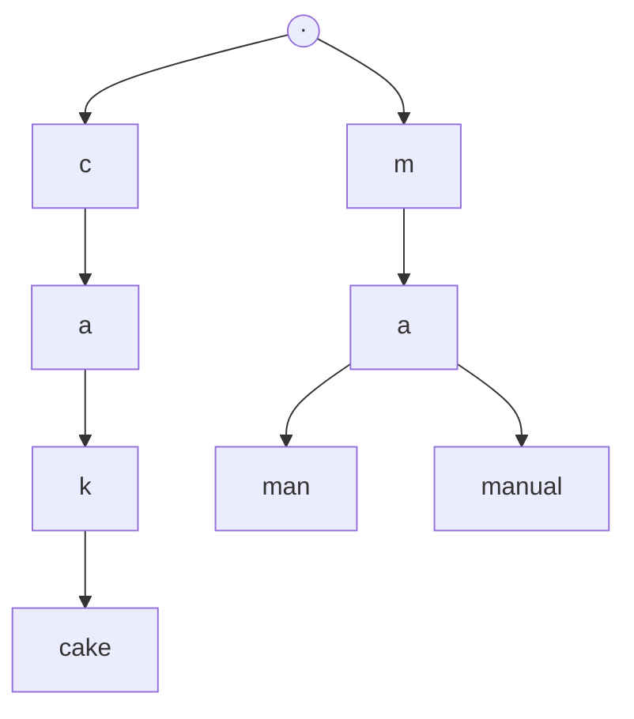
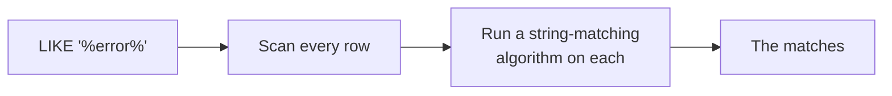

A cache makes a known query cheap by not running it. Search is the opposite problem: the query is not known in advance, the user invents it, and no amount of caching helps because the same words are rarely asked for twice.

# Search has no single answer

> [!important] **What you are searching for decides the solution.** Search is one of the most thoroughly solved problems in computing and there is no general solution — there is a different one for each kind of data.

Numbers are the easy case, and worth naming to set them aside:

| Question about numbers | Structure |
|---|---|
| Does this value exist | **Hash table** — constant time |
| Values in a range, sorted output | **Balanced binary search tree**, or a B+ tree index |

Both are already familiar from indexing. **Text is where the interesting problems are**, and it is what almost anyone means when they ask for a search feature.

> [!info] Text search also has a client-side half that this folder sets aside. A search box that fires a request on every keystroke will melt a backend regardless of how the backend is built, so the front end throttles that traffic — **debouncing**, which waits until typing pauses before sending anything, and **throttling**, which caps how often a request may be sent at all. Worth knowing they exist and are somebody's problem; everything below is the server side.

# Three shapes, and they are not equally hard

**Build me a search feature is not yet a specification.** It is the opening of a conversation, and the work that decides everything is the clarifying questions asked before any solution is proposed — what is being searched, how much of it there is, and what counts as a match. Answer those wrongly and the rest is wasted.

The first of them: what does the match look like?



| Shape | SQL | Example |
|---|---|---|
| **Prefix** | `LIKE 'cake%'` | Contact search — typing `S`, then `Sa`, then `San` |
| **Suffix** | `LIKE '%cake'` | Matching filenames by extension |
| **Substring** | `LIKE '%cake%'` | Log search — the term is anywhere in the line |

> [!important] **These three have completely different costs.** The first is nearly free, the second is solvable with a trick, and the third breaks everything an ordinary database can do. Establishing which one you need is the first question, not a detail.

# Prefix search

## The answer everyone gives

Say prefix search and the immediate response is a **trie** — a tree where each node is a character and each path from the root spells a prefix.



It is genuinely the right data structure. **Shared prefixes are stored once**, so it is remarkably space-efficient — `man` and `manual` occupy one path rather than two strings.

> [!warning] **No mainstream database gives you one.** There is no storage engine, open source or commercial, that will build and maintain a trie as an index. Using one means implementing it yourself, or pulling a library, and holding it in memory — typically in a cache.

Which makes it a fine answer to an algorithms question and a poor answer to an engineering one.

## The answer that actually ships

The alternative is unglamorous and available everywhere: **keep the strings sorted and binary search them.**

```text
  apple, banana, cake, halloween, hello, man, manual, sanket
```

Searching this for everything starting with `cake` is ordinary binary search — compare against the middle, discard half, repeat. Divide and conquer, O(log n).

> [!important] And **you already have this**, because that is what an index is. A B+ tree index on a text column holds its values in sorted order, so a prefix query walks it exactly like the sorted array above. Nothing new is needed.

```sql
1  SELECT * FROM products WHERE title LIKE 'cake%';
```

> [!important] **The wildcard is only at the end, so the prefix is fixed**, which gives the index a place to start and a direction to walk. This query uses the index.

The trie's advantage over this is space, not speed — both are logarithmic. **Losing some space efficiency to use a structure the database already maintains is an easy trade.**

# Suffix search

Indexes sort by the first character, so a query with the wildcard at the front has no entry point. There is a trick.

> [!important] **Store the reverse of each string and index that.** A suffix in the original is a prefix in the reversed copy, so a suffix search becomes a prefix search on the second index.

```text
  original:  prefix search
  reversed:  hcraes xiferp
```

Searching for everything ending in `search` becomes searching the reversed index for everything starting with `hcraes`.

> [!info] The cost is a second copy of the column and a second index, kept in step on every write. It is the space-for-time trade again, paid explicitly.

# Substring search, where it falls apart

```sql
1  SELECT * FROM logs WHERE line LIKE '%error%';
```

> [!warning] **No index can help.** The match may begin at any position, so there is no fixed prefix, nothing to binary search on, and no half of the data that can be discarded. **Divide and conquer is unavailable** — reversing does not help either, because the wildcard is on both sides.

So the database falls back to checking every row, and inside each row it runs a string-matching algorithm.

## What those algorithms cost

MySQL uses a variant of Boyer-Moore. The classical algorithms and their real complexities, for a text of length n and a pattern of length m:

| Algorithm | Worst case |
|---|---|
| **KMP** | O(n + m) |
| **Z-algorithm** | O(n + m) |
| **Boyer-Moore** | O(nm) — O(n + m) with the Galil rule |
| **Rabin-Karp** | **O(nm)** — O(n + m) on average, degrading on hash collisions |

> [!info] Boyer-Moore is the common choice despite the worse bound because it is **sublinear in practice** — it skips ahead rather than examining every character, and on realistic text it often reads a fraction of the input.

> [!important] But read what these are: **per-row costs.** Even at O(n + m) per row, the database is still doing that work for **every row in the table.** The algorithm makes checking one document fast; nothing here makes checking a million documents fast.



> [!warning] At a few thousand rows this is fine. At millions it is not, and no amount of tuning changes the shape — **the work grows linearly with the data**, and that is the property that had to be broken.

Which is the problem the rest of this folder solves, and it is solved by giving up on searching the documents at all.
