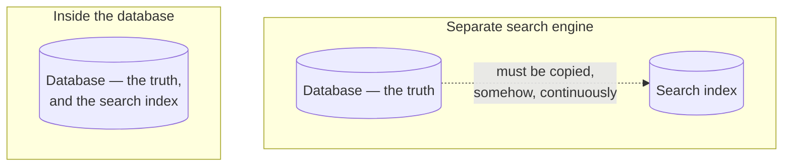
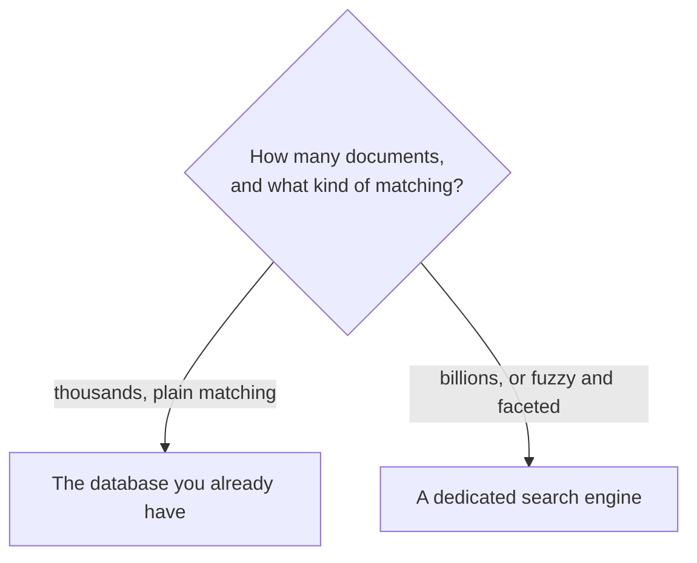

Scanning every row and running a string matcher on each is linear work, and linear work stops being acceptable somewhere. The instinct at that point is to reach for a dedicated search engine. For a great many applications that instinct is wrong, and the reason is worth understanding before spending the complexity.

# The database already does this

> [!important] **PostgreSQL has full-text search built in.** Not `LIKE` — a real implementation with tokenization, stop-word removal, stemming and relevance ranking, running inside the database you already have.

The mechanism is a purpose-built column type:

```sql
1  SELECT to_tsvector('english', 'The quick brown foxes are jumping');
2  -- 'brown':3 'fox':4 'jump':6 'quick':2
```

> [!important] A **`tsvector`** is a document reduced to its searchable terms with their positions. Notice what happened: `The` and `are` were dropped as carrying no meaning, `foxes` became `fox`, `jumping` became `jump`. **That is the same preprocessing a search engine does**, and it is the subject of the next note.

Queries run against that representation rather than the raw text, which is what makes them fast — the same idea as an index, applied to words instead of values.

> [!info] **Unverified.** The output above is from the PostgreSQL documentation; this material was not run, since the project here uses MySQL. MySQL has its own full-text indexes with `MATCH ... AGAINST`, which are less capable but exist.

# Four reasons this is the right answer more often than people think

**No new infrastructure.** The single largest one, and it is not really about search at all.

> [!important] A dedicated search engine is **another server to provision, monitor, back up, upgrade, secure and pay for.** The setup cost is visible and finite; the operational cost is invisible and permanent. Using the database you already run costs none of it.

**No synchronisation problem.** This is the deep one.



> [!warning] **A search engine is never the source of truth.** Your data lives in the database and a copy lives in the engine, and something has to keep them in step on every write. That pipeline can lag, fail silently, or drop records — and when it does, **search results disagree with the database** while both systems report themselves healthy.

> [!important] Full-text search inside the database has no copy, so it cannot disagree with itself. A row and its searchable form are updated in **the same transaction.**

**No extra hosting cost.** A search cluster is a real line item.

**A simpler architecture.** One fewer component, one fewer failure mode, one fewer thing a new engineer has to learn.

# Where the ceiling is

Not a general-purpose answer, and the boundary is roughly measurable.

| Scale | |
|---|---|
| Thousands to tens of thousands of documents | **PostgreSQL handles this comfortably** |
| Hundreds of thousands | Usually still fine, with attention to indexing |
| Hundreds of millions to billions | **A dedicated engine** |

> [!important] The upper end is not hypothetical. **A log search across a company like Google or Microsoft is billions of documents**, generated continuously, and no single relational instance holds that — which is where a system built to spread documents across many machines becomes necessary.

> [!info] The threshold is not only document count. Fuzzy matching, misspelling tolerance, faceting and relevance tuning are things a dedicated engine does well and a database does not do at all. Needing those can justify the move at a much smaller scale.

# The decision



> [!important] **Adding infrastructure is a cost paid forever, and search engines are usually added far earlier than the data justifies.** Reaching for one because search sounds like it needs a search engine is how a system acquires a component nobody can remove.

The honest test is whether the simpler thing has actually been tried and measured against realistic volume. Most applications never leave the left branch.
