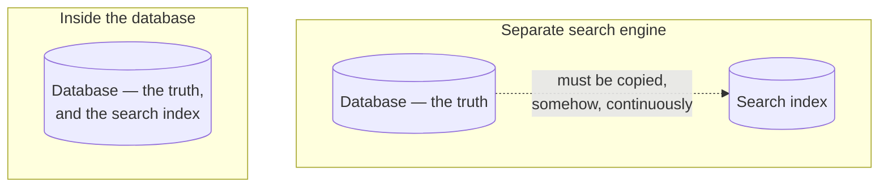
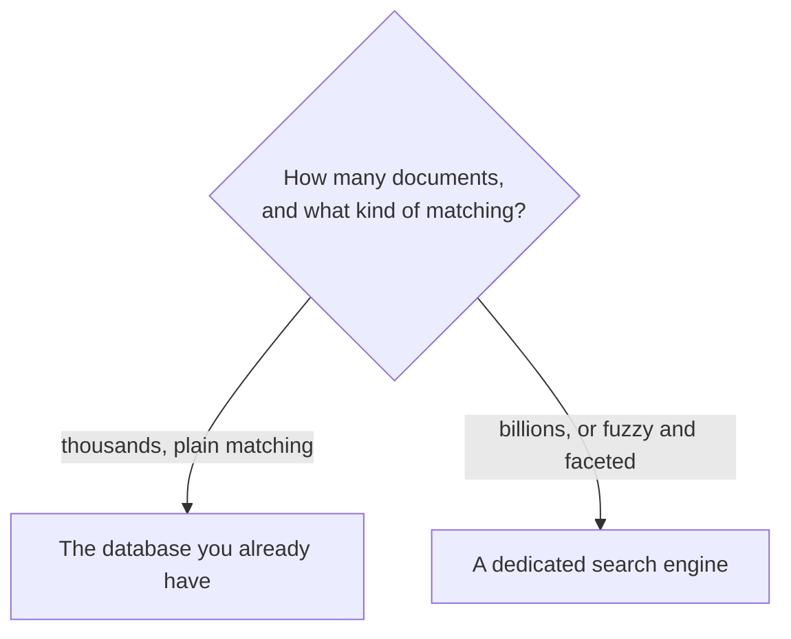

Scanning every row and running a string matcher on each is linear work, and linear work stops being acceptable somewhere. The instinct at that point is to reach for a dedicated search engine. For a great many applications that instinct is wrong, and the reason is worth understanding before spending the complexity.

# The database already does this

> [!important] **PostgreSQL has full-text search built in.** Not `LIKE` — a real implementation with tokenization, stop-word removal, stemming and relevance ranking, running inside the database you already have.

The mechanism is a purpose-built column type:

```sql
1  SELECT to_tsvector('english', 'The quick brown foxes are jumping');
2  -- 'brown':3 'fox':4 'jump':6 'quick':2
```

> [!important] A **`tsvector`** is a document reduced to its searchable terms with their positions. Notice what happened: `The` and `are` were dropped as carrying no meaning, `foxes` became `fox`, `jumping` became `jump`. **That is the same preprocessing a search engine does**, and it is the subject of the next note.

Queries run against that representation rather than the raw text, which is what makes them fast — the same idea as an index, applied to words instead of values.

> [!info] **Unverified.** The output above is from the PostgreSQL documentation; this material was not run, since the project here uses MySQL. MySQL has its own full-text indexes with `MATCH ... AGAINST`, which are less capable but exist.

# Five reasons this is the right answer more often than people think

**No new infrastructure.** The single largest one, and it is not really about search at all.

> [!important] A dedicated search engine is **another server to provision, monitor, back up, upgrade, secure and pay for.** The setup cost is visible and finite; the operational cost is invisible and permanent. Using the database you already run costs none of it.

**No synchronisation problem.** This is the deep one.



> [!warning] **A search engine is never the source of truth.** Your data lives in the database and a copy lives in the engine, and something has to keep them in step on every write. That pipeline can lag, fail silently, or drop records — and when it does, **search results disagree with the database** while both systems report themselves healthy.

> [!important] Full-text search inside the database has no copy, so it cannot disagree with itself. A row and its searchable form are updated in **the same transaction.**

**No extra hosting cost.** A search cluster is a real line item.

**A simpler architecture.** One fewer component, one fewer failure mode, one fewer thing a new engineer has to learn.

**And you keep everything else the database does.** Search is not bought at the cost of transactions, joins, constraints or any other Postgres feature — the searchable column sits in the same table as the rest of the row, so a query can filter on search relevance and on a price range and on a foreign key in one statement. A separate engine holds only what you copied into it.

# Where the ceiling is

Not a general-purpose answer, and the boundary is roughly measurable.

| Scale | |
|---|---|
| Thousands to tens of thousands of documents | **PostgreSQL handles this comfortably** |
| Hundreds of thousands | Usually still fine, with attention to indexing |
| Hundreds of millions to billions | **A dedicated engine** |

> [!important] The upper end is not hypothetical. **A log search across a company like Meta, Microsoft or Google is billions of documents**, generated continuously, and no single relational instance holds that — which is where a system built to spread documents across many machines becomes necessary.

> [!info] The threshold is not only document count. Faceting, relevance tuning and fuzzy matching are things a dedicated engine does well and a database does not do at all. Needing one of those can justify the move at a much smaller scale.

**Fuzzy search** is the one worth naming properly, because it is often the actual reason a team moves.

> [!important] **A fuzzy search matches text that is close to the query rather than equal to it**, so a misspelling still finds what the user meant — type `Googel` and the documents containing `Google` still come back. No amount of tokenizing and stemming inside a database gives you that; matching an approximate spelling is a different operation from matching a normalised word.

# The hard part is not the integration

> [!warning] **Wiring Elasticsearch into an application is straightforward. Deciding whether the problem needs it is not.** The integration is a client library and some configuration, and it is rarely where time goes. The judgment — is this a few-thousand-document problem the existing database already solves, or does it genuinely need fuzzy matching and a billion documents — is the part that is actually difficult and the part worth being able to defend.

In practice this decision is often already made by the time you arrive: on most established projects the search infrastructure is standing before you get there, and the work is using it rather than choosing it. Which is exactly why the reasoning matters when the choice does land on you.

# The decision



> [!important] **Adding infrastructure is a cost paid forever, and search engines are usually added far earlier than the data justifies.** Reaching for one because search sounds like it needs a search engine is how a system acquires a component nobody can remove.

The honest test is whether the simpler thing has actually been tried and measured against realistic volume. Most applications never leave the left branch.
