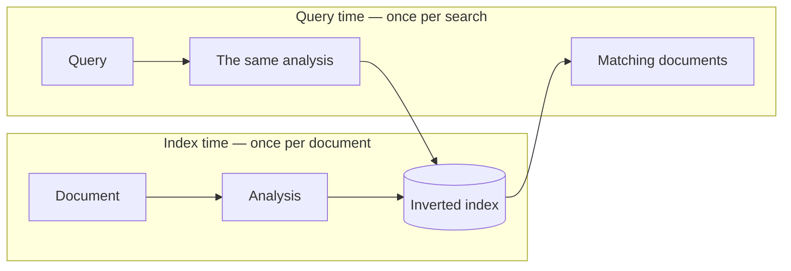
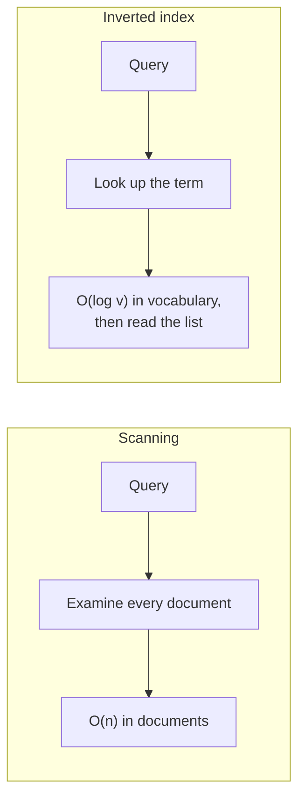

Past the scale a database handles, the answer is Elasticsearch — and it earns its reputation with two ideas rather than magic. This note is the first: the structure that makes searching billions of documents possible by never searching a document at all.

> [!info] **This note and the next cover Elasticsearch algorithmically, as it behaves on a single node.** How it spreads a billion documents across many machines — sharding, replication, how a query is answered from partial indexes — is a separate subject and is not here. Everything below explains what the engine does with a document and a query; none of it explains how it stays up at that size.

# Two phases, and the expensive one is not the search

> [!important] Work splits into **index time**, when a document is added, and **query time**, when somebody searches. Elasticsearch does a great deal at index time so that query time has almost nothing left to do.



The same idea as a database index. **Pay on write to make reads cheap** — only here what gets built is a structure over words rather than values.

> [!info] A **document** in Elasticsearch is one unit of searchable data — typically a JSON object. A product, a log line, an article. It is what a row is to a table.

# Analysis: what happens to text before it is stored

Raw text is not what gets indexed. Four steps run first, and each one exists to make two differently-written things match.

## Tokenization

> [!important] **Tokenization splits text into individual terms.** `I love my country` becomes `I`, `love`, `my`, `country`.

Conceptually a split on whitespace, and genuinely harder than that in practice — punctuation, hyphenation, contractions, and languages that do not put spaces between words all complicate it.

## Filtering

Two kinds of word get dropped.

> [!important] **Stop words** carry no search value. `the`, `a`, `is`, `and`, and the rest of the conjunctions and prepositions. Nobody searches for `the`, and it appears in a large fraction of English sentences, so indexing it costs enormous space and returns everything.

**Banned words** are the other kind — profanity or blocked terms, removed by configuration rather than by information theory.

## Stemming

> [!important] **Stemming reduces a word to a crude root by chopping affixes.** `connections`, `connecting`, `connected` and `connection` all become `connect`. `running` becomes `run`.

So a search for `connect` matches a document containing `connections`, which is the entire point — a user should not have to guess which grammatical form the author used.

> [!warning] **Stemming is mechanical and produces non-words.** `flies` becomes `fli`. That is fine internally — both the document and the query go through the same transformation, so they still meet — but a stem is not a word and should never be shown to anyone.

## Lemmatization

> [!important] **Lemmatization does the same job properly**, using a dictionary and grammar rather than rules about suffixes. `flies` becomes `fly`. `better` becomes `good`, which no amount of suffix-chopping would ever produce.

| | Stemming | Lemmatization |
|---|---|---|
| Method | Chop affixes by rule | **Dictionary and grammar** |
| `flies` → | `fli` | **`fly`** |
| Cost | Very fast | Slower — needs a language model |
| Output | Often not a word | **Always a real word** |

> [!info] Lemmatization shades into natural-language processing, and libraries such as NLTK exist for it. Elasticsearch does this work for you; knowing it happens is what matters, because it explains why a search matches text that does not literally contain the query.

# The inverted index

With analysis done, the structure itself.

> [!important] An ordinary index maps a document to its contents. An **inverted index maps the other way — each term to the list of documents containing it.** Hence inverted.

Take four documents:

```text
  D1  I love you
  D2  I love my country
  D3  I have a dog
  D4  I like to sit
```

After analysis, the index is a sorted key-value structure:

```text
  country → (D2, position 3, frequency 1)
  dog     → (D3, position 3, frequency 1)
  love    → (D1, position 1, frequency 1), (D2, position 1, frequency 1)
```

> [!important] **The key is a term. The value is a posting list** — which documents contain it, where in each, and how often. Position supports phrase queries; frequency is what ranking is built on.

Two details worth holding onto:

> [!info] **The keys are sorted**, so finding a term is a logarithmic lookup rather than a scan of the vocabulary.

> [!important] **`I` is absent** from all of it — dropped as a stop word. So is `a`. The index contains only terms that could distinguish one document from another.

# Why this changes the complexity



> [!important] **The document count leaves the search path entirely.** Looking up `dog` costs a lookup in the vocabulary plus reading its posting list. Ten million more documents that do not contain `dog` add nothing to that query — they are never touched, never opened, never matched against.

That is the whole trick, and it is the same one as every index: **the cost moves to write time, and the read stops depending on the size of the corpus.**

> [!info] Nothing here is free. The index is a second copy of the data in a different arrangement, and **its size grows in proportion to the documents indexed** — the space-for-time trade, at the scale of a corpus.

# What this does not yet do

The index answers which documents contain the terms. Search a large corpus for `love dog` and it may return thousands.

> [!important] **Containing the terms is not the same as being a good answer.** An inverted index gives a set, and users expect a ranked list. That second half is what makes a search engine useful, and it is the next note.
