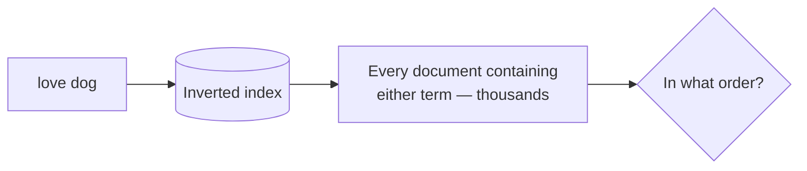
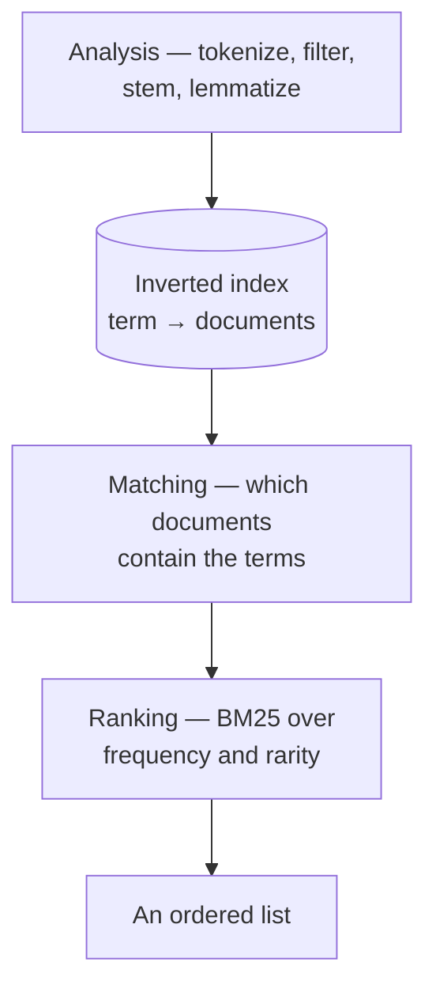

An inverted index answers which documents contain the terms. On a large corpus that is thousands of documents, returned in no meaningful order, and a user reads the first ten. Deciding which ten is the second half of search, and it is the half that decides whether the feature is any good.

# Matching is a set, and users want a list



Merging the posting lists and returning the union is a complete implementation and a useless product.

> [!important] **Relevance has to be computed**, and the raw material is already sitting in the index: how often a term appears in a document, and in how many documents it appears at all.

# Two intuitions

> [!important] **A term appearing often in a document makes that document more about the term.** A page mentioning `dog` twelve times is more likely to be about dogs than one mentioning it once.

> [!important] **A term appearing in few documents is more informative.** In an English corpus, `the` distinguishes nothing. A chemical formula or an unusual proper noun distinguishes almost everything — so a document containing a rare query term deserves more credit than one containing a common term.

The second is the one people find surprising, and it is what makes search feel intelligent. **The rarer your search word, the more the engine trusts whoever used it.**

# TF-IDF

Those two intuitions, made arithmetic.

> [!important] **TF-IDF** — term frequency, inverse document frequency — scores a term against a document by multiplying how much the document is about the term by how informative the term is.

$$\text{TF}(t, d) = \frac{\text{times } t \text{ appears in } d}{\text{total terms in } d}$$

$$\text{IDF}(t) = \log\!\left(\frac{\text{total documents}}{\text{documents containing } t}\right)$$

$$\text{score}(t, d) = \text{TF}(t, d) \times \text{IDF}(t)$$

Reading them in plain terms:

**TF is a proportion**, not a raw count, so a long document does not win simply by being long.

**IDF divides the corpus by the term's document frequency**, so a term in every document scores $\log 1 = 0$ — it contributes nothing at all. A term in one document out of a million scores high.

> [!info] A document's score for a multi-term query is the sum of its per-term scores. A further step, **cosine similarity**, compares the query and document as vectors; the intuition above is what the arithmetic is expressing.

# Worked through, simplified

The real formula obscures the idea on small numbers, so here is a simplified version that keeps both intuitions and drops the logarithm and the normalisation.

Seven documents:

```text
  D1  I love cats and dogs
  D2  I hate cats and dogs
  D3  I have a car
  D4  I am a student
  D5  cats hate dogs
  D6  cats and dogs are pets
  D7  I work with meta
```

The query `meta loves dogs`, after the same analysis the documents went through, becomes **`meta love dog`**.

> [!important] **The query is analysed identically to the documents.** `loves` stems to `love`, `dogs` to `dog`, and `I`-style stop words would be dropped. If the two sides were transformed differently they would never meet.

Document frequencies from the index:

| Term | Appears in | df |
|---|---|---|
| `meta` | D7 | **1** |
| `love` | D1 | **1** |
| `dog` | D1, D2, D5, D6 | **4** |

Scoring each document as the sum over query terms of (count in document) ÷ (documents containing it):

| Doc | `meta` | `love` | `dog` | Score |
|---|---|---|---|---|
| **D1** I love cats and dogs | 0⁄1 | **1⁄1** | 1⁄4 | **1.25** |
| **D7** I work with meta | **1⁄1** | 0⁄1 | 0⁄4 | **1.00** |
| D2 I hate cats and dogs | 0 | 0 | 1⁄4 | 0.25 |
| D5 cats hate dogs | 0 | 0 | 1⁄4 | 0.25 |
| D6 cats and dogs are pets | 0 | 0 | 1⁄4 | 0.25 |
| D3 I have a car | 0 | 0 | 0 | **0** |
| D4 I am a student | 0 | 0 | 0 | **0** |

> [!important] **Read the top two.** D1 wins by matching two query terms. **D7 comes second on one term** — because `meta` appears in only one document out of seven, while `dog` appears in four. Rarity beat quantity, which is exactly the second intuition doing its job.

> [!warning] **This arithmetic is not TF-IDF.** It divides by document frequency instead of applying a logarithm, and skips document-length normalisation. It is a teaching device that produces the same ranking here. **The formulas above are the real ones.**

# Where TF-IDF is wrong

> [!warning] **It has no idea what words mean.** No context, no relationships, no sense that `dog` and `puppy` are related or that `bank` differs between a river and a mortgage. It counts strings.

> [!warning] **Rarity is a proxy for importance, and proxies fail.** A typo appears in one document and is therefore maximally rare — TF-IDF weights it as if it were a precious technical term. Rare and meaningless is indistinguishable from rare and meaningful.

> [!info] Both limits are what embedding-based and semantic search address, by representing meaning as vectors rather than counting terms. That is a different technique with different costs, and TF-IDF remains the foundation underneath a great deal of production search.

# What actually runs

The material above is the right foundation and is not the algorithm Elasticsearch uses.

> [!important] **Elasticsearch has defaulted to BM25 since version 5.** The documentation describes it as a "TF/IDF based similarity that has built-in tf normalization" — a direct descendant that keeps both intuitions and fixes two places plain TF-IDF is wrong.

**Saturation.** Under TF-IDF, a term appearing 100 times scores 100 times a single appearance. That is not how relevance works — the tenth mention adds far less than the second. BM25 curves the term-frequency contribution so it flattens, controlled by a parameter `k1`, defaulting to **1.2**.

**Length normalisation.** A longer document contains more of everything and would otherwise win by volume. BM25 discounts by length against the corpus average, controlled by `b`, defaulting to **0.75**.

> [!info] **Verified** against the Elasticsearch documentation's similarity reference, which lists `BM25 similarity (default)` along with both parameters and their defaults.

> [!important] Which is why TF-IDF is still worth learning properly. **BM25 is not a different theory** — it is the same two intuitions with the sharp edges filed off, and neither its parameters nor its behaviour make sense without them.

# The shape of the whole thing



> [!important] **Neither half is sufficient alone.** The inverted index without ranking returns thousands of documents in arbitrary order. Ranking without the index means scoring every document in the corpus on every query. Together they are what makes searching billions of documents feel instant.
