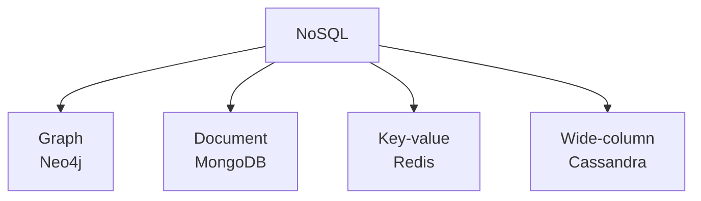
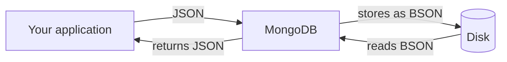

Search needed a second store beside the database because a relational engine cannot rank text. This folder is a different departure: a database that replaces the relational one outright, for data whose shape a table fights rather than fits.

# What NoSQL actually means

The name is unhelpful — it sounds like a rejection of a query language when it describes something structural.

> [!important] **NoSQL is a category of databases that do not store data in tables and do not use SQL to query it.** Both halves matter, and the first is the cause of the second: without tables there are no rows and columns for `SELECT` to address.

There is a second, softer reason these databases went looking for a different language: **SQL is not especially intuitive to read.** `SELECT * FROM products` could as easily have been written `PRINT FROM products`, and the vocabulary was settled decades ago by people solving a different problem. On a simple query it hardly matters. On a long one — nested subqueries, several joins, a `HAVING` clause — the syntax stops describing what you want and starts hiding it. The document databases were free to choose something else and did.

> [!info] There are exceptions in both directions. Some products store data non-relationally and still expose a SQL-like interface over it, precisely because so many people already know SQL.

## Four families, and they are not variations on each other



| Family | Stores | Suits |
|---|---|---|
| **Graph** | Nodes joined by edges | Relationships as the primary thing — social networks, recommendations |
| **Document** | Self-contained records, usually JSON | Entities whose shape varies |
| **Key-value** | One value per key | Lookups where the key is always known |
| **Wide-column** | Rows with dynamic columns | Very high write throughput |

> [!important] **These are different databases, not settings.** Choosing among them is choosing what shape your data has and what question you will ask of it — the same reasoning that made a sorted set right for a leaderboard and wrong for everything else.

**Redis is already familiar** as the key-value entry, which is worth noticing: you have been using a NoSQL database for two folders without it being framed that way.

# MongoDB

> [!important] MongoDB is the **document** database — the most widely used one, open source with paid enterprise tiers, and cross-platform, meaning the same database and the same programs run across operating systems and processor architectures.

> [!info] Platform here means the operating system **and** the processor architecture together. Software that runs on both is platform-independent.

## Document does not mean file

> [!warning] The word invites the wrong picture. **A document is not a PDF or a Word file.** It is one structured record — a collection of related information about one thing.

A product, a user, an order. What a row is to a table, a document is to a collection.

# JSON and BSON

Two formats sit underneath everything MongoDB does.

## JSON

> [!important] **JSON — JavaScript Object Notation — is a text format for structured data**, built from key-value pairs, human-readable, and understood by every language.

> [!warning] **It is not JavaScript**, despite the name. A JSON document is not valid JavaScript syntax. The name records where the shape was borrowed from: JavaScript's object literals are written the same way, and the format took its **notation** from them and nothing else.

```json
1  {
2    "id": 1,
3    "name": "sanket",
4    "price": 499.00
5  }
```

Where it shows up:

| Use | Example |
|---|---|
| **API payloads** | The body of nearly every REST request and response |
| **Config files** | `package.json` |
| **Log output** | Structured logs |
| **Database storage** | MongoDB, among many |

> [!important] The reason it took over is that it describes **an object rather than a scalar.** A product is not a number or a string — it is a name, a price, a discount and more, together. JSON carries that shape across a network in text a human can read.

Made concrete: **you open the Zomato app and it shows you restaurants.** The app sent a request to a server, possibly carrying details of its own — your location, a filter — and the server sent a response back. Both directions are JSON. Neither side knows or cares what language the other is written in; they agreed on a text format that describes an object, and that is the whole contract.

## BSON

> [!important] **BSON — Binary JSON — is JSON's binary encoding**, and it stores things plain JSON leaves implicit: the length of each value, its type, and the total size of the document.

That extra metadata is what makes it useful to a database. Knowing a field's length in advance means skipping to the next one without parsing forward; knowing its type means no inference.



> [!important] **MongoDB stores BSON on disk and hands you JSON.** The conversion is invisible — you never write BSON and never read it. It matters only as the explanation for why a document store can be fast rather than merely convenient.

# The vocabulary, translated

Everything relational has a counterpart, and the words are all different.

Take a Twitter-like application, where the database is `twitterDev`:

| Relational | MongoDB | In `twitterDev` |
|---|---|---|
| **Table** | **Collection** | `users`, `tweets`, `comments`, `likes`, `hashtags` — one per real-world entity |
| **Row** | **Document** | One user, one tweet, one comment |
| **Column** | **Field** | `email`, `password` — a key inside the document |
| **Primary key** | **`_id`** | Present on every document, generated if not supplied |

So a single tweet is a document; every tweet together is the `tweets` collection; and the fields of that document are what columns would have been.

> [!important] The names differ because the things differ. **A table enforces that every row has the same columns; a collection enforces nothing of the kind.** Calling a collection a table would import an expectation that does not hold.

# What is actually being traded

> [!important] **Gained:** documents with no fixed shape, nested structures stored whole rather than spread across joined tables, and a record that is retrieved in one read because it is already assembled.
>
> **Lost:** the schema that guaranteed every row was well-formed, joins, and the ability to ask a question nobody designed for.

Which is the same shape of trade as every other tool in these notes, and it points the same way: **the freedom is real and so is the discipline it removes.** A collection where half the documents are missing a field is not a database problem — it is exactly what you asked for.
