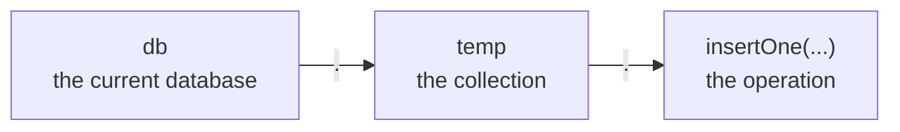
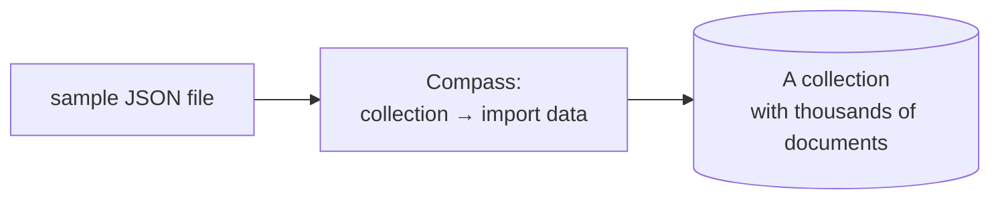

Collections hold documents and documents are JSON. Getting data into them is a short set of commands, and two of them behave in ways that surprise people coming from a relational shell.

# Connecting

```text
  mongosh
```

That is the whole command — no host, no user, no password for a local server. The relational equivalent needs a user and usually a password before it will talk to you.

> [!info] There is also **MongoDB Compass**, a graphical client from the same project. It shows collections and documents, and imports JSON files without a command. Useful for looking at data; the shell is what you learn the operations in.

# Databases

```text
  test> show dbs
  admin      40.00 KiB
  config    108.00 KiB
  local      72.00 KiB
```

`show databases` does the same thing. Then:

```text
  test> use newdb
  switched to db newdb
```

> [!important] **`use` creates the database if it does not exist.** There is no `CREATE DATABASE`. Naming a database you have never used switches you into it and that is all it takes.

Except it does not appear yet:

```text
  newdb> show dbs
  admin      40.00 KiB
  config    108.00 KiB
  local      72.00 KiB
```

> [!warning] **A database with no collections does not exist on disk.** `use` sets where your commands are aimed; nothing is written until there is something to write. The database becomes real, and visible, when its first collection is created.

> [!warning] **Case in a database name is not a way to tell two databases apart.** You cannot have both `salesData` and `SalesData` — they are not two databases. And once one exists, every later reference has to use the same capitalization; `salesdata` is not a valid way to reach `salesData`. Get the case wrong and the shell objects rather than quietly giving you a second, empty database.

# Collections

```text
  newdb> db.createCollection("temp")
  { ok: 1 }
  newdb> show collections
  temp
```

`db` refers to whichever database `use` last selected, so every command reads as **database, collection, operation**:



> [!info] `show collections` lists collections in the current database; `show dbs` lists databases. Confusing the two is common early on — one is a level above the other.

# Inserting

```text
  newdb> db.temp.insertOne({ name: "sanket", city: "bangalore" })
  {
    acknowledged: true,
    insertedId: ObjectId('...')
  }
```

> [!important] **No columns were declared and no table was defined.** The document's shape is decided by the document. `insertMany` takes an array and does the same for several at once.

`insertedId` is the `_id` MongoDB generated. Every document gets one, and it is indexed automatically.

## Nothing enforces a shape

This is the property everything else follows from:

```text
  newdb> db.temp.insertOne({ name: "rahul", college: "iit", age: 24 })
```

Two documents now sit in one collection with different fields. Neither is wrong.

> [!important] **There is no schema.** No fixed set of fields, no requirement that documents match, no migration needed to start storing something new. Adding a field means writing a document containing it.

The relational contrast, which is worth stating precisely:

| | Relational | MongoDB |
|---|---|---|
| Adding a field | `ALTER TABLE`, applied to every row | **Write a document containing it** |
| Rows without a value | Store `NULL` in that column | **Simply do not have the field** |
| Guarantee of shape | **The schema enforces it** | None |

> [!important] The middle row is a real storage difference, not just a modelling one. A nullable column occupies space in **every** row that does not use it. **A missing field in a document occupies nothing.** For data where most records use a small subset of many possible fields, that difference is large.

> [!warning] And the cost is exactly the guarantee. **Nothing prevents a typo becoming a new field.** Write `nmae` instead of `name` and the database accepts it, stores it, and returns a document your code cannot read. In a relational schema that is an error at write time; here it is a bug discovered later.

# Reading it back

```text
  newdb> db.temp.find()
  [
    { _id: ObjectId('...'), name: 'sanket', city: 'bangalore' },
    { _id: ObjectId('...'), name: 'rahul', college: 'iit', age: 24 }
  ]
```

`find()` with no arguments is `SELECT * FROM temp`.

## Counting, and what happens with many

```text
  newdb> db.temp.countDocuments()
  2
```

On a collection of any size, `find()` does not print everything:

```text
  Type "it" for more
```

> [!important] **`find()` returns a cursor, not the documents.** A cursor is a handle the server holds, giving out results in batches as they are asked for. Typing `it` fetches the next batch.

That is not a shell convenience — it is how the driver works too. Ten thousand documents are never loaded into memory just because a query matched them.

> [!info] `.toArray()` drains a cursor into an actual array, loading every matching document into memory at once. Convenient on a small result, and exactly the wrong thing on a large one.

# Loading real data

Practising against two hand-typed documents teaches very little. MongoDB publishes sample datasets — Airbnb listings, weather observations, analytics transactions — as JSON files.



> [!info] Compass imports a JSON file into a chosen collection directly. The Airbnb sample is around 95 MB and lands as roughly 5,500 documents, each carrying nested arrays of reviews and amenities — the kind of shape that shows why a document store exists, and the kind that is awkward to model in tables.

Having thousands of real documents matters for everything after this. **A query is fast on ten documents no matter how badly it is written**, and the difference between a scan and an index does not appear until there is something to scan.
