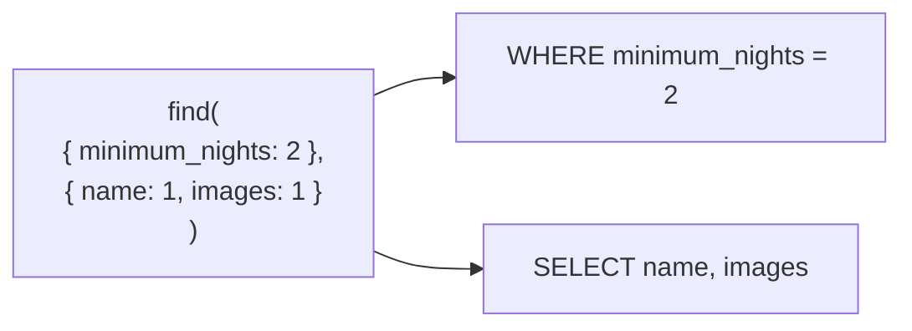

`find()` with no arguments returns everything, which is useful once. Every real query narrows it — choosing which documents come back, which fields of them, and in what order.

# The two arguments of find

```text
  db.collection.find( <filter>, <projection> )
```

> [!important] **The first argument decides which documents. The second decides which fields.** In SQL terms the first is `WHERE` and the second is the column list after `SELECT` — reversed in order from how SQL reads.



Both are optional. `find()` is `SELECT *` with no `WHERE`.

# Projection

Returning whole documents is wasteful when a document is large, and the Airbnb sample makes that concrete — one listing carries a description, an address, availability and an array of every review.

```text
  > db.temp.find({}, { name: 1 }).limit(1)
  [ { _id: ObjectId('...'), name: 'Ribeira Charming Duplex' } ]
```

> [!important] **`1` includes a field, `0` excludes it.** Any truthy or falsy value works — `true` and `false` do the same thing — but 1 and 0 are the convention.

```text
  > db.temp.find({}, { name: 1, amenities: 1, images: 1 }).limit(1)
```

Or the other direction, when you want everything except one heavy field:

```text
  > db.temp.find({}, { reviews: 0 }).limit(1)
```

> [!warning] **`_id` comes back whether you asked for it or not.** It is the only field included by default, and excluding it takes an explicit `{ _id: 0 }`.

> [!important] This is the concept called **projection**, and the name is worth knowing because it is what people ask about. It means returning a chosen subset of a document's fields rather than the whole thing.

# Filtering

The simplest filter is equality:

```text
  > db.temp.find({ minimum_nights: "2" }, { name: 1 }).count()
  1505
```

Any field can be filtered, including one nested inside another, addressed with a dotted string:

```text
  > db.weatherdata.find({ "airTemperature.value": { $gt: 3 } })
```

> [!important] **Dot notation reaches into nested documents.** `"airTemperature.value"` is the `value` field inside the `airTemperature` object — the equivalent of a join in a relational model, except there is no join because the data is already inside the document.

## Query operators

Equality is one comparison. Everything else is an operator, written as a nested object.

```text
  > db.weatherdata.find({ callLetters: { $ne: "PLAT" } }).count()
  9463
```

| Operator | Meaning |
|---|---|
| `$eq` `$ne` | Equal, not equal |
| `$gt` `$gte` | Greater than, greater or equal |
| `$lt` `$lte` | Less than, less or equal |
| `$in` `$nin` | In / not in a list of values |
| `$exists` | The field is present at all |
| `$type` | The field has a given BSON type |

> [!important] **`$exists` has no relational equivalent**, because in a table every row has every column. Here a field may simply be absent, which is a different thing from being null — and only a schemaless store needs a way to ask about it.

`$in` takes an array and matches any of them:

```text
  > db.weatherdata.find({ callLetters: { $in: ["PLAT", "SHIP", "VCSZ"] } }).count()
  20
```

> [!info] The documentation recommends `$in` over `$or` when the checks are equality tests on **the same field**. It is clearer and the engine handles it better.

## Combining conditions

Two conditions in one object are an implicit AND, but only across **different** fields. Two conditions on the same field need `$and` and an array:

```text
  > db.weatherdata.find({
      $and: [
        { elevation: { $lte: 10000 } },
        { elevation: { $gt: 9999 } }
      ]
    }).count()
  528
```

> [!warning] The obvious shorter form is wrong. **An object cannot hold the same key twice**, so writing two `elevation` conditions side by side silently keeps only the last one. That is a JSON limitation surfacing as a query bug, and it produces a wrong answer rather than an error.

`$or`, `$not` and `$nor` complete the set.

# Distinct

```text
  > db.weatherdata.distinct("type")
  [ 'FM-13', 'SAO' ]
```

> [!important] Answers what values does this field actually take — the same question as SQL's `DISTINCT`, and the first thing worth running before filtering on a field you have not seen.

# One document, or many

```text
  > db.temp.findOne({ minimum_nights: "2" })
```

| | Returns | Cursor? |
|---|---|---|
| **`find`** | Every match | **Yes** — batched, and `.count()`, `.limit()`, `.sort()` chain onto it |
| **`findOne`** | The first match, as a document | **No** |

> [!warning] Because `findOne` returns a document rather than a cursor, **the cursor methods do not work on it.** `.toArray()` on a `findOne` result is an error, and `.count()` on it is meaningless.

# Sorting

```text
  > db.temp.find({}, { name: 1, minimum_nights: 1 }).sort({ minimum_nights: -1 }).limit(1)
```

> [!important] **`1` is ascending, `-1` is descending** — the same convention as projection's include and exclude, which is an unfortunate collision worth being deliberate about.

Multiple keys break ties, left to right:

```text
  > db.temp.find().sort({ minimum_nights: -1, maximum_nights: -1 })
```

The second key only decides between documents the first could not separate — identical to `ORDER BY a, b`.

# Pagination

`limit` alone gives the first N. A second page needs to skip the first ones.

```text
  > db.temp.find().skip(20).limit(10)
```


> [!important] **`skip = (page − 1) × pageSize`.** This is MySQL's `LIMIT 10 OFFSET 20` under a different name, and it is how search results and product listings are served one page at a time.

> [!warning] It has a cost that is invisible at small page numbers. **`skip(n)` still walks past those n documents** — the database counts to 20,000 before returning ten. Deep pagination degrades linearly, which is why large systems paginate by a remembered position rather than an offset.
