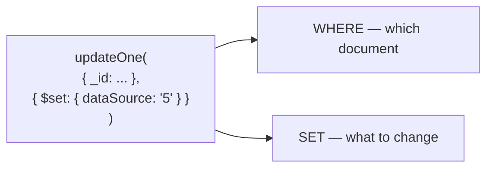

Reading is the larger half of most workloads and the smaller half of the risk. Changing documents introduces a distinction that has no equivalent in a `SELECT` — how many documents an operation is allowed to touch.

# One or many, chosen explicitly

Every write operation comes in a pair.

| | Affects |
|---|---|
| `insertOne` / `insertMany` | One document / an array of them |
| `updateOne` / `updateMany` | The first match / every match |
| `deleteOne` / `deleteMany` | The first match / every match |

> [!important] **There is no ambiguous form.** SQL's `UPDATE products SET price = 0` with a forgotten `WHERE` rewrites the table; here the equivalent mistake requires typing `updateMany` and meaning it. **The scope of the write is in the name of the method**, which is a genuinely good piece of API design.

# Updating

```text
  > db.weatherdata.updateOne(
      { _id: ObjectId('...') },
      { $set: { dataSource: "5" } }
    )
  { acknowledged: true, matchedCount: 1, modifiedCount: 1 }
```

Two arguments, both objects, mirroring `find`:



## Why `$set` is required

Writing the second argument as a plain object looks natural and is a different operation entirely.

> [!warning] **Without an operator, the document is replaced, not updated.** Every field not mentioned is deleted. `$set` is what says change these fields and leave the rest alone.

## The other operator worth knowing

```text
  > db.weatherdata.updateOne(
      { _id: ObjectId('...') },
      { $inc: { elevation: 1 } }
    )
```

> [!important] **`$inc` adds to the existing value** rather than replacing it, and a negative amount subtracts. The distinction matters for the same reason `ZINCRBY` did in Redis: **read-then-write loses concurrent updates**, and an increment performed inside the database cannot.

Both can appear in one call:

```text
  > db.weatherdata.updateOne(
      { _id: ObjectId('...') },
      {
        $set: { pastWeatherObservationManual: "" },
        $inc: { elevation: 5 }
      }
    )
```

## Reading the result

```text
  { acknowledged: true, matchedCount: 528, modifiedCount: 528 }
```

> [!important] **`matchedCount` is how many documents the filter found; `modifiedCount` is how many actually changed.** They differ when a document already held the value being set — matched but not modified.

That gap is the useful signal. **`matchedCount: 0` means the filter was wrong**; `matchedCount: 5, modifiedCount: 0` means the filter was right and the update was a no-op. Two different bugs, distinguishable without another query.

## Updating many

```text
  > db.weatherdata.updateMany(
      { callLetters: "PLAT" },
      { $set: { elevation: 10000 } }
    )
  { acknowledged: true, matchedCount: 528, modifiedCount: 528 }
```

Same shape, every match affected.

> [!warning] **Run the filter as a `find` before running it as an `updateMany`.** The count it returns is the number of documents about to change, and there is no transaction wrapped around this by default — the writes are applied as they are made.

# Deleting

```text
  > db.temp.deleteOne({ _id: ObjectId('...') })
  { acknowledged: true, deletedCount: 1 }

  > db.temp.deleteMany({ minimum_nights: "2" })
  { acknowledged: true, deletedCount: 1505 }
```

One argument, the filter, and the same one-or-many split.

> [!warning] **`deleteMany({})` empties the collection**, since an empty filter matches everything. It is the shortest destructive command in the shell and reads almost identically to `find({})`.

# What this costs, and the alternative you already know

There is no soft delete here, no `deleted_at`, and nothing that makes deletion recoverable.

> [!important] Which is the same argument as `10-Many-To-Many-And-Soft-Delete/05-Soft-Delete`, and it applies unchanged. **A deleted document is gone, and with it the record that it existed.** Nothing about a document store makes that less true — if the history matters, the pattern is the same one: a `deletedAt` field, set on delete, and every query filtering on its absence.

> [!warning] And it is harder to enforce here, not easier. Hibernate could apply `@SQLRestriction` to every query for an entity. **In the shell and in most drivers there is no such hook**, so every query in the application has to remember `{ deletedAt: { $exists: false } }` — and the one that forgets returns deleted data without failing.
